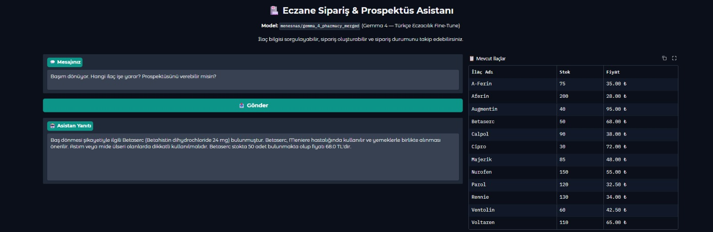
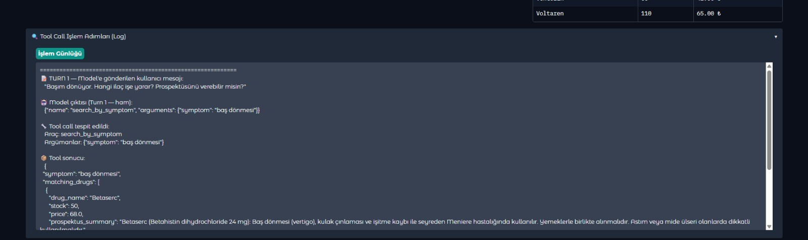
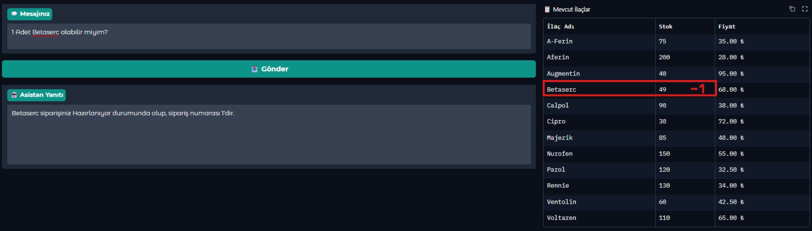
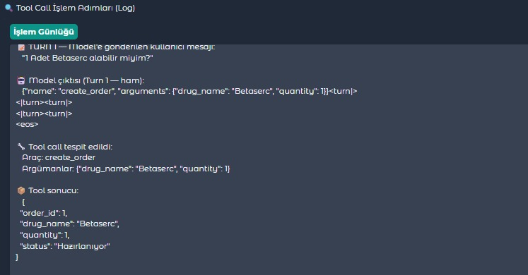

# 🏥 Eczane Sipariş & Prospektüs Asistanı

Tool-calling destekli, gerçek veritabanı okuma/yazma yapan, halüsinasyon üretmeyen bir eczane asistanı.

## 🎯 Senaryo Özeti

Kullanıcı bir ilaç hakkında bilgi ister (stok durumu, prospektüs özeti), sipariş oluşturur ve sipariş durumunu sorgular. Model hiçbir zaman ilaç bilgisini kendi hafızasından **uydurmaz** — her yanıt bir tool çağrısının döndürdüğü gerçek veriye dayanır.

## 🏗️ Mimari

```
Kullanıcı
   │
   ▼
[Gradio Arayüzü]
   │
   ▼
[Turn 1] Model → sistem promptuna göre JSON tool-call üretir
   │
   ▼
[Tool Router] → hangi fonksiyon çağrılacak, argümanları parse eder
   │
   ├─► get_drug_info(drug_name)      ─┐
   ├─► create_order(drug_name, qty)   ├─► SQLite DB (drugs, orders tabloları)
   └─► check_order_status(order_id)  ─┘
   │
   ▼ (get_drug_info: DB'de ilaç yoksa)
[Web Arama API: Tavily / SerpApi] → prospektüs özeti çeker → DB'ye yazar
   │
   ▼
[Turn 2] Model, tool sonucunu alır, kullanıcıya doğal dilde özetler
```

### Kullanılan Model

**`menesnas/gemma_4_pharmacy_merged`** — Gemma 4 tabanlı, Türkçe eczacılık QA verisiyle LoRA fine-tune edilmiş, merge edilmiş model.

## 📂 Dosya Yapısı

```
OrderDrug/
├── app.py                # Gradio arayüzü + model yükleme + tool router
├── db.py                 # SQLite bağlantı, şema oluşturma, CRUD fonksiyonları
├── tools.py              # get_drug_info, create_order, check_order_status
├── search_provider.py    # Tavily/SerpApi soyutlaması
├── seed_db.py            # İlk çalıştırmada örnek 10 ilaç ekler
├── requirements.txt      # Bağımlılıklar
├── pharmacy.db           # SQLite veritabanı (seed_db.py ile üretilir)
├── PROJECT_SPEC.md       # Detaylı proje spesifikasyonu
└── README.md             # Bu dosya
```

## 🚀 Yerelde Çalıştırma

```bash
# 1. Bağımlılıkları kur
pip install -r requirements.txt

# 2. Veritabanını başlat (opsiyonel — app.py otomatik çağırır)
python seed_db.py

# 3. Uygulamayı başlat
python app.py
```

### Ortam Değişkenleri

Web arama özelliği için (DB'de olmayan ilaçları aramak):

| Değişken | Açıklama |
|---|---|
| `TAVILY_API_KEY` | Tavily API anahtarı (önerilen) |
| `SERPAPI_API_KEY` | SerpApi API anahtarı (alternatif) |

> Her iki anahtar da yoksa, DB'de bulunmayan ilaçlar için "bulunamadı" hatası döner.

## 🧪 Örnek Kullanım Senaryoları

| # | Kullanıcı Girdisi | Tetiklenen Tool | Beklenen Davranış |
|---|---|---|---|
| 1 | "Parol stokta var mı?" | `get_drug_info` | DB'den stok/prospektüs döner |
| 2 | "Aspirin hakkında bilgi ver" | `get_drug_info` | Web araması → DB'ye kayıt → sonuç |
| 3 | "3 kutu Aferin sipariş et" | `create_order` | Stok azalır, sipariş oluşur |
| 4 | "500 kutu Parol sipariş et" | `create_order` | "Yetersiz stok" hatası |
| 5 | "5 numaralı sipariş ne durumda?" | `check_order_status` | Sipariş durumu döner |
| 6 | "Hava nasıl?" | — | Normal yanıt (tool çağrılmaz) |


## 📸 Örnek Çalıştırma Ekran Görüntüleri

Aşağıda, sistemin farklı senaryolarda tool-call mekanizmasını nasıl tetiklediğini gösteren örnek girdi/çıktılar yer almaktadır.

### 1. Semptoma Göre İlaç Sorgulama (Asistan Yanıtı)

**Kullanıcı girdisi:** `"Başım dönüyor. Hangi ilaç işe yarar? Prospektüsünü verebilir misin"`

Model `get_drug_info` fonksiyonunu çağırır, veritabanından gerçek stok ve prospektüs bilgisini çeker.





### 2. Sipariş Oluşturma

**Kullanıcı girdisi:** `"3 kutu Aferin sipariş et"`

`create_order` fonksiyonu çağrılır, stok düşürülür ve yeni bir sipariş kaydı oluşturulur.






## ⚠️ Disclaimer

Bu sistem akademik bir projedir; stok/fiyat verileri simülasyondur, prospektüs özetleri gerçek tıbbi tavsiye yerine geçmez.


