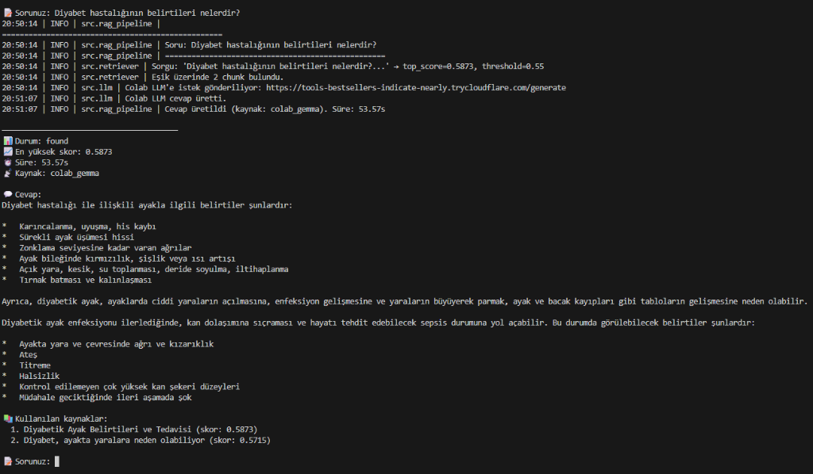

# Türkçe Tıbbi RAG Sistemi

Türkçe hastane/tıbbi makalelerinden oluşan bir veri kümesini chunk'layıp ChromaDB vektör veritabanına yükleyen, threshold bazlı retrieval yapan ve local LLM ile cevap üreten bir RAG (Retrieval-Augmented Generation) sistemi.

## 📋 İçindekiler

- [Proje Hakkında](#proje-hakkında)
- [Mimari](#mimari)
- [Kurulum](#kurulum)
- [Kullanım](#kullanım)
- [Örnek Çalışma Ekranı](#-örnek-çalışma-ekranı)
- [Chunking Stratejisi](#chunking-stratejisi)
- [Embedding Modeli](#embedding-modeli)
- [Threshold Analizi](#threshold-analizi)
- [Benchmark Sonuçları](#benchmark-sonuçları)
- [HF Dataset](#hf-dataset)

## 🏥 Proje Hakkında

Bu proje, Türkçe tıbbi makalelerden oluşan bir bilgi tabanı üzerine kurulu RAG sistemi geliştirmeyi amaçlamaktadır. Sistem:

1. **Veri Kaynağı:** `alibayram/turkish-hospital-medical-articles` — 14 hastane kaynağından ~24.612 makale
2. **Örneklem:** Acıbadem + Memorial hastanelerinden rastgele 500 makale
3. **Chunking:** Hibrit (paragraf-aware + token bazlı), 512 token / 64 overlap
4. **Embedding:** `magibu/embeddingmagibu-200m` — 768 boyut, Türkçe odaklı
5. **Vektör DB:** ChromaDB (local, persistent)
6. **Retrieval:** Threshold bazlı — eşik altında reddeder, üstünde LLM'e gönderir
7. **LLM:** Google Gemma 4 E4B (Colab üzerinde)

## 🏗️ Mimari

```
┌─────────────────── LOCAL (VSCode) ───────────────────┐     ┌──── COLAB (GPU) ────┐
│                                                       │     │                      │
│  Soru → Embedding → ChromaDB → Threshold Check  ─────┼────▶│  Gemma 4 E4B         │
│              (magibu-200m)        │                   │ HTTP│  Flask API           │
│                                   │                   │ POST│  /generate           │
│                              skor < eşik?             │     │                      │
│                              ├─ Evet → "Cevap yok"    │     │  ngrok tunnel ile    │
│                              └─ Hayır → LLM'e gönder ─┼────▶│  dışarıya açık       │
│                                                       │     │         │            │
│                          Cevap ◀──────────────────────┼─────│◀────────┘            │
└───────────────────────────────────────────────────────┘ JSON└──────────────────────┘
```

**Detaylı Akış:**

1. Kullanıcı sorusu `magibu/embeddingmagibu-200m` ile 768-boyutlu vektöre dönüştürülür (local)
2. ChromaDB'de cosine similarity ile en yakın k=5 chunk aranır (local)
3. **Threshold kontrolü:** En yüksek skor < eşik ise → `"Bu sorunun cevabı dokümanlarımda yer almamaktadır."` (LLM'e gitmez)
4. Eşik üzerindeyse → Context chunk'ları + soru, **HTTP POST** ile Colab'daki Gemma 4 E4B'ye gönderilir
5. Colab'daki Flask API cevabı üretir ve JSON olarak döndürür

## 🛠️ Kurulum

### Gereksinimler

- Python 3.9+
- CUDA destekli GPU (embedding için önerilir, zorunlu değil)

### Adımlar

```bash
# 1. Bağımlılıkları yükle
pip install -r requirements.txt

# 2. .env dosyası oluştur
cp .env.example .env
# .env içine HF_TOKEN'ınızı ekleyin

# 3. HF dataset erişim izni
# https://huggingface.co/datasets/alibayram/turkish-hospital-medical-articles
# adresinden erişim isteyin
```

## 🚀 Kullanım

### Tüm Pipeline (Önerilen)

```bash
# Veri yükle → Chunk'la → Embed et → ChromaDB'ye kaydet
python main.py --step all
```

### Adım Adım

```bash
# 1. Veri yükleme
python main.py --step load

# 2. Chunking
python main.py --step chunk

# 3. Embedding üretimi
python main.py --step embed

# 4. ChromaDB'ye kaydetme
python main.py --step store

# 5. Benchmark çalıştırma
python main.py --step benchmark

# 6. Etkileşimli soru-cevap
python main.py --step query

# 7. HF Dataset export
python main.py --step export --hf-repo username/repo-name
```

### Parametreler

```bash
python main.py --step all \
    --splits acibadem,memorial \
    --sample-size 500 \
    --chunk-size 512 \
    --chunk-overlap 64 \
    --batch-size 64 \
    --threshold 0.55 \
    --top-k 5 \
    --verbose
```

### Colab LLM Kurulumu

1. `notebooks/colab_llm_inference.py` dosyasını Google Colab'a yükleyin
2. Runtime → Change runtime type → T4 GPU seçin
3. Script'i çalıştırın
4. ngrok / cloudflared URL'ini `.env` dosyasındaki `COLAB_LLM_URL` alanına yapıştırın

## 📸 Örnek Çalışma Ekranı

Aşağıdaki ekran görüntüsünde, kullanıcının *"Diyabet hastalığının belirtileri nelerdir?"* sorusu üzerine sistemin uçtan uca çalışması görülmektedir:

1. **Embedding & Retrieval:** Soru `magibu/embeddingmagibu-200m` ile vektörleştirilip ChromaDB'den en alakalı chunk'lar çekildi (`top_score: 0.5873`).
2. **Threshold Kontrolü:** Benzerlik skoru eşiğin üzerinde olduğu için sorgu onaylandı.
3. **Colab Gemma 4 E4B Entegrasyonu:** İlgili metin parçaları Colab sunucusundaki Gemma 4 modeline gönderildi ve model anlaşılır, maddelenmiş Türkçe cevap üretti (`kaynak: colab_gemma`).



## ✂️ Chunking Stratejisi

**Yöntem:** Hibrit (Mixed) Chunking — Paragraf sınırlarına hizalı + token bazlı bölme

LangChain'in s`RecursiveCharacterTextSplitter.from_tiktoken_encoder()` kullanılarak hibrit bir parçalama stratejisi uygulanmıştır. Bu yöntem önce doğal metin sınırlarını (paragraf, satır, cümle) tercih eder, paragraf çok uzunsa token bazlı bölmeye geçer.

| Parametre | Değer | Gerekçe |
|-----------|-------|---------|
| `chunk_size` | 512 token | Embedding modeli 8192 token destekliyor ancak retrieval hassasiyeti için daha küçük, odaklı chunk'lar tercih edildi |
| `chunk_overlap` | 64 token | Chunk sınırında bağlam kaybını önlemek için (~%12.5 örtüşme) |
| Separators | `\n\n` → `\n` → `. ` → `, ` → ` ` → `` | Paragraf → Satır → Cümle → Virgül → Kelime → Karakter sırasıyla denenir |
| Tokenizer | `cl100k_base` (tiktoken) | Token bazlı doğru ölçüm için; karakter sayısı yerine gerçek token sayısı kullanılır |
| Toplam Chunk | **4.209** | 500 makaleden üretildi (makale başına ortalama ~8.4 chunk) |

**Neden hibrit yaklaşım seçildi?**

1. **Saf token bazlı bölme** cümleleri ortasından keser → anlamsal bütünlük bozulur, retrieval kalitesi düşer
2. **Saf paragraf bazlı bölme** makale yapısına göre çok değişken chunk boyutları üretir (10 token'dan 2000 token'a kadar) → embedding kalitesi tutarsız olur
3. **Hibrit yaklaşım** her iki sorunu da çözer: doğal paragraf sınırlarını korurken, uzun paragrafları token limitinde böler → anlamsal bütünlük + tutarlı boyut

## 🔢 Embedding Modeli

**Model:** [`magibu/embeddingmagibu-200m`](https://huggingface.co/magibu/embeddingmagibu-200m)

| Özellik | Değer |
|---------|-------|
| Boyut (Dimension) | **768** |
| Context Window | **8.192 token** |
| Parametre Sayısı | ~200M |
| Backbone | Gemma3 tabanlı, mean pooling |
| Normalizasyon | ℓ₂-normalize (cosine similarity = dot product) |
| Dil Desteği | Türkçe odaklı, 40+ dil |
| STSbTR Pearson | ~77.5 |
| TR-MTEB Sıralaması | Türkçe embedding modelleri arasında en güçlülerden |

**Neden `magibu/embeddingmagibu-200m` seçildi?**

1. **Türkçe performansı:** `all-MiniLM-L6-v2` gibi İngilizce odaklı modellere kıyasla Türkçe tıbbi metinlerde çok daha yüksek benzerlik skorları üretir (STSbTR Pearson ~77.5)
2. **Geniş context window:** 8192 token ile 512 token'lık chunk'lar rahatlıkla işlenir; uzun makaleler için de esneklik sağlar
3. **Normalizasyon avantajı:** Vektörler ℓ₂-normalize edildiği için cosine similarity hesaplaması basit dot product'a indirgenir → performans artışı
4. **Gemma3 backbone:** Modern transformer mimarisi ile güçlü anlamsal temsil yeteneği

## 📊 Threshold (Eşik) Analizi

30 soruluk benchmark seti üzerinde 0.30'dan 0.70'e kadar 0.05 aralıklarla farklı eşik değerleri test edilmiştir. Amaç: pozitif sorularda doğru chunk'ı yakalayan, negatif sorularda ise "cevap yok" diyen en iyi eşik değerini bulmaktır.

### Threshold Tarama Sonuçları

| Threshold | Pozitif Doğ. | Negatif Doğ. | Genel | Precision | Recall | F1 |
|:---------:|:------------:|:------------:|:-----:|:---------:|:------:|:-----:|
| 0.30 | 100.0% | 80.0% | 93.3% | 0.909 | 1.000 | 0.952 |
| **0.35** | **100.0%** | **90.0%** | **96.7%** | **0.952** | **1.000** | **0.976** |
| 0.40 | 100.0% | 90.0% | 96.7% | 0.952 | 1.000 | 0.976 |
| 0.45 | 100.0% | 90.0% | 96.7% | 0.952 | 1.000 | 0.976 |
| 0.50 | 95.0% | 90.0% | 93.3% | 0.950 | 0.950 | 0.950 |
| 0.55 | 85.0% | 100.0% | 90.0% | 1.000 | 0.850 | 0.919 |
| 0.60 | 75.0% | 100.0% | 83.3% | 1.000 | 0.750 | 0.857 |
| 0.65 | 50.0% | 100.0% | 66.7% | 1.000 | 0.500 | 0.667 |
| 0.70 | 30.0% | 100.0% | 53.3% | 1.000 | 0.300 | 0.462 |

### 🏆 Seçilen Eşik: `0.35`

| Metrik | Değer |
|--------|-------|
| **F1 Score** | **0.976** |
| **Genel Doğruluk** | **96.7%** |
| Pozitif Doğruluk (Recall) | 100.0% (20/20) |
| Negatif Doğruluk (Specificity) | 90.0% (9/10) |
| True Positive (TP) | 20 |
| False Negative (FN) | 0 |
| True Negative (TN) | 9 |
| False Positive (FP) | 1 |

**Eşik seçim gerekçesi:** 0.35 eşiği, tüm pozitif soruları doğru yakalayarak (%100 recall) negatif soruların %90'ını başarıyla reddeder. F1 skoru 0.976 ile en yüksek değerdedir. Daha yüksek eşikler (ör. 0.55+) negatif doğruluğu %100'e çıkarsa da pozitif soruları kaçırmaya başlar.

**Tek hatalı sonuç:** "Kedilerde aşı takvimi nasıl uygulanır?" sorusu 0.5216 skorla eşiğin üzerinde kalmıştır. Bunun nedeni, veri setinde çocuk aşı takvimi ile ilgili makaleler bulunması ve "aşı takvimi" ifadesinin anlamsal olarak örtüşmesidir — bu, embedding modelinin beklenen bir davranışıdır.

## 📈 Benchmark Sonuçları

- **Test seti:** 30 soru (20 pozitif + 10 negatif)
- **Pozitif sorular:** Tıbbi makalelerden türetilmiş, cevabı chunk'larda doğrudan bulunan sorular
- **Negatif sorular:** Veterinerlik, uzay bilimi, tarih, programlama gibi alakasız konular

### Pozitif Sorular (20/20 ✅)

| Soru | Benzerlik Skoru |
|------|:--------------:|
| Migren ağrısının tetikleyici faktörleri nelerdir? | 0.7962 |
| Cilt kanseri belirtileri nasıl anlaşılır? | 0.7616 |
| Göz tansiyonu (glokom) nasıl tedavi edilir? | 0.7590 |
| Tip 2 diyabette insülin direnci nasıl gelişir? | 0.7578 |
| Anemi (kansızlık) belirtileri ve tedavisi nelerdir? | 0.7444 |
| Hipertansiyon tedavisinde hangi ilaçlar kullanılır? | 0.7386 |
| Kalp yetmezliğinin nedenleri nelerdir? | 0.7301 |
| Felç (inme) geçiren hastaya ilk müdahale nasıl yapılır? | 0.7175 |
| Çocuklarda aşı takvimi nasıl uygulanır? | 0.6631 |
| Depresyon tedavisinde kullanılan yöntemler nelerdir? | 0.6369 |
| Astım hastalığında nefes darlığı nasıl kontrol edilir? | 0.6344 |
| Alerji testleri nasıl yapılır ve sonuçları ne anlama gelir? | 0.6127 |
| Prostat büyümesi hangi yaşlarda görülür? | 0.6093 |
| Tiroid bezinin işlevleri nelerdir? | 0.6078 |
| Gebelikte beslenme nasıl olmalıdır? | 0.6015 |
| Bel fıtığı ameliyatı ne zaman gereklidir? | 0.5985 |
| Böbrek taşı oluşumunu önlemek için neler yapılmalıdır? | 0.5961 |
| Diyabet hastalığının belirtileri nelerdir? | 0.5873 |
| Mide ülseri belirtileri ve tedavisi nasıldır? | 0.5072 |
| Osteoporoz hastalığında kemik yoğunluğu nasıl artırılır? | 0.4686 |

### Negatif Sorular (9/10 ✅)

| Soru | Benzerlik Skoru | Sonuç |
|------|:--------------:|:-----:|
| Kedilerde aşı takvimi nasıl uygulanır? | 0.5216 | ❌ FP |
| Yapay zekâ modelleri nasıl eğitilir? | 0.3328 | ✅ |
| Mars gezegeninde yaşam koşulları nasıldır? | 0.3045 | ✅ |
| Fotossentez süreci nasıl gerçekleşir? | 0.2396 | ✅ |
| Python programlama dilinde list comprehension nasıl yazılır? | 0.2172 | ✅ |
| Kuantum fiziğinde dalga-parçacık ikiliği nedir? | 0.2160 | ✅ |
| Kripto para madenciliği nasıl yapılır? | 0.2065 | ✅ |
| Antik Mısır'da piramitler nasıl inşa edilmiştir? | 0.1999 | ✅ |
| Osmanlı İmparatorluğu hangi yılda kurulmuştur? | 0.1928 | ✅ |
| Dünya'nın en derin noktası neresidir? | 0.1763 | ✅ |

## 📦 HF Dataset

Export edilen dataset şu kolonları içerir:

| Kolon | Açıklama |
|-------|----------|
| `url` | Kaynak makale URL'i |
| `chunk_text` | Parçalanmış metin |
| `chunk_vector` | 768 boyutlu float vektör |
| `title` | Makale başlığı |
| `source` | Hastane kaynağı |

*HF Dataset linki: (export sonrası eklenecek)*

## 📁 Proje Yapısı

```
RAG_vector/
├── data/
│   ├── raw/                          # HF'den indirilen ham veri
│   ├── chroma_db/                    # ChromaDB persistent storage
│   ├── cache/                        # Ara adım cache'leri
│   └── benchmark.csv                 # 30 soruluk test seti
├── src/
│   ├── data_loader.py                # HF dataset yükleme + örnekleme
│   ├── chunking.py                   # Hibrit chunk'lama
│   ├── embedding.py                  # embeddingmagibu-200m wrapper
│   ├── vector_store.py               # ChromaDB yönetimi
│   ├── retriever.py                  # Threshold'lu retrieval
│   ├── llm.py                        # Colab LLM wrapper
│   ├── rag_pipeline.py               # Uçtan uca pipeline
│   └── benchmark.py                  # Benchmark + metrikler
├── notebooks/
│   └── colab_llm_inference.py        # Colab LLM script
├── export_to_hf.py                   # ChromaDB → HF Dataset
├── main.py                           # Ana çalıştırma scripti
├── requirements.txt
├── .env.example
├── PROJECT_PLAN.md
└── README.md
```

## 📄 Lisans

Bu proje eğitim amaçlı geliştirilmiştir.
