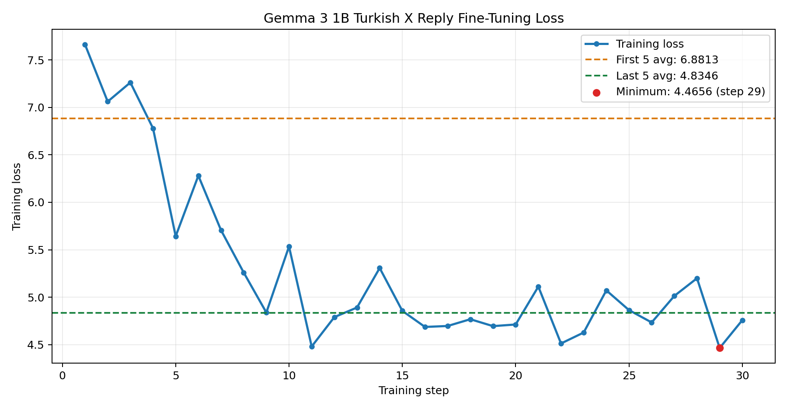

---
language:
- tr
license: other
base_model: unsloth/gemma-3-1b-it
pipeline_tag: text-generation
datasets:
- berkbirkan/turkish-x-engagement-replies
tags:
- gemma-3
- unsloth
- lora
- sft
- turkish
- x-replies
- social-media
---

# Gemma 3 1B — Turkish X Reply LoRA Fine-Tuning

Bu repo, Gemma 3 1B modelinin gerçek Türkçe X reply örnekleri üzerinde Unsloth
ve LoRA ile supervised fine-tuning (SFT) deneyini içerir. Amaç, modele bir ana X
gönderisine bağlama uygun, doğal ve kısa Türkçe reply üretme davranışını
kazandırmaktır.

This repository contains a supervised fine-tuning (SFT) experiment in which
Gemma 3 1B was adapted with Unsloth and LoRA on real Turkish X reply examples.
The objective is to teach the model to write short, natural Turkish replies that
are relevant to a parent X post.

## Bağlantılar / Links

- Eğitilen model / Trained model: [berkbirkan/gemma-3-lora-finetune-x-replies](https://huggingface.co/berkbirkan/gemma-3-lora-finetune-x-replies)
- Eğitim dataseti / Training dataset: [berkbirkan/turkish-x-engagement-replies](https://huggingface.co/datasets/berkbirkan/turkish-x-engagement-replies)
- Dataset GitHub: [berkbirkan/x-replies-quotes-dataset](https://github.com/berkbirkan/x-replies-quotes-dataset)
- Bu deneyin GitHub reposu / Experiment repository: [berkbirkan/gemma-3-lora-finetune-x-replies](https://github.com/berkbirkan/gemma-3-lora-finetune-x-replies)
- Notebook: [`Gemma3_(4B)_ipynb_x_replies_dataset_finetuning.ipynb`](Gemma3_(4B)_ipynb_x_replies_dataset_finetuning.ipynb)

> **Adlandırma notu / Naming note:** Notebook dosya adında `4B` yazmasına rağmen
> çalıştırılan `model_name` açıkça `unsloth/gemma-3-1b-it` değeridir. Eğitim
> logunda da toplam parametre sayısı 1.006.408.832 olarak görünür. Bu rapor gerçek
> çalıştırmayı esas alır ve modeli **Gemma 3 1B** olarak tanımlar.
>
> Although the notebook filename contains `4B`, the executed `model_name` is
> explicitly `unsloth/gemma-3-1b-it`, and the trainer reports 1,006,408,832 total
> parameters. This report follows the actual run and identifies the model as
> **Gemma 3 1B**.

---

## Türkçe

### Projenin amacı

Bu deney, genel amaçlı Gemma 3 1B Instruct modeline Türkçe sosyal medya reply
üslubu kazandırmayı hedefler. Hedef davranışlar:

- Ana gönderinin bağlamına doğrudan cevap vermek
- Kısa ve doğal Türkçe kullanmak
- Reply ile quote davranışlarını karıştırmamak
- Konuşmayı ilerleten veya anlamlı tepki veren cevaplar üretmek
- Sosyal medya dilindeki mention ve kısa ifade kalıplarına uyum sağlamak

Bu çalışma modelin virallik üretmesini veya etkileşim garantisi vermesini
amaçlamaz. X etkileşimleri görünürlük, takipçi ağı, zamanlama, konu ve platform
algoritmasından etkilenir.

### Dataset

Kaynak dataset:
[`berkbirkan/turkish-x-engagement-replies`](https://huggingface.co/datasets/berkbirkan/turkish-x-engagement-replies)

| Split | Kayıt |
|---|---:|
| Train | 823 |
| Validation | 126 |
| Test | 51 |
| Toplam | 1.000 |

Notebook yalnız `split="train"` ile 823 train örneğini yüklemiştir. Validation ve
test splitleri veri kaynağında mevcut olmasına rağmen `SFTTrainer` içinde
`eval_dataset=None` bırakılmıştır; bu nedenle bu deneyde validation loss veya
test metriği yoktur.

Her satır yalnızca `messages` sütununa sahip iki turlu bir konuşmadır:

```json
{
  "messages": [
    {
      "role": "user",
      "content": "Aşağıdaki X gönderisine bağlama uygun, doğal ve kısa bir reply yaz: ..."
    },
    {
      "role": "assistant",
      "content": "Seçilmiş gerçek reply metni"
    }
  ]
}
```

Notebookta gösterilen ilk eğitim örneğinde kullanıcı, Çin ve ABD arasındaki
ticaret savaşını konu alan bir X gönderisine kısa reply ister. Hedef cevap:

> @ProfDemirtas Valla bi şekilde biz görürüz gibi geliyor ya

Bu örnek datasetin resmi olmayan, kısa ve sosyal medya bağlamına özgü üslubunu
gösterir.

### Veri istatistikleri

Yerel olarak saklanan ve Hugging Face'e yüklenen nihai Parquet dosyaları üzerinde
hesaplanan mesaj uzunluğu istatistikleri:

| Split | Alan | Ortalama karakter | Medyan karakter | Min–maks karakter | Ortalama kelime | Medyan kelime |
|---|---|---:|---:|---:|---:|---:|
| Train | User prompt | 316,37 | 342 | 101–419 | 44,28 | 48 |
| Train | Reply | 140,01 | 111 | 19–350 | 18,63 | 15 |
| Validation | User prompt | 330,44 | 391 | 122–419 | 45,49 | 50 |
| Validation | Reply | 160,19 | 160,5 | 31–350 | 21,10 | 19 |
| Test | User prompt | 365,59 | 419 | 141–419 | 49,12 | 52 |
| Test | Reply | 116,45 | 73 | 26–350 | 15,31 | 9 |

Ek yüzey özellikleri:

| Split | Mention içeren reply | URL içeren reply |
|---|---:|---:|
| Train | 743 / 823 (`%90,28`) | 111 / 823 (`%13,49`) |
| Validation | 113 / 126 (`%89,68`) | 14 / 126 (`%11,11`) |
| Test | 50 / 51 (`%98,04`) | 10 / 51 (`%19,61`) |

Mention oranının yüksek olması modelin `@kullanıcı` biçimini öğrenmesine yardımcı
olabilir; aynı zamanda modelin gereksiz mention üretme riski bulunduğu için bu
davranış ayrıca değerlendirilmelidir. URL içeren hedefler de modelin link benzeri
metin üretmesini teşvik edebilir. Üretimde gerçek dışı kullanıcı adı veya URL
oluşturmayı engellemek için post-processing ve güvenlik kontrolü gerekir.

### Eğitim ortamı

Notebook çıktısında kaydedilen ortam:

| Bileşen | Değer |
|---|---|
| GPU | NVIDIA Tesla T4 |
| GPU sayısı | 1 |
| Toplam GPU belleği | 14.563 GB |
| Platform | Linux / Google Colab |
| Unsloth | 2026.7.4 |
| Transformers | 4.56.2 |
| PyTorch | 2.11.0+cu128 |
| CUDA Toolkit | 12.8 |
| Triton | 3.6.0 |
| Xformers | 0.0.34 |
| Bfloat16 | Kullanılmadı |
| Eğitim hassasiyeti | Unsloth tarafından float32'ye geçirildi |

Notebook, Unsloth'un `trl`, `transformers` ve `peft` paketlerinden önce import
edilmesi gerektiğine dair bir uyarı üretmiştir. Eğitim tamamlanmış olsa da tekrar
çalıştırmada `import unsloth` satırını diğer ilgili importlardan önce çalıştırmak
performans ve patch tutarlılığı açısından daha güvenlidir.

Gemma 3 bu ortamda float16 eğitimle çalışmadığı için Unsloth eğitimi float32'ye
geçirmiştir. Temel model belleğe 4-bit yüklenmiş, güncelleme LoRA adaptörleri
üzerinden yapılmıştır.

### Model ve LoRA yapılandırması

| Parametre | Değer |
|---|---|
| Gerçek temel model | `unsloth/gemma-3-1b-it` |
| Maksimum dizi uzunluğu | 2.048 token |
| Temel model yükleme | 4-bit |
| Full fine-tuning | Kapalı |
| Yöntem | PEFT / LoRA |
| LoRA rank (`r`) | 8 |
| LoRA alpha | 8 |
| LoRA dropout | 0 |
| Bias | `none` |
| Vision katmanları | Eğitilmedi |
| Language katmanları | Eğitildi |
| Attention modülleri | Eğitildi |
| MLP modülleri | Eğitildi |
| Random seed | 3407 |
| Toplam parametre | 1.006.408.832 |
| Eğitilebilir parametre | 6.522.880 |
| Eğitilen oran | `%0,65` |

Model parametrelerinin yalnız yaklaşık `%0,65`i güncellenmiştir. Bu yaklaşım,
tam fine-tuning'e kıyasla eğitilebilir parametre ve adaptör boyutunu azaltır.
Notebook ayrıca adaptörü yaklaşık 26,1 MB olarak Hub'a göndermiş, ardından
adaptörleri temel modele birleştirerek yaklaşık 2,00 GB'lık 16-bit model exportu
hazırlamıştır.

### SFT yapılandırması

| Parametre | Değer |
|---|---|
| Kullanılan train örneği | 823 |
| Trainer tarafından gösterilen epoch aralığı | 1 |
| Gerçek tamamlanan örnek oranı | Yaklaşık `0,29 epoch` |
| Toplam step | 30 |
| Cihaz başına batch | 2 |
| Gradient accumulation | 4 |
| Etkin batch | 8 |
| Yaklaşık örnek sunumu | 240 |
| Learning rate | `2e-4` |
| Warmup | 5 step |
| Optimizer | `adamw_8bit` |
| Weight decay | `0.001` |
| LR scheduler | Linear |
| Logging | Her step |
| Eval dataset | Yok |
| Chat template | Gemma 3 |
| Loss kapsamı | Yalnız assistant reply'ları |

30 step × etkin batch 8 = yaklaşık 240 örnek sunumu eder. 240 / 823 ≈ `0,292`
olduğu için eğitim tüm train datasetini bir kez dolaşmamıştır. Trainer “Num
Epochs = 1” yazsa da progress widgetın `Epoch 0/1` göstermesi ve hesaplanan oran,
çalıştırmanın yaklaşık `%29`luk bir epoch olduğunu doğrular.

Notebook açıklamasında şablondan kalan “60 steps” ifadesi bulunur; fakat gerçek
`SFTConfig`, trainer logu ve loss tablosu `max_steps=30` olduğunu açıkça gösterir.
Bu raporda gerçek çalıştırma olan 30 step esas alınmıştır.

`train_on_responses_only`, user/instruction tokenlarını `-100` ile maskeleyerek
loss hesabını yalnız assistant reply tokenlarına uygulamıştır.

### Training loss



| Step | Loss | Step | Loss | Step | Loss |
|---:|---:|---:|---:|---:|---:|
| 1 | 7.6616 | 11 | 4.4814 | 21 | 5.1123 |
| 2 | 7.0608 | 12 | 4.7906 | 22 | 4.5131 |
| 3 | 7.2619 | 13 | 4.8918 | 23 | 4.6284 |
| 4 | 6.7793 | 14 | 5.3079 | 24 | 5.0723 |
| 5 | 5.6427 | 15 | 4.8563 | 25 | 4.8645 |
| 6 | 6.2805 | 16 | 4.6873 | 26 | 4.7345 |
| 7 | 5.7062 | 17 | 4.6974 | 27 | 5.0140 |
| 8 | 5.2605 | 18 | 4.7686 | 28 | 5.2000 |
| 9 | 4.8390 | 19 | 4.6959 | 29 | **4.4656** |
| 10 | 5.5344 | 20 | 4.7131 | 30 | 4.7589 |

Özet:

| Metrik | Değer |
|---|---:|
| İlk step loss | 7.6616 |
| Son step loss | 4.7589 |
| İlk–son düşüş | `%37,89` |
| İlk 5 step ortalaması | 6.8813 |
| Son 5 step ortalaması | 4.8346 |
| İlk 5 / son 5 ortalama düşüşü | `%29,74` |
| Minimum loss | 4.4656 — step 29 |
| 30 step ortalaması | 5.2760 |

Loss ilk 10 stepte hızlı biçimde düşmüş, sonraki bölümde yaklaşık `4,5–5,2`
bandına yerleşmiştir. Son step ilk stepten `%37,89`, son beş step ortalaması ise
ilk beş ortalamasından `%29,74` daha düşüktür. Bu, yalnız train datası açısından
optimizerın reply hedeflerine uyum sağlamaya başladığını gösteren olumlu bir
sinyaldir.

Eğri monoton değildir ve son bölümde belirgin dalgalanma sürer. Üstelik eğitim
train splitinin yalnız yaklaşık `%29`una karşılık gelen örnek sunumuyla
sonlanmıştır. Bu nedenle loss platosunun kalıcı olup olmadığı veya daha fazla
stepte iyileşmenin sürüp sürmeyeceği bu çalışmadan belirlenemez.

Validation ve test splitleri eğitim datasında mevcut olduğu halde trainer'a
bağlanmadığı için validation loss, perplexity veya reply kalite metriği yoktur.
Training loss düşüşü tek başına görülmemiş gönderilere daha iyi reply üretildiğini
kanıtlamaz.

### Süre ve GPU belleği

| Metrik | Değer |
|---|---:|
| Trainer tarafından raporlanan süre | 359.0106 saniye |
| Dakika | 5.98 dakika |
| Başlangıçta ayrılmış bellek | 1.512 GB |
| Peak reserved memory | 1.869 GB |
| Eğitim/LoRA için ek reserved memory | 0.357 GB |
| Peak / toplam GPU belleği | `%12,834` |
| Ek eğitim belleği / toplam | `%2,451` |

Progress widget `30/30 02:56` gösterirken `trainer_stats` toplam süreyi 359.0106
saniye olarak raporlar. Bu raporda resmi toplam süre olarak trainer metriği
kullanılmıştır; widget yalnız step döngüsünün farklı bir bölümünü ölçüyor olabilir.

### Eğitim sonrası cevaplar

Notebookta üç genel amaçlı inference örneği kaydedilmiştir. Önemli sınırlama:
**eğitim sonrası gerçek bir Türkçe X reply promptu çalıştırılmamıştır.** Bu nedenle
notebook çıktılarından modelin ana hedef olan reply kalitesini doğrudan ölçmek
mümkün değildir.

#### 1. Fibonacci dizisi

Prompt:

```text
Continue the sequence: 1, 1, 2, 3, 5, 8,
```

Model cevabı:

> The sequence is the Fibonacci sequence. So the next numbers in the sequence
> are: 13, 21, 34, 55, 89, 144...

Cevap doğrudur. Kısa fine-tuning sonrasında temel örüntü tamamlama ve genel bilgi
yeteneğinin korunduğuna dair olumlu fakat tek örneklik bir sinyaldir.

#### 2. Gökyüzü neden mavidir?

Prompt:

```text
Why is the sky blue?
```

Kaydedilen cevap:

> Okay, let's break down why the sky is blue! It's a fascinating phenomenon that
> boils down to a combination of physics and light. Here's the explanation:
> **1. Sunlight and its Colors:** Sunlight, which appears white to us, is
> actually made up of all the...

Cevap fizik ve ışık açıklamasına doğru yönde başlamıştır; ancak
`max_new_tokens=64` sınırında tamamlanmamıştır. Bu çıktı reply fine-tuning
kalitesini değil, genel İngilizce açıklama davranışının tamamen kaybolmadığını
gösterir.

#### 3. Gemma 3 nedir?

Prompt:

```text
What is Gemma-3?
```

Model Gemma 3'ü açık ağırlıklı bir dil modeli ailesi olarak açıklamaya doğru
başlamış, fakat cevap yine 64 yeni token sınırında kesilmiştir. Tek örnekle
olgusal doğruluk veya catastrophic forgetting ölçülemez.

### Sonuç

Teknik eğitim akışı başarıyla tamamlanmıştır:

- 30/30 step çalışmıştır.
- Loss genel olarak belirgin biçimde düşmüştür.
- Yalnız `%0,65` parametre LoRA üzerinden eğitilmiştir.
- Peak reserved GPU belleği toplam T4 belleğinin `%12,834`ünde kalmıştır.
- Fibonacci örneği doğru cevaplanmıştır.
- Adaptör ve birleştirilmiş 16-bit model Hugging Face'e gönderilmiştir.

Bu sonuçlar, düşük maliyetli kısa bir LoRA koşusunun train reply hedeflerine uyum
sağlamaya başladığını ve temel genel yeteneklerin en azından örneklenen sorularda
korunduğunu gösteren olumlu sinyallerdir. Buna karşın gerçek bir X-reply inference
testi ve eval metriği olmadığı için modelin hedef davranışta ne kadar geliştiği
henüz gösterilmemiştir. Bu bir başarısızlık değil, **teknik pipeline'ı ve öğrenme
sinyalini doğrulayan ilk deneydir**; bir sonraki aşama hedef-domain evaluation
olmalıdır.

### Önerilen sonraki deney

1. Mevcut 126 validation ve 51 test örneğini gerçekten kullanmak.
2. Base model ve fine-tuned modeli aynı 30–50 Türkçe X gönderisinde kör biçimde
   karşılaştırmak.
3. Bağlam uygunluğu, doğal Türkçe, kısalık, özgünlük, toxicity ve spam için insan
   veya LLM-as-judge rubriği oluşturmak.
4. Mention doğruluğu ve uydurma kullanıcı adı oranını ayrı ölçmek.
5. Gerçek dışı URL üretimini kontrol eden bir metrik eklemek.
6. Temperature etkisini ayırmak için greedy/low-temperature ve sampling
   sonuçlarını birlikte raporlamak.
7. Validation loss izlemeden learning rate veya step sayısını artırmamak.
8. Tam epoch, daha düşük learning rate ve farklı LoRA rank değerleriyle küçük
   ablation deneyleri yapmak.
9. Reply promptlarını inference notebookuna eklemek ve çıktıları kaydetmek.

### Güvenlik ve kullanım sınırlamaları

- Dataset gerçek sosyal medya metinlerinden türetilmiştir; telif, platform
  koşulları, yeniden dağıtım ve model eğitimi izinleri kullanım senaryosuna göre
  ayrıca değerlendirilmelidir.
- Model kullanıcı adı, URL, iddia veya kişisel bilgi uydurabilir.
- Model taciz, hedefleme, taklit, spam veya manipülatif etkileşim üretmek için
  kullanılmamalıdır.
- Üretim çıktıları yayımlanmadan önce toxicity, gizlilik, doğruluk ve insan
  denetiminden geçirilmelidir.
- Notebookta gerçek Hugging Face tokenı tutulmaz; credentiallar environment
  variable veya Colab Secrets üzerinden sağlanmalıdır.

---

## English

### Objective

This experiment adapts the general-purpose Gemma 3 1B Instruct model to the
style of short Turkish X replies. The intended behavior is to respond directly
to the context of a parent post, use natural and concise Turkish, and preserve
the distinction between reply and quote-post behavior. It does not promise
virality or engagement.

### Dataset

The source is
[`berkbirkan/turkish-x-engagement-replies`](https://huggingface.co/datasets/berkbirkan/turkish-x-engagement-replies),
with 823 train, 126 validation, and 51 test examples. Every row contains one
two-turn `messages` conversation: the user asks for a contextually appropriate
reply to a parent X post, and the assistant message contains the selected reply.

Only the 823-example train split was loaded by the notebook. Although validation
and test data exist, `eval_dataset=None` was used, so this run has no validation
loss or test-quality metric.

Train replies average 140.01 characters and 18.63 words; their median is 111
characters and 15 words. 743 of 823 train replies (90.28%) contain an `@mention`,
and 111 (13.49%) contain a URL. These patterns are relevant to the target style
but also create risks of unnecessary mentions and fabricated handles or links.

### Training configuration

| Component | Value |
|---|---|
| Actual base model | `unsloth/gemma-3-1b-it` |
| Framework | Unsloth 2026.7.4 / TRL SFTTrainer |
| GPU | 1× NVIDIA Tesla T4, 14.563 GB |
| Maximum sequence length | 2,048 tokens |
| Base-model loading | 4-bit |
| Training precision | Switched to float32 by Unsloth |
| Method | PEFT / LoRA |
| LoRA rank / alpha / dropout | 8 / 8 / 0 |
| Tuned modules | Language, attention, and MLP |
| Vision layers | Disabled |
| Trainable parameters | 6,522,880 / 1,006,408,832 |
| Trainable ratio | 0.65% |
| Available train examples | 823 |
| Steps / effective batch | 30 / 8 |
| Approximate example presentations | 240 |
| Effective completed epoch fraction | About 0.29 |
| Learning rate | `2e-4` |
| Warmup | 5 steps |
| Optimizer | `adamw_8bit` |
| Weight decay | `0.001` |
| Scheduler | Linear |
| Loss masking | Assistant replies only |
| Evaluation dataset | None |

The trainer banner displays one epoch because the step-limited run falls within
the first epoch. In practice, 30 steps × effective batch 8 = about 240 example
presentations, or 240 / 823 ≈ 0.292 of the training split. The progress widget
accordingly reports `Epoch 0/1`.

A template markdown cell still says “60 steps,” but the executed `SFTConfig`,
trainer output, and loss table all show `max_steps=30`; 30 is authoritative.

The Gemma 3 chat template was applied, and `train_on_responses_only` masked user
tokens so that loss was calculated only over assistant replies.

### Training-loss analysis


| Metric | Value |
|---|---:|
| Step 1 loss | 7.6616 |
| Step 30 loss | 4.7589 |
| First-to-last decrease | 37.89% |
| Mean of first 5 steps | 6.8813 |
| Mean of last 5 steps | 4.8346 |
| First-5 to last-5 decrease | 29.74% |
| Minimum loss | 4.4656 at step 29 |
| Mean across all 30 steps | 5.2760 |

Loss dropped rapidly during the first ten steps and then fluctuated mainly in
the 4.5–5.2 range. The final loss is 37.89% below the first step, while the last
five-step mean is 29.74% below the first five-step mean. This is a positive
training-only signal that optimization began adapting to the reply targets.

It does not establish out-of-sample reply quality. Only about 29% of one epoch
was completed, the late-stage curve remains noisy, and no validation loss was
recorded.

### Runtime and memory

| Metric | Value |
|---|---:|
| Trainer-reported runtime | 359.0106 seconds |
| Runtime in minutes | 5.98 minutes |
| Initial reserved memory | 1.512 GB |
| Peak reserved memory | 1.869 GB |
| Additional reserved training memory | 0.357 GB |
| Peak / total GPU memory | 12.834% |
| Additional training memory / total | 2.451% |

The progress widget displayed `30/30 02:56`, whereas `trainer_stats` reported
359.0106 seconds. This report uses the trainer metric as the official total
runtime; the widget may represent only a narrower portion of the step loop.

### Post-training responses

The notebook records three general-purpose prompts but **does not run an actual
Turkish X reply inference prompt after training**. Therefore, its outputs cannot
directly establish improvement on the target task.

#### Fibonacci sequence

For `Continue the sequence: 1, 1, 2, 3, 5, 8,`, the model correctly identified
the Fibonacci sequence and continued with `13, 21, 34, 55, 89, 144`. This is a
small positive signal that a basic general capability remained intact.

#### Why is the sky blue?

The answer started in a scientifically relevant direction by discussing
sunlight, colors, physics, and light, but was truncated at the 64-new-token
limit. This tests retained general English explanation behavior rather than X
reply quality.

#### What is Gemma-3?

The model began a plausible explanation of Gemma 3 as an open-weight model
family, again truncated at 64 new tokens. One sample is insufficient to evaluate
factual accuracy or catastrophic forgetting.

### Conclusion

The technical pipeline completed successfully: all 30 steps ran, training loss
decreased substantially, only 0.65% of parameters were updated, peak reserved
memory stayed at 12.834% of the T4 capacity, and the Fibonacci example remained
correct. The adapter and merged 16-bit model were uploaded to Hugging Face.

These are encouraging signs for a short, resource-efficient LoRA run. However,
because no domain-specific reply inference and no evaluation metrics were
recorded, the improvement on real Turkish X reply generation remains unproven.
This should be treated as a **successful pipeline and learning-signal
experiment**, followed by a target-domain evaluation phase.

### Recommended next experiment

1. Use the existing 126-example validation and 51-example test splits.
2. Compare the base and fine-tuned models blindly on the same 30–50 Turkish X
   posts.
3. Score context relevance, natural Turkish, brevity, originality, toxicity,
   and spam risk.
4. Measure mention accuracy and fabricated-handle rate.
5. Measure fabricated or invalid URL generation.
6. Compare greedy/low-temperature decoding with sampling.
7. Do not increase steps or learning rate without validation-loss monitoring.
8. Run small ablations over full-epoch training, learning rate, and LoRA rank.
9. Add and save real reply-generation prompts in the inference section.

### Safety and limitations

- The source contains real social-media text; users must independently evaluate
  platform terms, copyright, redistribution, privacy, and training permissions.
- The model may fabricate handles, URLs, claims, or personal information.
- Do not use it for harassment, impersonation, spam, targeting, or manipulative
  engagement.
- Apply toxicity, privacy, factuality, and human-review checks before publishing
  generated replies.
- Keep Hugging Face credentials in environment variables or Colab Secrets,
  never in notebook cells, outputs, or Git history.

## Reproduction

Open the notebook in a Tesla T4 Google Colab runtime and run the cells in order.
Import Unsloth before TRL/Transformers/PEFT, configure Hugging Face credentials
through Colab Secrets or environment variables, and add target-domain inference
and evaluation cells before treating the model as production-ready.

## Turkish MMLU benchmark

The fine-tuned model was evaluated with the existing Turkish MMLU benchmark
algorithm from
[`alibayram/yapay_zeka_turkce_mmlu_bolum_sonuclari`](https://huggingface.co/datasets/alibayram/yapay_zeka_turkce_mmlu_bolum_sonuclari/blob/main/olcum.py).
All models received the same Turkish multiple-choice prompt, random seed (`42`),
generation limit (`42` new tokens), answer parsing, semantic-similarity fallback,
and scoring procedure. The run used a Hugging Face Job with one NVIDIA T4 GPU.

| Model | Parameters | Correct answers | Accuracy | Test duration |
|---|---:|---:|---:|---:|
| `unsloth/gemma-3-1b-it` (base) | 1B | 2,680 | **43.23%** | 1,072.517 s |
| `Qwen/Qwen2.5-1.5B-Instruct` | 1.5B | 2,485 | **40.08%** | 1,323.730 s |
| `berkbirkan/gemma-3-lora-finetune-x-replies` | 1B | 2,411 | **38.89%** | 1,855.230 s |

The reply-focused fine-tuned model scored 4.34 percentage points below its base
model and 1.19 points below Qwen 2.5 1.5B. This result does not show that the
fine-tuning failed at its intended social-media reply task: the training data
targeted short Turkish X replies, whereas MMLU measures multiple-choice academic
knowledge and reasoning. It does show that this short LoRA run did not improve
general Turkish MMLU performance and may have traded some general benchmark
ability for target-domain behavior.

Detailed outputs:

- [Overall leaderboard](https://huggingface.co/datasets/berkbirkan/yapay_zeka_turkce_mmlu_liderlik_tablosu)
- [Per-section results](https://huggingface.co/datasets/berkbirkan/yapay_zeka_turkce_mmlu_bolum_sonuclari)
- [Model answers](https://huggingface.co/datasets/berkbirkan/yapay_zeka_turkce_mmlu_model_cevaplari)
- [Hugging Face Job](https://huggingface.co/jobs/berkbirkan/6a6124e113e6ef894d54c3ac)
