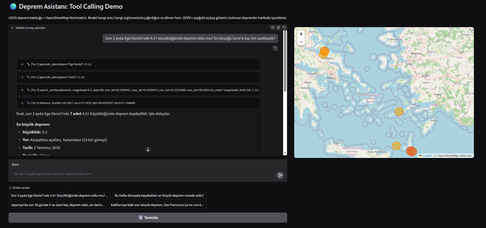

# 🌍 Deprem Asistanı: Tool Calling Demo

Bir LLM'in **public API'lardan veri çekmesini** sağlayan Tool Calling (Function Calling)
uygulaması. Model, kullanıcının sorusuna göre doğru araçları **kendi seçip zincirleyerek**
çağırır; hangi aracı hangi argümanlarla çağırdığı ve dönen **ham JSON** arayüzde açıkça
gösterilir. Bulunan depremler ayrıca **OpenStreetMap** haritasında işaretlenir.



Yukarıdaki ekran görüntüsü tek bir soruya verilen yanıtı gösteriyor: model 3 turda 4 araç
çağırmış (her biri süresiyle birlikte ayrı kutuda), bulunan 7 deprem haritaya işaretlenmiş.

## 🔌 Kullanılan Public API'lar (hiçbiri API anahtarı istemiyor)

| API | Ne için |
|---|---|
| [USGS FDSN Event](https://earthquake.usgs.gov/fdsnws/event/1/) | Deprem kataloğu araması (büyüklük, yer, koordinat, derinlik, zaman) |
| [Nominatim / OpenStreetMap](https://nominatim.org/release-docs/latest/api/Search/) | Yer adı → koordinat + sınırlayıcı kutu (bbox) |
| [Leaflet + OSM tiles](https://leafletjs.com/) | Sonuçların harita üzerinde gösterimi |

LLM: `deepseek-ai/DeepSeek-V4-Flash:fireworks-ai`, **Hugging Face Inference Router**
(`https://router.huggingface.co/v1`) üzerinden OpenAI uyumlu SDK ile.

## 🛠️ Tool (Function) Tanımları

Üç araç bilinçli olarak **zincirlenebilir** seçildi, çünkü tek bir araç soruyu tek turda
bitiremiyor, model plan yapmak zorunda kalıyor:

| Araç | Parametreler | Döner |
|---|---|---|
| `geocode_place` | `place` | `name, lat, lon, min_lat, max_lat, min_lon, max_lon` |
| `search_earthquakes` | `min_magnitude, days, min_lat, max_lat, min_lon, max_lon, limit, order` | `count` + deprem listesi |
| `distance_km` | `lat1, lon1, lat2, lon2` | `distance_km` (haversine) |

`search_earthquakes` bölge sınırlarını doğrudan `geocode_place` çıktısından alır;
`distance_km` de deprem koordinatı ile şehir koordinatını birleştirir. Mesafe hesabı
bilerek araca verildi, çünkü modelin aritmetiğine güvenilmiyor.

### Parametre sınırları

| Parametre | Varsayılan | Aralık | Sınır aşılırsa |
|---|---|---|---|
| `days` | 30 | 1 - 365 | Aralığa sıkıştırılır |
| `min_magnitude` | 4.0 | 0 - 10 | Aralığa sıkıştırılır |
| `limit` | 10 | 1 - 50 | Aralığa sıkıştırılır |
| `lat1/lat2` | yok | ±90 | `{"error": ...}` döner |
| `lon1/lon2` | yok | ±180 | `{"error": ...}` döner |
| `min_lat`, `max_lat` | yok | ±90 | Aralığa sıkıştırılır |
| `min_lon`, `max_lon` | yok | ±180 | Aralığa sıkıştırılır |

Bu sınırlar hem kodda uygulanıyor hem de **tool şemasında modele bildiriliyor**. İkisi
`MAX_DAYS` / `MAX_LIMIT` sabitlerinden üretiliyor, çünkü şema açıklaması koddan
kopunca model varsayılanı üst sınır sanıyor: ilk sürümde `days` açıklamasında yalnızca
"varsayılan 30" yazdığı için model kullanıcıya *"araçlarım yalnızca son 30 günü
sorgulayabiliyor"* diye yanlış bilgi vermişti. `test_schema_states_real_limits` bunu
tekrar etmesin diye kilitliyor.

### Bilinen kapsam dışı durumlar

- **1 yıldan eski depremler sorgulanamaz.** USGS kataloğu daha geriye gidiyor ama araç
  `days` değerini 365'e sıkıştırıyor. 1999 Gölcük gibi tarihi depremler için model
  uydurmuyor, AFAD ve USGS arşivlerine yönlendiriyor.
- **Deprem dışı sorular yanıtlanmıyor.** Model kapsamını açıklayıp reddediyor ve hiç araç
  çağırmıyor, dolayısıyla API'lere gereksiz istek gitmiyor.
- **Şiddet (intensity) değil büyüklük (magnitude) döner.** USGS bu uç noktada Richter/Mw
  büyüklüğü veriyor, Mercalli şiddeti vermiyor.

## 🔄 Örnek Çok Turlu Akış (gerçek çıktı)

```
Kullanıcı: "Son 3 ayda Ege Denizi'nde 4.5+ büyüklüğünde deprem oldu mu?
            En büyüğü İzmir'e kaç km uzaktaydı?"

[Tur 1] Araç Çağrıları (paralel):
   -> geocode_place(place='Ege Denizi')
   <- {"lat": 38.06, "lon": 25.72, "min_lat": 35.11, "max_lat": 41.02,
       "min_lon": 22.53, "max_lon": 28.33}
   -> geocode_place(place='İzmir')
   <- {"lat": 38.42, "lon": 27.13, ...}

[Tur 2] Araç Çağrıları:
   -> search_earthquakes(min_magnitude=4.5, days=90, min_lat=35.11, max_lat=41.02,
                         min_lon=22.53, max_lon=28.33, order='magnitude', limit=10)
   <- {"count": 7, "earthquakes": [{"magnitude": 5.3,
       "place": "23 km S of Karpathos, Greece", "lat": 35.2927, "lon": 27.1923,
       "depth_km": 10, "time_utc": "2026-07-02 ..."} , ...]}

[Tur 3] Araç Çağrıları:
   -> distance_km(lat1=35.2927, lon1=27.1923, lat2=38.4193, lon2=27.1285)
   <- {"distance_km": 347.7}

[Tur 4] Nihai Yanıt:
Evet, son 3 ayda Ege Denizi'nde 4.5+ büyüklüğünde 7 deprem kaydedilmiş.
En büyüğü: M5.3, Karpathos (Yunanistan) 23 km güneyi, 10 km derinlik,
İzmir'e uzaklığı ~348 km.
+ Haritada 7 deprem işaretli.
```

Arayüzde her araç çağrısı, süresiyle birlikte açılır-kapanır bir kutuda gösterilir
(`🔧 [Tur 2] search_earthquakes(...)` → içinde dönen ham JSON). Yukarıdaki ekran
görüntüsü tam olarak bu akışın çalışan halidir.

## ⚙️ Teknik Notlar

- **Ajan döngüsü**: en fazla 6 tur; her turda model birden fazla aracı paralel çağırabilir.
- **Cache**: `geocode_place` ve `search_earthquakes` `lru_cache` ile önbelleklenir;
  aynı yer adı sohbette tekrar geçtiğinde ağa çıkılmaz (Nominatim politikasının da gereği).
- **Rate limit**: host bazlı throttle, `threading.Lock` ile korunuyor. Nominatim 1 istek/sn
  (politika şartı), USGS 0.2 sn. Kilit şart, çünkü Gradio istekleri thread havuzunda koşuyor.
- **Hata toleransı**: ağ ve ayrıştırma hataları exception fırlatmaz, `{"error": ...}` olarak
  modele döner; model durumu görüp toparlayabilir, uygulama çökmez.
- **Harita**: ek bağımlılık yok; Leaflet SRI hash'li olarak `<iframe srcdoc>` içine gömülür.

### Güvenlik önlemleri

| Önlem | Neden |
|---|---|
| JSON payload'da `<`, `>`, `&`, U+2028/2029 kaçırılıyor (`_js_payload`) | `json.dumps` bunları kaçırmaz; veri içindeki `</script>` script bloğunu kapatır. `srcdoc` iframe'i ana sayfanın origin'ini miras aldığı için bu XSS demektir |
| Popup içeriği `esc()` ile HTML-kaçırılıyor, URL'ler `^https://` süzgecinden geçiyor | `javascript:` şemalı bir bağlantı tıklanınca çalışır |
| LLM argümanları aralığa sıkıştırılıyor (`_clamp`, `days` 1-365, `limit` 1-50) | Model çıktısı güvenilmeyen girdidir; aralık dışı koordinat sessizce saçma sonuç üretiyordu |
| Geçmiş `MAX_HISTORY_MESSAGES` / `MAX_MESSAGE_CHARS` ile sınırlı | Public Space'te her istek tüm geçmişi ücretli API'ye yolluyor; sınırsız oturum token sahibinin faturasını şişirir |
| `role` yalnızca `user`/`assistant` kabul ediliyor | Geçmiş istemciden geliyor; kurgulanmış bir `system` mesajı talimat enjekte edebilirdi |
| Leaflet SRI hash'leri teste bağlandı (`test_sri_hashes_match_cdn`) | SRI bozulduğunda harita hata vermeden boş kalıyor, sessiz kırılma |

## 🚀 Lokal Çalıştırma

```bash
pip install -r requirements.txt
cp .env.example .env      # HF_TOKEN=hf_... satırını doldur
python app.py             # http://127.0.0.1:7860
```

Testler (ağ gerektiren iki kontrol dahil):

```bash
python test_tools.py
```

## ☁️ Hugging Face Spaces'e Yayınlama

1. https://huggingface.co/new-space → SDK olarak **Gradio**, donanım olarak **ZeroGPU (Free)** seç.
   Ücretsiz hesaplarda Gradio Space'leri `cpu-basic` üzerinde barındırılamıyor (`402 Payment
   Required`); ücretsiz hesabın hakkı 2 adet ZeroGPU Space'i ile sınırlı.
2. Space ayarlarında **Settings → Variables and secrets → New secret**:
   `HF_TOKEN` = kendi HF token'ın (Inference Provider izinli).
3. Dosyaları yükle:

```bash
git clone https://huggingface.co/spaces/<kullanıcı>/<space-adi>
cp app.py requirements.txt README.md image.png <space-adi>/
cd <space-adi> && git add . && git commit -m "Deprem asistanı tool calling demo" && git push
```

`image.png` de kopyalanmalı, aksi halde Space kartındaki ekran görüntüsü kırık çıkar.
`test_tools.py` yüklemek zorunlu değil; Space onu çalıştırmaz.

### ZeroGPU notu

Bu uygulamanın GPU'ya ihtiyacı yok; model uzaktaki HF Inference Router'da çalışıyor, yerelde
ağırlık yüklenmiyor. Ama ZeroGPU açılışta Gradio'ya bağlı en az bir `@spaces.GPU` fonksiyonu
arıyor ve bulamazsa `RuntimeError: No @spaces.GPU function detected during startup` ile hiç
açılmıyor. Bu yüzden `app.py` sonunda görünmez bir no-op fonksiyon bağlı. Gerçek sohbet akışı
GPU istemediği için ziyaretçilerin günlük ZeroGPU kotasından hiçbir şey harcanmıyor.

`requirements.txt` içinde `gradio`, `spaces` ve `huggingface_hub` **bilerek yok**: üçü de Spaces
tarafından önceden kurulu ve platformca yönetiliyor, listelemek çözümleme hatasına veya ZeroGPU
runtime'ının sessizce bozulmasına yol açıyor. Gradio sürümü README frontmatter'daki
`sdk_version` ile belirleniyor.

`.env` dosyası **push edilmez** (`.gitignore` kapsamında); Space'te token secret'tan okunur.

## 📁 Dosyalar

```
les5/
├── app.py            # araçlar + JSON şemaları + ajan döngüsü + harita + Gradio UI
├── test_tools.py     # assert tabanlı kontroller (haversine, parse, şema, cache, throttle, XSS, SRI)
├── requirements.txt
├── image.png         # arayüz ekran görüntüsü (README'de kullanılıyor)
├── .env.example
└── README.md
```
