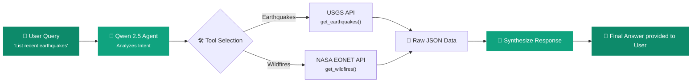

<div align="center">

# 🌍 Agentic Disaster Tracker

### AI-Powered Natural Disaster Intelligence

**Ask questions about global earthquakes and wildfires in natural language — driven by autonomous AI agents.**

[](https://python.org)
[](https://gradio.app/)
[](https://huggingface.co/Qwen)
[](LICENSE)

<br/>

[Features](#-features) · [How It Works](#-how-it-works) · [Installation](#-installation) · [Tech Stack](#-tech-stack)

</div>

---

## ❓ What is Agentic Disaster Tracker?

Agentic Disaster Tracker is an intelligent, autonomous agent designed to fetch real-time global disaster data. By seamlessly integrating **Tool Calling (Function Calling)** capabilities, the system bridges the gap between Large Language Models (LLMs) and real-world Public APIs. 

Ask the AI about recent earthquakes or active wildfires, and the underlying **Agentic Loop** will autonomously decide which API to call, fetch the live data, and synthesize a comprehensive, natural language response.

> **Transparent Intelligence:** Watch the AI think! Every tool call, parameter, and raw JSON response is displayed in real-time, offering a completely transparent view into the model's decision-making process.

---

## ✨ Features

| Feature | Description |
|---|---|
| 🤖 **Autonomous Tool Calling** | The assistant intelligently decides whether to query the Earthquake API or the Wildfire API based purely on your conversational input. |
| 🔍 **Transparent Execution** | The UI explicitly reveals the AI's internal monologue, the exact API functions it triggers, the parameters sent, and the raw data received. |
| 🧠 **Powerful Qwen 2.5 LLM** | Powered by `Qwen/Qwen2.5-7B-Instruct`, a state-of-the-art open-source model highly optimized for complex function calling tasks. |
| ⚡ **ZeroGPU Serverless Execution** | Seamlessly deployed on Hugging Face Spaces using the `@spaces.GPU` decorator, ensuring efficient, serverless inference for a 7B model. |
| 🌍 **Live Public API Integration** | Directly connected to USGS (United States Geological Survey) and NASA EONET for up-to-the-minute global disaster data. |

---

## 🧠 How It Works



**Pipeline in detail:**

1. **Input** — You ask a natural language question (e.g., "Were there any magnitude 5.5+ earthquakes in the last 3 days?").
2. **Analysis** — The Qwen 2.5 model parses your request and identifies the need for external data.
3. **Execution** — The Agentic Loop triggers the appropriate python function (Tool Call) with the correct parameters (dates, magnitude).
4. **Data Retrieval** — Live data is fetched from public USGS or NASA endpoints.
5. **Synthesis** — The model ingests the raw JSON output and formulates a human-readable, conversational summary.

---

## 🛠️ Installation

Run the Agentic Disaster Tracker locally on your machine.

### 1. Clone the Repository

```bash
git clone https://github.com/MertAlii/Agentic-Disaster-Tracker.git
cd Agentic-Disaster-Tracker
```

### 2. Install Dependencies

> ⚠️ Note: Running a 7B parameter model locally requires adequate RAM and ideally a dedicated GPU.

```bash
pip install -r requirements.txt
```

### 3. Start the Application

```bash
python app.py
```

The Gradio web interface will launch and be available at `http://127.0.0.1:7860/`.

---

## 🏗️ Tech Stack

<div align="center">

| Layer | Technology | Role |
|---|---|---|
| **Frontend UI** | Gradio 4.44.1 | Interactive Chat Interface |
| **LLM Engine** | Qwen/Qwen2.5-7B-Instruct | Intent parsing, Tool Calling & Synthesis |
| **Inference Hardware** | Hugging Face ZeroGPU | Serverless GPU acceleration |
| **Earthquake Data** | USGS Earthquake API | Real-time seismic event tracking |
| **Wildfire Data** | NASA EONET API | Active global wildfire monitoring |

</div>

---

<div align="center">

**Built with ❤️ for the Tool Calling Assignment.**

</div>
