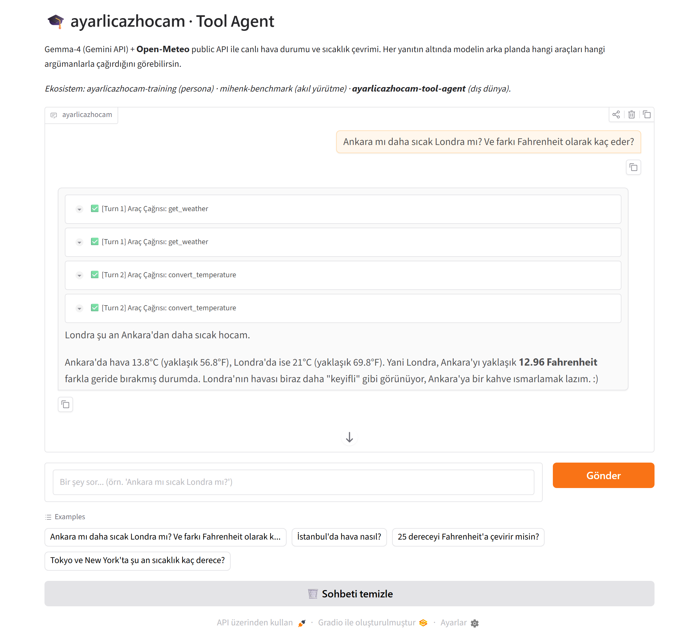

---
---

# ayarlicazhocam · Tool Agent

A live Gradio app on Hugging Face Spaces where a language model connects to an
open **public API** via **Tool / Function Calling** and answers using real-world
data.

The model is **Gemma-4** (served through the Gemini API, native function calling).
It pulls live weather from the **Open-Meteo** public API (no API key required) and
converts temperature units. After every answer, the interface transparently shows
**which tools the model called, with which arguments, and what they returned**.

> **Model note:** The project initially targeted `gemma-4-12b-it`, but when the
> model ID was verified against the Gemini API's live model list, that size turned
> out not to be served over the API (available Gemma-4 models: `gemma-4-26b-a4b-it`,
> `gemma-4-31b-it`). Since this project uses the model _through the API_, size does
> not affect local VRAM; the default is **`gemma-4-26b-a4b-it`** (MoE, ~4B active
> parameters). The model ID is **not hard-coded** — it is resolved from the live
> list and can be overridden with the `MODEL_ID` environment variable.

> **ayarlicazhocam ecosystem**
>
> - [`ayarlicazhocam-training`](https://github.com/gorkemergune/ayarlicazhocam-training) — identity/persona (LoRA fine-tune)
> - [`mihenk-benchmark`](https://github.com/gorkemergune/mihenk-benchmark) — reasoning evaluation
> - **`ayarlicazhocam-tool-agent`** (this repo) — interaction with the outside world

---

## Demo



The screenshot shows the running Gradio app: the chat answer plus the expandable
**"Araç Çağrısı" (Tool Call)** blocks under it, one per tool invocation, labeled
by turn.

### Example run (real, live data)

**Question:** _"Ankara mı daha sıcak Londra mı? Ve farkı Fahrenheit olarak kaç eder?"_
(“Is Ankara or London warmer? And what is the difference in Fahrenheit?”)

The output below is captured from an actual run against the live Open-Meteo API:

```
[Turn 1] Tool calls:
  • get_weather(city="Ankara")  -> {"city":"Ankara","temperature_c":13.8,"condition":"açık", ...}
  • get_weather(city="Londra")  -> {"city":"Londra","temperature_c":21.0,"condition":"açık", ...}

[Turn 2] Tool calls:
  • convert_temperature(value=13.8, to_unit="F") -> {"converted_value":56.84, ...}
  • convert_temperature(value=21.0, to_unit="F") -> {"converted_value":69.8, ...}

Final answer (ayarlicazhocam persona):
  Londra şu an Ankara'dan daha sıcak hocam.
  Ankara'da hava 13.8°C (yaklaşık 56.8°F), Londra'da ise 21°C (yaklaşık 69.8°F).
  Yani Londra, Ankara'yı yaklaşık 12.96 Fahrenheit farkla geride bırakmış durumda.
```

This exact run is the one shown in the screenshot above.

Note how the model issues **two `get_weather` calls in the first turn**, then
**two `convert_temperature` calls in the next turn**, and computes the difference
itself. Numbers change on every run since the data is live.

---

## Architecture

```
User (Gradio chat)
  └─> google-genai SDK ──> Gemma-4 (Gemini API)
        • system_instruction: ayarlicazhocam persona
        • tools: [get_weather, convert_temperature]
  <── model returns a function_call
        │
        ▼
  Python side (tools.py): VALIDATE arguments → real Open-Meteo request
        │  (geocoding → forecast)
        ▼
  sent back to the model as a function_response
        │
        ▼
  model produces the final natural-language answer
        │
        ▼
  Gradio: shows both the tool-call trace (collapsible) and the final answer
```

The model can call several tools in a row (e.g. a separate `get_weather` per
city, then `convert_temperature`). The app supports this multi-turn loop and
renders every step as its own "Tool Call" block in the UI.

## Tools

| Tool                  | Arguments                           | What it does                                                                           | Source         |
| --------------------- | ----------------------------------- | -------------------------------------------------------------------------------------- | -------------- |
| `get_weather`         | `city: str`                         | Geocodes the city to lat/lon, returns current temperature/humidity/wind/condition (°C) | Open-Meteo API |
| `convert_temperature` | `value: float`, `to_unit: "C"\|"F"` | Converts temperature (`F` → input treated as °C; `C` → input treated as °F)            | Pure Python    |

Tool schemas are defined with `google.genai.types.FunctionDeclaration` (typed,
rather than hand-written JSON strings). The real HTTP request is **always** made
by the Python code; the model is never given direct code-execution access, and the
returned `function_call` arguments are **validated (type/format)** before execution.

---

## Setup (local)

```bash
pip install -r requirements.txt
cp .env.example .env          # then fill in GOOGLE_API_KEY
python app.py
```

Get a `GOOGLE_API_KEY` from [Google AI Studio](https://aistudio.google.com/app/apikey).
The key is **never** committed to code: locally it lives in `.env` (git-ignored),
and on Spaces it is provided via **Settings → Secrets**.

The model ID is not hard-coded: the app automatically selects a suitable Gemma-4
(instruction-tuned) model from the Gemini API's live list. To pin one manually,
set the `MODEL_ID` environment variable.

## Deploy to Hugging Face Spaces

1. Create a new Space → **SDK: Gradio**.
2. Upload `app.py`, `tools.py`, `requirements.txt`, `README.md`, and `assets/`.
3. Add `GOOGLE_API_KEY` under **Settings → Secrets**.
4. The Space builds and launches automatically.

---

## Tech stack

- **Model:** Gemma-4 (`gemma-4-26b-a4b-it`, Gemini API, `google-genai` SDK) — native function calling
- **Persona:** the ayarlicazhocam identity applied via `system_instruction`
- **API:** Open-Meteo (public, no key) — geocoding + forecast
- **UI:** Gradio (Chatbot, messages format, collapsible tool-call trace)

## Files

- `app.py` — Gemini API client, tool schemas, tool-calling loop, Gradio UI
- `tools.py` — `get_weather` / `convert_temperature` implementations (offline-testable)
- `requirements.txt` — dependencies
- `.env.example` — environment-variable template
- `assets/demo.png` — interface screenshot

## License

Apache 2.0
