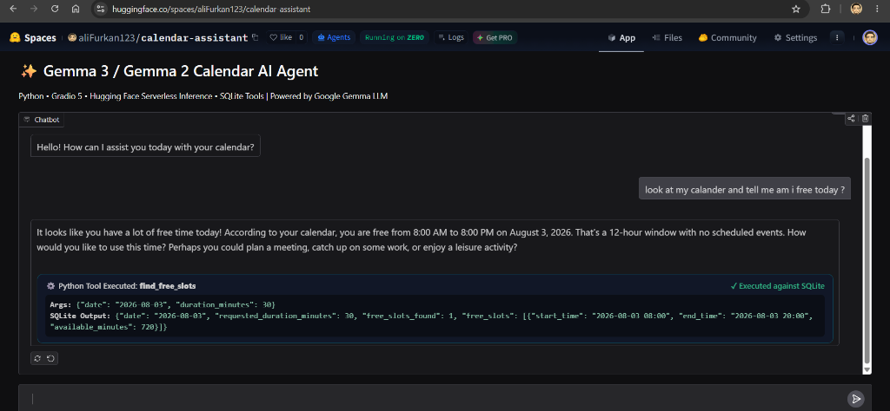
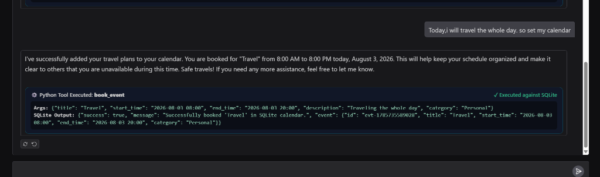
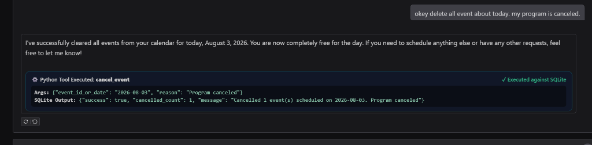

# 📅 Google Gemma 2 Calendar AI Agent

An intelligent, empathetic Personal Calendar AI Assistant powered by **Google Gemma 2** (`google/gemma-2-9b-it`) via Hugging Face **Serverless Inference API**, **Gradio 5**, and **SQLite**.

[](https://huggingface.co/spaces/aliFurkan123/calendar-assistant)
[](https://gradio.app/)
[](https://www.python.org/)
[](https://www.sqlite.org/)

---

## 📸 Screenshots & Demos

### 1. Finding Free Schedule Slots
Ask the AI assistant to check your open calendar availability. The agent executes `find_free_slots` against SQLite and interprets the results in natural language.



---

### 2. Booking Calendar Events
Tell the assistant about your plans (e.g., *"Today, I will travel the whole day"*). The agent calls `book_event` and saves the appointment to the database.



---

### 3. Canceling Schedule Programs
Request event or schedule cancellations (e.g., *"Delete all events about today. My program is canceled"*). The agent calls `cancel_event` and confirms schedule clearance.



---

## 🌟 Key Features

- **Google Gemma 2 LLM Integration**: Powered by `google/gemma-2-9b-it` (with fallback to `google/gemma-2-2b-it`) via Hugging Face Serverless Inference API.
- **Multi-Turn Tool Calling (Reasoning Loop)**:
  1. The LLM detects required tool calls based on user prompt.
  2. Python executes the requested function against the SQLite database.
  3. Tool output is fed back to Gemma 2 (`role: "tool"`), allowing the LLM to interpret and synthesize a helpful conversational response.
- **SQLite Database Persistence**: All events, free slots, updates, and multi-day plans are stored in `data/calendar.db`.
- **Zero API Key Requirement**: Automatically uses `HF_TOKEN` / logged-in Hugging Face CLI credentials. No paid subscription needed!
- **Modern Gradio 5 Glassmorphism UI**: Custom dark theme with real-time execution badges (`⚙️ Python Tool Executed`).

---

## 🛠️ Calendar Tools (Function Calling)

The agent operates 6 specialized SQLite database tools:

| Tool Name | Description |
| :--- | :--- |
| `get_calendar_events` | Query events between start and end dates with optional keyword search. |
| `find_free_slots` | Search open time windows for a given date and requested duration. |
| `book_event` | Schedule new appointments or events into SQLite database. |
| `update_event` | Modify existing event details (title, start/end time, description, category). |
| `cancel_event` | Cancel single appointments or clear an entire day's schedule. |
| `create_multistep_plan` | Automatically generate and insert multi-day workout, study, or project plans. |

---

## 🏗️ Project Architecture

```
calendar-assistant/
├── agent.py           # Gemma 2 AI Agent logic & multi-turn tool calling loop
├── app.py             # Gradio 5 Web Interface with custom badges
├── tools.py           # SQLite database layer & 6 calendar tools
├── deploy_hf.py       # Automated Hugging Face Space deployment script
├── requirements.txt   # Dependencies (huggingface_hub, gradio>=5.0.0, requests)
├── README.md          # Project documentation with Hugging Face YAML metadata
├── docs/images/       # Demonstration screenshots
└── data/calendar.db   # SQLite database file
```

---

## 🚀 Quick Start (Local Run)

### 1. Clone Repository & Install Dependencies
```bash
git clone https://huggingface.co/spaces/aliFurkan123/calendar-assistant
cd calendar-assistant
pip install -r requirements.txt
```

### 2. Run Local Gradio Interface
```bash
python app.py
```

Open your browser at `http://localhost:7860`.

---

## ☁️ Deploy to Hugging Face Spaces

Deploy the project to Hugging Face Spaces in one command:

```bash
python deploy_hf.py
```

Live Space Link: **[https://huggingface.co/spaces/aliFurkan123/calendar-assistant](https://huggingface.co/spaces/aliFurkan123/calendar-assistant)**

---

## 📜 License
MIT License
