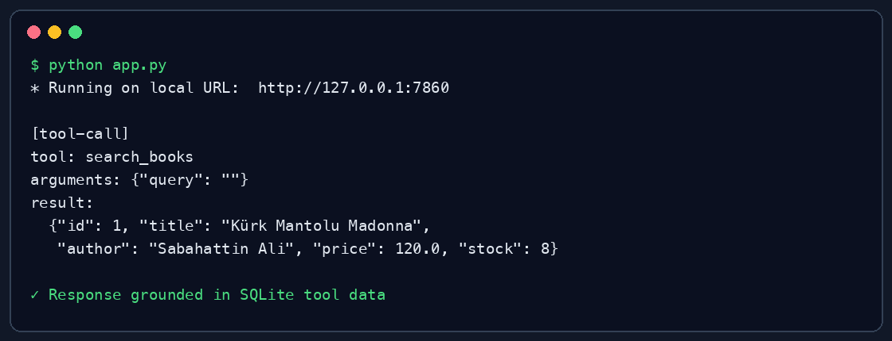

# Türkçe Kitapçı Tool-Calling Asistanı

Hugging Face Inference API üzerindeki açık kaynak bir modelin SQLite veritabanından gerçek kitap bilgisi okuduğu, sipariş oluşturduğu ve sipariş durumunu sorguladığı küçük bir Gradio uygulaması.

- Canlı demo: https://huggingface.co/spaces/enes1863/turkish-bookstore-tool-calling
- GitHub: https://github.com/enshkn/turkish-bookstore-tool-calling
- Chat template: [`chat_template.jinja`](chat_template.jinja)

## Mimari

`app.py`, Qwen3 modeline OpenAI uyumlu tool şemalarını gönderir ve gelen çağrıyı izin verilen Python fonksiyonuna yönlendirir. `bookstore.py`, standart kütüphanedeki `sqlite3` ile veriyi okur/yazar. Model; ürün, fiyat, stok ve sipariş bilgisini tahmin etmemesi, her zaman tool sonucunu kullanması için sistem mesajıyla sınırlandırılmıştır.

Kullanılan model varsayılan olarak `Qwen/Qwen3-32B`'dir. `HF_MODEL` ve `HF_PROVIDER` ortam değişkenleriyle kod değiştirmeden başka bir uyumlu model/sağlayıcı seçilebilir.

### Araçlar

| Tool | İşlev |
|---|---|
| `search_books(query)` | Başlık/yazar arar; fiyat ve stok okur. |
| `create_order(book_id, quantity)` | Sipariş yazar ve stoğu SQLite transaction içinde düşürür. |
| `get_order_status(order_id)` | Kayıtlı sipariş durumunu okur. |

## Custom Chat Template

`chat_template.jinja`; `system`, `user`, `assistant` ve `tool` rollerini ChatML belirteçleriyle ayırır. Tool tanımları sistem bölümüne JSON olarak eklenir; model çağrıları `<tool_call>`, sonuçlar `<tool_response>` bloklarıyla sarılır. `add_generation_prompt` desteği de bulunur.

## Yerelde çalıştırma

Python 3.10+ gerekir.

```bash
python -m venv .venv
source .venv/bin/activate
pip install -r requirements.txt
export HF_TOKEN=hf_...
python app.py
```

Kontrol:

```bash
python test_bookstore.py
```

## Örnek akış ve tool-call kaydı

Kullanıcı girdisi:

```text
Stokta hangi kitaplar var?
```

Arka planda oluşan kayıt:

```json
{"tool":"search_books","arguments":"{\"query\":\"\"}","result":{"books":[{"id":1,"title":"Kürk Mantolu Madonna","author":"Sabahattin Ali","price":120.0,"stock":8}]}}
```



## Hugging Face Space kurulumu

Space ayarlarında `HF_TOKEN` adlı secret tanımlanmalıdır. SQLite dosyası Space yeniden başladığında yeniden oluşturulur; bu demo için siparişlerin kalıcı olması amaçlanmamıştır.

