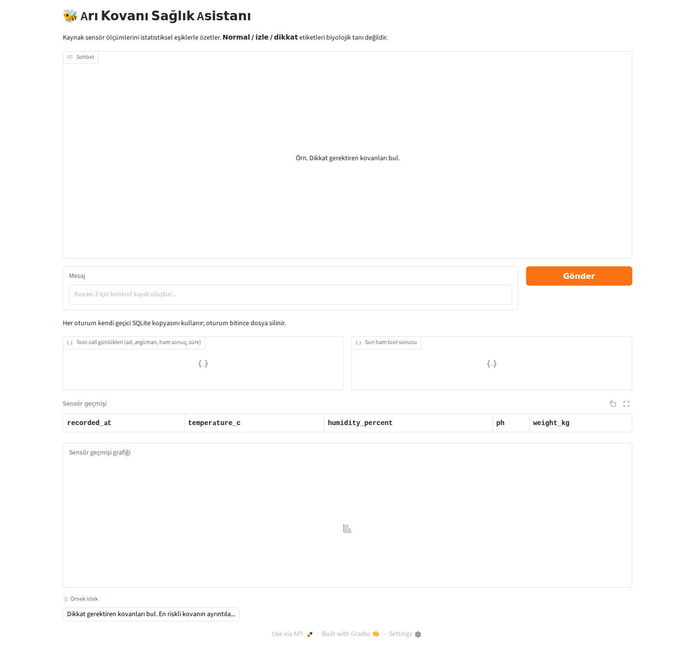
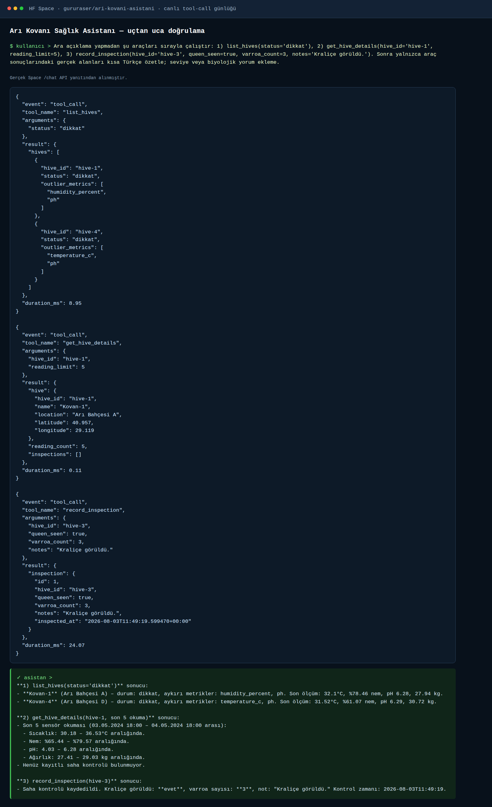

# Ödev 2 — Arı Kovanı Sağlık Asistanı

Bu klasör kendi başına çalışan bir Gradio + SQLite tool-calling uygulamasıdır. Kovan bilgisi gereken her model yanıtından önce `list_hives`, `get_hive_details` veya `record_inspection` aracını kullanır. Araç çağrısı, argümanları, ham JSON sonucu ve süre ayrı kutularda görünür; sensör geçmişi tablo ve grafik olarak gösterilir.



Bu görsel, doğrulanmış ilk responsive Gradio arayüzü ekran görüntüsüdür; sahte bir tool sonucu veya uydurma terminal günlüğü değildir.

HF ZeroGPU başlangıç denetimi için yalnızca `spaces` paketi mevcutsa görünmez, bir saniyelik bir no-op GPU fonksiyonu bağlanır. Gerçek sohbet ve model çağrıları uzak HF Router’da çalışır; bu no-op sohbet isteklerini GPU’ya yönlendirmez ve sohbet için GPU kotası tüketmez. Yerel `.venv` içinde `spaces` yoksa import güvenle `None` olur.

Durum etiketleri tıbbi/biyolojik tanı değildir. Her metrik için kaynak dağılımının %10–%90 aralığı kullanılır: sıfır aykırı `normal`, bir aykırı `izle`, iki veya fazlası `dikkat`.

## Mimari

`app.py` Gradio 6.20 arayüzüdür. Her kullanıcı oturumu `gr.State` içinde geçici SQLite dosyası taşır ve yaşam süresi dolunca silinir. `database.py` üç tabloyu oluşturur; `data_loader.py` Kaggle CSV’sindeki 3.000 gerçek sensör satırını altı sentetik kovana deterministik olarak dağıtır. `agent.py` kovan alanındaki sorgularda ilk model isteğine `tool_choice="required"` gönderir; genel selamlaşmalarda `auto` kullanır ve en fazla dört tur sürer. `llm.py`, HF Inference Router’ın OpenAI uyumlu uç noktasına bounded timeout/retry/token ayarlarıyla bağlanır.

Kullanıcı girdisi en fazla `MAX_USER_MESSAGE_CHARS=2000`; geçmiş en fazla `MAX_HISTORY_MESSAGES=20` mesaj ve mesaj başına `MAX_HISTORY_CONTENT_CHARS=2000` karakterdir. Araç döngüsü `MAX_TOOL_ROUNDS=4`, Router isteği `MAX_COMPLETION_TOKENS=4096`, 30 saniye timeout ve en fazla iki retry ile sınırlıdır. Bu sınırlar public Space maliyetini ve kötüye kullanımı sınırlar.

## Model ve veri

- Model: [`deepseek-ai/DeepSeek-V4-Flash:fireworks-ai`](https://huggingface.co/deepseek-ai/DeepSeek-V4-Flash), HF Inference Router üzerinden; model lisansı MIT olarak belirtilmiştir.
- Veri: [Honey Bee Hive Monitoring Dataset](https://www.kaggle.com/datasets/sharannagarajan06/honey-bee-hive-monitoring-dataset), CC0: Public Domain.
- `data/honey_bee_dataset.csv` içindeki sıcaklık, nem, pH ve ağırlık değerleri 3.000 satırın tamamında korunur. Kovan kimliği/adı/konumu ve UTC zamanı sentetiktir: altı kovana satır sırasına göre döngüsel atama, `2024-01-01T00:00:00Z` başlangıcı.
- HF Space ephemeral disk kullanır; yeniden başlatma SQLite kayıtlarını silebilir.

## Kurulum ve test

Proje kökünde:

```bash
source .venv/bin/activate
pip install -r les6/odev2_beehive_assistant/requirements.txt
export HF_TOKEN=hf_...
cd les6/odev2_beehive_assistant
python -m pytest -q -W error
python -m py_compile *.py
python app.py
```

`HF_TOKEN` yoksa import ve DB/tool testleri çalışır; canlı model isteği kullanıcıya genel `MODEL_ERROR` döndürür. İsteğe bağlı Router smoke testi token ayarlı değilse skip edilir.

## Örnek istek ve araç sonucu

> Dikkat gerektiren kovanları bul. En riskli kovanın ayrıntılarını göster ve Kovan-3 için kraliçenin görüldüğü, varroa sayısının 3 olduğu bir kontrol kaydı oluştur.

Doğrulanmış canlı Space API akışı şu sırayı kullandı:

1. `list_hives(status='dikkat')`
2. `get_hive_details(hive_id='hive-1', reading_limit=5)`
3. `record_inspection(hive_id='hive-3', queen_seen=true, varroa_count=3, notes='Kraliçe görüldü.')`



Bu ekran görüntüsü gerçek canlı Space API yanıtından render edilmiştir; uydurma bir tool sonucu değildir. Yazma çağrısı izole ephemeral oturumda `inspection id 1` döndürdü; kalıcı saklama iddiası yoktur. Son yazma çağrısı okuma sonucu içermese bile ekran, ters yöndeki tool günlüklerinden son `readings`/`hives` sonucunu bulup tablo ve grafiği korur. Bilinmeyen kovan, geçersiz varroa/not ve DB hataları yapılandırılmış `{ "error": { "code": ..., "message": ... } }` sonucudur.

## HF Space teslimi

Bu klasör tek başına Space kaynağıdır:

<https://huggingface.co/spaces/gururaser/ari-kovani-asistani>

GitHub klasörü: <https://github.com/gururaser/magibu-uygulamali-yz-egitim/tree/main/les6/odev2_beehive_assistant>
