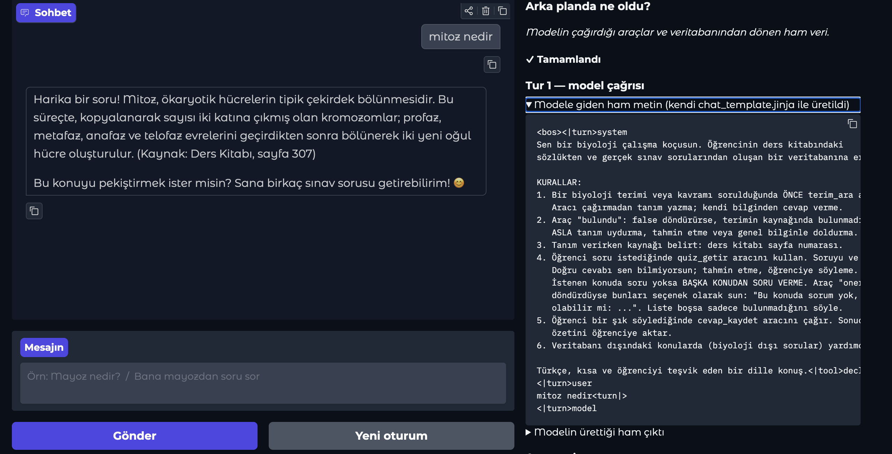
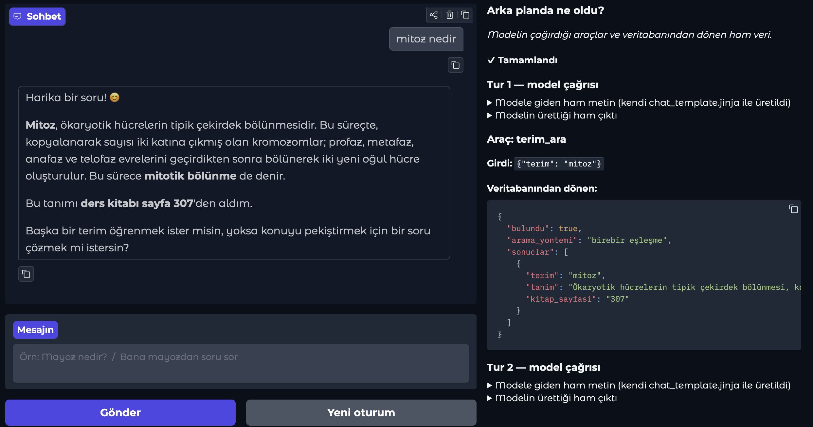

# Biyoloji Çalışma Koçu

Tool-calling destekli bir çalışma asistanı. Öğrenci sohbet eder; model terim tanımlarını
ve sınav sorularını **veritabanından** çeker, öğrencinin cevaplarını **veritabanına yazar**.
Yanıtlar modelin kendi bilgisine değil, araçlardan dönen gerçek veriye dayanır.

**Canlı demo:** https://nyzmemre-biyoloji-calisma-kocu.hf.space

**Space sayfası:** https://huggingface.co/spaces/nyzmemre/biyoloji-calisma-kocu

**Kaynak kod:** https://github.com/nyzmemre/biyoloji-calisma-kocu

## Senaryo

Veri uydurulmadı; iki gerçek kaynak kullanıldı:

| Tablo | Kayıt | Kaynak |
|---|---|---|
| `terimler` | 1000 | Biyoloji ders kitabı sözlüğü (terim + tanım + sayfa no) |
| `sorular` | 102 | Gerçek sınav soruları, 5 şıklı, cevap anahtarlı |
| `quiz_sonuclari` | — | Çalışma sırasında yazılır |

Soru bankası belirli ünitelerden derlendiği için kapsamı sözlükten dardır: hücre (35 soru),
DNA (16), protein (15), enzim (6), mayoz (4), mitoz (3). Fotosentez, solunum ve kalıtım
konularında soru yoktur — bu terimlerin **tanımı** sözlükte bulunur ancak **sorusu** yoktur.
Sistem bu durumda soru uydurmaz, başka konudan da soru vermez.

### Araçlar

| Araç | İşlem | Açıklama |
|---|---|---|
| `terim_ara(terim)` | **Okuma** | Sözlükten tanım ve ders kitabı sayfa numarası |
| `quiz_getir(konu, adet)` | **Okuma** | Soru bankasından soru. Doğru cevabı modele göndermez |
| `cevap_kaydet(soru_id, cevap)` | **Yazma** | Cevabı değerlendirir, `quiz_sonuclari` tablosuna INSERT eder, ilerleme özeti döner |

## Halüsinasyon engelleme

Bu senaryoda model biyolojiyi zaten "biliyor" — yani uydurabilir. Bunu engellemek için
üç katman kullanıldı:

1. **Sistem talimatı** — terim sorulduğunda önce aracı çağırma zorunluluğu, araç boş dönerse
   tanım uydurma yasağı (`koc/prompt.py`).
2. **Araç yanıtı** — kayıt bulunamazsa araç `{"bulundu": false, "not": "Tanım uydurma..."}`
   döndürür. Model bu alanı görür (`koc/araclar.py`).
3. **Şeffaflık** — arayüzde her tool-call'ın girdisi ve ham çıktısı gösterilir; cevabın
   veritabanından mı geldiği doğrudan denetlenebilir.

Ayrıca doğru cevap `quiz_getir` yanıtında yer almaz — model onu bilmediği için öğrenciye
sızdıramaz. Öğrenci kimliği de modelden alınmaz, sunucu tarafında zorlanır.

## Mimari

```
kullanıcı mesajı
   -> app.py (Gradio)
   -> koc/ajan.py         tool yönlendirme döngüsü, backend'den bağımsız
        -> koc/llm/*      model backend'i (Groq veya yerel Ollama)
        -> koc/araclar.py araç fonksiyonları + JSON şemaları
             -> koc/db.py SQLite (SQL yalnızca burada)
```

| Dosya | Sorumluluk |
|---|---|
| `app.py` | Gradio arayüzü, tool-call log paneli |
| `koc/ajan.py` | Ajan döngüsü: model çağır, tool_call'ları çalıştır, sonucu geri besle |
| `koc/prompt.py` | Sistem talimatı |
| `koc/araclar.py` | Üç araç ve JSON şemaları, fonksiyon yönlendirme |
| `koc/db.py` | Veritabanı bağlantısı ve sorgular |
| `koc/llm/groq_backend.py` | Bulut backend (canlı demo) |
| `koc/llm/ollama_backend.py` | Yerel backend, projenin kendi chat template'i ile |
| `koc/chat_template.jinja` | Bu proje için yazılan özel Jinja2 chat template |
| `kurulum.py` | JSON kaynaklarından SQLite üretimi |

## Model ve iki backend

Sistem tek bir modele bağlı değil; `koc/llm/` altındaki backend'ler aynı sözleşmeyi sağlar:

```python
sohbet(messages, tools) -> {"content": str | None, "tool_calls": [...]}
```

| Backend | Model | Chat template nerede uygulanır? |
|---|---|---|
| `GroqBackend` | Llama 3.3 70B (açık kaynak, Groq altyapısı) | Sunucu tarafında — projenin şablonu devrede değil |
| `OllamaBackend` | Gemma 4 (yerel, Ollama) | **Bu projede** — `koc/chat_template.jinja` ile |

Canlı demo Groq kullanır (hız ve güvenilirlik). Yerel backend ise projenin kendi chat
template'inin gerçekten çalıştığını gösterir: `messages` + `tools` listesi şablonla düz metne
çevrilir ve Ollama'ya `raw=True` gönderilir, böylece Ollama'nın kendi şablonu devre dışı kalır.
Modelin ürettiği Gemma DSL biçimindeki tool-call metni (`<|tool_call>call:ad{...}<tool_call|>`)
`ollama_backend.py` içinde parse edilir.

## Karşılaşılan sorunlar ve çözümleri

### Alt-dize araması alakasız sonuç döndürüyordu

"tit kavramıyla ilgili soru getir" denendiğinde sistem amino asit kodonlarıyla ilgili
alakasız bir soru getirdi. İnceleyince arama `LIKE '%tit%'` olduğu için "nükleo**tit**"
ve "kroma**tit**" kelimelerinin içine düştüğü, 102 sorudan 14'ünün eşleştiği görüldü.

Dikkat çekici olan, zincirin her halkasının kendi işini doğru yapmış olmasıdır: model
konuyu ayırt edip `quiz_getir(konu="tit")` çağırmış, dönen veriyi de sorgulamadan
aktarmıştı — ki halüsinasyona karşı ondan tam olarak bu isteniyor. Hata modelde değil,
arama katmanındaydı. Tool-calling sistemlerinde kalitenin büyük kısmı modelde değil,
verinin getirildiği katmanda belirlenir.

Arama kelime sınırına taşındı (`\btit\w*`). Sondaki `\w*` bilinçlidir: Türkçe eklemeli
bir dil olduğu için "mayoz" araması "mayozda", "mayozun" biçimlerini de bulmalıdır.

### Sonuç bulunamadığında kullanıcı çıkmaza giriyordu

Kelime sınırı eklendikten sonra yanlış eşleşme bitti ama bu sefer "sonuç yok" cevabı
kullanıcıyı boşlukta bırakıyordu. Arama dört kademeye çıkarıldı; her kademe bir
öncekinin kör noktasını kapatır ve pahalı olan sona bırakılır:

| Kademe | Yöntem | Örnek |
|---|---|---|
| 1 | Birebir eşleşme (indeksli) | `mayoz` → mayoz |
| 2 | Aksansız birebir | `nukleotit` → nükleotit |
| 3 | Aksansız alt-dize | `hucre zari` → hücre zarı (plazma zarı) |
| 4 | Benzerlik (`difflib`) | `fotosentz` → fotosentez, `mayos` → mayoz |

Öneriler `oneriler` alanıyla modele iletilir; model bunları "şunlardan biri olabilir mi?"
diye sunar. Alakasız bir arama (`zebra`) hiçbir kademede eşleşmez ve öneri listesi boş kalır.

Öneri üretilirken aday terimin soru bankasında **gerçekten sorusu olduğu** doğrulanır.
Aksi halde kullanıcı öneriyi seçer, yine boş sonuç alır ve iki kez hayal kırıklığına uğrar.

#### Yazım hatalarında "bunu mu demek istediniz?"

Dördüncü kademe pratikte bir yazım düzeltme mekanizması gibi çalışır. Kullanıcı terimi
yanlış yazdığında sistem sessizce boş dönmek yerine en yakın sözlük terimini önerir:

```
KULLANICI: ay yanlış yazmışım kardeş. mitz nedir diye soracaktım kusura bakma

  [TOOL] terim_ara({'terim': 'mitz'})
         -> {'bulundu': False, 'aranan': 'mitz', 'oneriler': ['mitoz'], ...}

ASİSTAN: "Mitz" terimi de maalesef sözlük veritabanımda bulunmuyor. Ancak, aradığın
terim "mitoz" olabilir mi? Eğer öyleyse, "mitoz" teriminin tanımını getirebilirim.
```

Desteklenen yazım hatası türleri:

| Girdi | Öneri | Hata türü |
|---|---|---|
| `mitz` | mitoz | eksik harf |
| `mayos` | mayoz | yanlış harf |
| `kromozon` | kromozom | yanlış harf |
| `fotosentz` | fotosentez | eksik harf |
| `nukleotit` | nükleotit (doğrudan bulunur) | Türkçe karakter yazılmamış |
| `hucre zari` | hücre zarı (plazma zarı) | Türkçe karakter yazılmamış |
| `zebra` | (öneri yok) | sözlükte karşılığı olmayan kelime |

**Öneri sunulur, otomatik uygulanmaz.** Model düzeltilmiş terimle kendiliğinden arama
yapıp sonucu doğruymuş gibi sunmaz; kullanıcıdan onay ister. Bu bilinçli bir tercihtir:
projenin temel kuralı modelin tahmin yürütmemesidir ve "muhtemelen bunu kastetti"
demek de bir tahmindir. Onay adımı, yanlış terime sessizce sapmayı engeller.

Eşik değeri `difflib` benzerlik oranında 0.75'tir. Daha düşük bir eşik alakasız
kelimeleri (örneğin `zebra`) önermeye başlar; daha yükseği ise gerçek yazım hatalarını
kaçırır.

### İki backend'i karşılaştırırken görülenler

- **Tip esnekliği gerekiyor.** Groq araç çağrılarını şemaya karşı sunucu tarafında doğrular.
  Model `adet` parametresini `"1"` (string) gönderdiğinde istek 400 ile reddedildi. Şemada
  ilgili alanlar `string` yapılıp çevirim veri katmanına alındı. Yerel backend'de doğrulama
  olmadığı için bu hata hiç görünmüyordu — sessizce geçerdi.
- **Kimlik parametresi modele bırakılmamalı.** Model `ogrenci_id` alanını kendiliğinden
  `"misafir"` olarak doldurdu. Alan şemadan çıkarıldı ve değeri ajan katmanında zorlanıyor.

## Yerelde çalıştırma

```bash
git clone https://github.com/nyzmemre/biyoloji-calisma-kocu.git
cd biyoloji-calisma-kocu

python -m venv .venv && source .venv/bin/activate
pip install -r requirements.txt

python kurulum.py          # JSON kaynaklarından SQLite veritabanını üretir
```

Ardından iki seçenek var:

**Groq ile (bulut):**
```bash
echo "GROQ_API_KEY=..." > .env     # console.groq.com/keys
python app.py
```

**Yerel model ile (Ollama, kendi chat template'imizle):**
```bash
ollama pull gemma4
python app.py                      # GROQ_API_KEY yoksa otomatik yerel backend
```

Arayüzsüz akış testi:
```bash
python test_akis.py                # yerel backend
python test_akis.py groq           # Groq backend
```

## Örnek çalışma ve tool-call kaydı

Aşağıdaki çıktı `python test_akis.py groq` komutundan alınmıştır.

```
========================================================================
KULLANICI: Mayoz nedir?
------------------------------------------------------------------------
  [TOOL] terim_ara({'terim': 'mayoz'})
         -> {'bulundu': True, 'sonuclar': [{'terim': 'mayoz', 'tanim': 'Eşey organlarında
            eşey hücrelerinin oluşması sırasında diploit veya somatik kromozom sayısının
            yarıya indiği ve dört haploit hücrenin oluştuğu hücre bölünmesi tipi...',
            'kitap_sayfasi': '216', ...}]}

ASİSTAN: Mayoz, eşey organlarında eşey hücrelerinin oluşması sırasında diploit veya somatik
kromozom sayısının yarıya indiği ve dört haploit hücrenin oluştuğu hücre bölünmesi tipidir.
Bu bilgi, ders kitabının 216. sayfasında bulunabilir.

========================================================================
KULLANICI: Kuantum fotosentezi nedir?        <-- HALÜSİNASYON TESTİ
------------------------------------------------------------------------
  [TOOL] terim_ara({'terim': 'kuantum fotosentezi'})
         -> {'bulundu': False, 'aranan': 'kuantum fotosentezi',
             'not': 'Bu terim sözlükte yok. Tanım uydurma; kaynakta bulunmadığını söyle.'}

ASİSTAN: Maalesef "kuantum fotosentezi" terimi kaynakta bulunamadı.

========================================================================
KULLANICI: Bana mayoz konusundan bir soru sor
------------------------------------------------------------------------
  [TOOL] quiz_getir({'adet': '1', 'konu': 'mayoz'})
         -> {'bulundu': True, 'sorular': [{'soru_id': 20, 'soru': 'İnsanlarda normal bir
             yumurta hücresi; I. mayoz bölünme ile oluşma, II. hareketsiz olma, III. haploit
             kromozom içerme özelliklerinden hangileri...', 'secenekler': {...}}]}
                                            ^-- doğru cevap yanıtta YOK

ASİSTAN: [soru ve şıklar]  Lütfen bir şık seçiniz.

========================================================================
KULLANICI: C
------------------------------------------------------------------------
  [TOOL] cevap_kaydet({'cevap': 'C', 'soru_id': '20', 'ogrenci_id': 'test_ogrenci'})
         -> {'kaydedildi': True, 'dogru_mu': False, 'verilen_cevap': 'C',
             'dogru_cevap': 'B', 'ilerleme': {'toplam_soru': 1, 'dogru_sayisi': 0,
             'basari_yuzdesi': 0.0}}                    ^-- VERİTABANINA YAZILDI

ASİSTAN: Cevap yanlış. Doğru cevap B. İlerleme durumun: 1 soru cevaplandı, 0 doğru,
başarı yüzdesi %0.
```

### Arayüzdeki şeffaflık paneli

Sağ panel yalnızca sonucu değil, tüm zinciri gösterir: modele giden ham metin, modelin
ürettiği ham çıktı, çağrılan araç, aracın girdisi ve veritabanından dönen kayıt.

Modele giden ham metin — bu metni üreten şey projenin kendi `chat_template.jinja`
dosyasıdır (bkz. [gemma4-custom-chat-template](https://github.com/nyzmemre/gemma4-custom-chat-template)):



Modelin ürettiği ham çıktı — parse edilmeden önceki hâli:



## Notlar

- Space ücretsiz donanımda çalıştığı için disk kalıcı değildir; Space yeniden başladığında
  `quiz_sonuclari` tablosu sıfırlanır. Terim ve soru tabloları `kurulum.py` ile yeniden üretilir.
- Hugging Face'in ücretsiz katmanında Gradio uygulamaları yalnızca ZeroGPU donanımında
  barındırılabiliyor. ZeroGPU başlangıçta en az bir `@spaces.GPU` fonksiyonu arar; bu uygulama
  çıkarımı Groq API üzerinden yaptığı ve GPU kullanmadığı için `app.py` içinde yalnızca bu
  koşulu karşılayan minimal bir fonksiyon bulunur.
- Groq API anahtarı depoda tutulmaz; Space'te Secret, yerelde `.env` dosyası olarak verilir.
- Chat template ayrıca kendi deposunda yayımlanmıştır:
  [gemma4-custom-chat-template](https://github.com/nyzmemre/gemma4-custom-chat-template)
