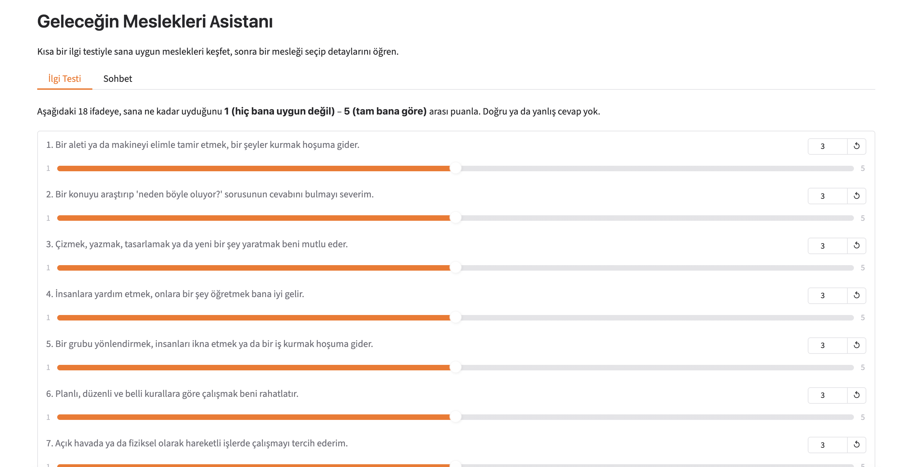

# Geleceğin Meslekleri Asistanı

Mesleğini henüz seçmemiş gençlere yönelik bir kariyer keşif aracı. Genç, kısa bir ilgi testiyle kendine uygun meslekleri görür; ardından bir mesleği seçip **gerçek verilere** dayalı olarak ne iş yaptığını, nasıl başlanacağını, gelecek görünümünü ve Avrupa'daki iş talebini/maaşını sade bir dille öğrenir.

**🔗 Canlı demo:** https://huggingface.co/spaces/namruni/kariyer-kesif-asistani

## Model ve tool-calling

Sohbet motoru **Gemini (`gemini-3.1-flash-lite`)**, OpenAI-uyumlu API üzerinden çalışır. Model, kullanıcının sorusuna göre tanımlı fonksiyonları (tool) çağırır; kod bu çağrıyı ilgili veri kaynağına yönlendirir, sonucu modele geri verir ve model **yalnızca dönen gerçek veriye** dayanarak yanıt üretir. Modelin veritabanı/API dışı bilgi uydurması, sistem promptundaki "yalnızca araçtan geleni genişlet, uydurma" kuralıyla engellenir.

## Ne yapar?

- **İlgi testi (RIASEC esinli):** 18 soruluk kısa bir test, gencin baskın ilgi alanlarını belirler ve küratörlü havuzdan en uygun meslekleri **deterministik** (Python'da, modelden bağımsız) eşleştirir.
- **Meslek tanıtımı — iki coğrafi bölüm:** Bir meslek sorulduğunda cevap ayrı ayrı sunulur. **🇺🇸 Amerika (O*NET):** ne iş yaptığı, günlük görevleri, gereken eğitim/hazırlık düzeyi, "parlak gelecek" (hızlı büyüyen) görünümü ve temel beceriler. **🇪🇺 Avrupa (ESCO + Adzuna):** ESCO'nun Avrupa meslek tanımı ve temel becerileri; Adzuna'nın 10 Avrupa ülkesindeki iş ilanına dayalı 0–100 talep skoru, ilan sayısı ve maaşı.
- **Kişisel hafıza:** Test sonucu ve ilgi listesi, **oturuma özel** bir kimlikle veritabanına kaydedilir; sohbet, "profilime göre" gibi isteklerde yalnızca o kullanıcının verisini okur.

## Kurulum

Dört API anahtarı için bir `.env` dosyası oluştur:

```
GEMINI_API_KEY=...
ONET_API_KEY=...
ADZUNA_APP_ID=...
ADZUNA_APP_KEY=...
```

Bağımlılıklar (uv ile):

```bash
uv sync
```

veya pip ile:

```bash
pip install -r requirements.txt
```

## Çalıştırma

```bash
uv run python app.py
```

Uygulama açılırken eksik API anahtarı varsa terminale açık bir uyarı yazar. Arayüzde iki sekme vardır: **İlgi Testi** (kaydırıcılarla test) ve **Sohbet** (meslek detayları, öğrenme planı, ilgi listesi).

> HuggingFace Space'te çalıştırmak için dört anahtarı Space ayarlarındaki **Secrets** bölümüne ekle (`.env` yüklenmez).

## Örnek tool-call çıktısı

Uygulama çalışırken her araç çağrısı terminale loglanır. Örnek bir kullanıcı girdisi ve arka planda tetiklenen tool-call:

**Kullanıcı:** _"Grafik Tasarımcı mesleğini tanıt"_

```
INFO asistan: ARAÇ ÇAĞRISI → meslek_tanit({'meslek': 'Grafik Tasarımcı'})
INFO asistan: ARAÇ SONUCU ← meslek_tanit: {"meslek": "Grafik Tasarımcı", "ne_yapar": {"aciklama": "Design or create graphics ...", "gorevler": [...]}, "esco": {...}, "gelecek_skoru": {"skor": 41, ...}}
```

Model, bu gerçek veriyi Türkçeleştirip iki bölümde (🇺🇸 Amerika / 🇪🇺 Avrupa) sunar; veritabanı/API dışından bilgi eklemez.



## Mimari

| Dosya | Görevi |
|-------|--------|
| `havuz.py` | Küratörlü meslek havuzu: Türkçe ad + Adzuna arama öbeği + RIASEC kodu + Adzuna kategorisi + O*NET SOC kodu. |
| `adzuna.py` | Adzuna API'sinden 10 Avrupa ülkesinde talep/maaş çeker; log ölçekli gelecek skorunu hesaplar. |
| `onet.py` | O*NET (ABD) API'sinden meslek tanımı, günlük görevler, eğitim/hazırlık düzeyi, büyüme (Bright Outlook) ve temel becerileri getirir. |
| `esco.py` | ESCO (Avrupa) API'sinden meslek tanımı ve temel becerileri getirir (anahtarsız). |
| `veritabani.py` | SQLite: oturum kimliğine (`kullanici_id`) göre ayrılmış profil ve ilgi listesi. |
| `araclar.py` | Tool katmanı: holland_analiz, meslek_tanit (üç kaynağı paralel toplar), meslek_ne_yapar, meslek_esco, nasil_baslanir, buyume_gorunumu, meslek_becerileri, gelecek_skoru, profil_kaydet/profilim, listeme_ekle/listem. |
| `asistan.py` | Gemini (`gemini-3.1-flash-lite`, OpenAI-uyumlu API) tabanlı sohbet; system prompt + hata dayanıklı tool çağrı döngüsü. |
| `app.py` | Gradio arayüzü (İlgi Testi + Sohbet); oturuma özel kimlik üretir. |
| `yapilandirma.py` | Başlangıçta gerekli API anahtarlarını doğrular. |

### Gelecek skoru nasıl hesaplanır?

Bir mesleğin 10 Avrupa ülkesindeki (`at, be, ch, de, es, fr, gb, it, nl, pl`) toplam ilan sayısı, logaritmik bir ölçekte 0–100'e oturtulur. Logaritma, çok değişken ilan sayılarını adil biçimde kıyaslamak içindir (deprem/desibel ölçekleri gibi). Tavan, havuzdaki en çok aranan mesleğin gerçek talebine göre kalibre edilmiştir. Aramalar, meslekleri birbirine karıştırmamak için tam öbek + Adzuna kategorisiyle sınırlandırılır.

## Bilinen sınırlar

- **Coğrafya ayrımı:** Cevaplar iki bölümde sunulur — **ABD** tarafı O*NET (görevler, eğitim, büyüme, beceriler); **Avrupa** tarafı ESCO (resmi tanım + beceriler) ve Adzuna (talep, maaş). Asistan her veriyi kaynağıyla etiketler.
- **API kotaları:** Sohbet modeli Gemini'nin ücretsiz katmanını kullanır; `flash-lite` modelinin günlük ücretsiz istek kotası bu kullanım için geniştir, ancak çok yoğun kullanımda günlük sınır dolabilir. Adzuna ücretsiz katmanda hız limitlidir; O*NET anahtar gerektirir; ESCO anahtarsızdır.
- **Dil kapsamı:** Adzuna aramaları İngilizce öbeklerle yapılır; İngilizce dışı pazarlarda (ör. Almanya, İtalya) yerel dildeki ilanların bir kısmı sayılamayabilir.
- **Maaşlar yerel para birimindedir** (GBP, EUR, CHF, PLN); karşılaştırırken bu göz önünde tutulmalı.
- **Doktorluk toplu ölçülür:** Uzmanlık dalları çok farklı unvanlara dağıldığı için ayrı ayrı ölçülmez.
- **Model dili:** Sohbet yanıtları bir dil modelinden gelir; nadiren yabancı bir kelime karışabilir.
- **Oturum hafızası:** HuggingFace ücretsiz katmanda depolama geçicidir; Space yeniden başlayınca kayıtlı profil/liste sıfırlanır.
- Skorlar bir **talep göstergesidir**, kesin gelecek tahmini ya da iş garantisi değildir.

## Veri kaynakları

- [O*NET](https://www.onetcenter.org/) — ABD meslek bilgi sistemi (tanım, görevler, eğitim, büyüme, beceriler, ilgi tipleri).
- [ESCO](https://esco.ec.europa.eu/) — Avrupa Komisyonu'nun meslek/beceri sınıflandırması (Avrupa tanımı ve temel beceriler; anahtarsız).
- [Adzuna](https://developer.adzuna.com/) — Avrupa iş ilanı arama API'si (talep ve maaş).

## Testler

Hata dayanıklılığı ve puanlama testleri:

```bash
uv run python test_dayaniklilik.py
```
