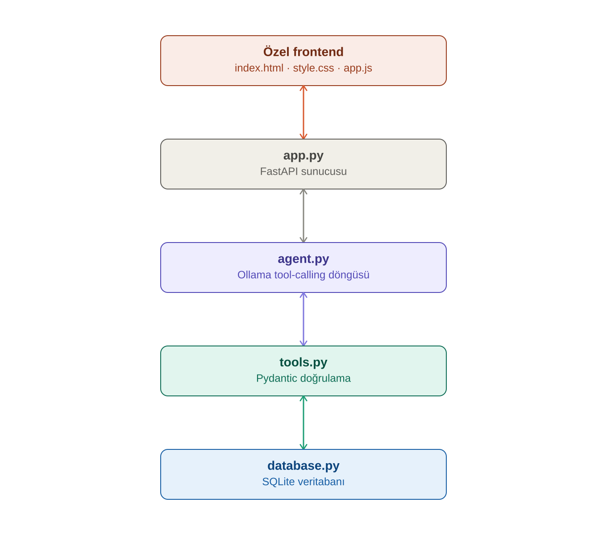

# 🏦 Yılmaz Bank — Sanal Şube Asistanı

Tool-calling destekli, yerel bir LLM (Ollama) ile çalışan bir banka asistanı.
Gerçek bir SQLite veritabanına hem **okuma** hem **yazma** yapar; tasarımın
merkezinde **halüsinasyon önleme** var — model hiçbir hesap, bakiye, kart
veya kullanıcı bilgisini uydurmaz, her cevap gerçek bir tool sonucuna dayanır.

---

## 📋 İçindekiler

- [Senaryo](#senaryo)
- [Mimari](#mimari)
- [Tool'lar](#toollar)
- [Halüsinasyon önleme](#halüsinasyon-önleme)
- [Kurulum ve çalıştırma](#kurulum-ve-çalıştırma)
- [Demo veriler](#demo-veriler)
- [Örnek test soruları ve cevapları](#örnek-test-soruları-ve-cevapları)
- [Tasarım ve test sürecinde karşılaşılan bulgular](#tasarım-ve-test-sürecinde-karşılaşılan-bulgular)
- [Bilinen sınırlamalar](#bilinen-sınırlamalar)
- [Neler geliştirilebilir](#-neler-geliştirilebilir)
- [Kullanılan teknolojiler](#kullanılan-teknolojiler)

---

## Senaryo

**Banka sanal şube asistanı.** Kullanıcı doğal dilde bir istek yazıyor
("Ayşe'nin hesaplarını listele", "3 numaralı hesaptan 5'e 200 TL transfer
yap" gibi), yerel bir LLM bu isteği anlayıp doğru fonksiyonu (tool) çağırıyor,
fonksiyon gerçek SQLite veritabanına okuma/yazma yapıyor, sonuç modele geri
besleniyor ve model bu gerçek veriye dayanarak Türkçe bir cevap üretiyor.

Bu senaryo özellikle seçildi çünkü hem okuma hem yazma işlemlerini doğal
olarak barındırıyor (bakiye sorgulama = okuma; transfer, kart işlemleri,
hesap açma = yazma) ve yanlış/uydurma bir cevabın gerçek sonuçları olan
(yanlış bakiye, var olmayan bir transfer) bir alan olduğu için halüsinasyon
önleme kriterini test etmeye çok uygun.

## Mimari



İstek yukarıdan aşağı akar (frontend → FastAPI → agent → tools →
veritabanı), cevap ve tool sonucu aynı yoldan yukarı geri döner.

| Dosya | Görevi |
|---|---|
| `database.py` | Saf SQLite katmanı — şema, bağlantı, tüm CRUD fonksiyonları. LLM'den, tool şemasından tamamen habersiz; bağımsız test edilebilir. |
| `seed_data.py` | Veritabanını 24 sentetik (tamamen uydurma) kullanıcı ve ~50-60 hesapla doldurur. |
| `tools.py` | Her tool için Pydantic girdi şeması + JSON tool tanımı + `database.py`'yi çağıran execution katmanı (bağlantı açma/kapatma, commit/rollback). |
| `agent.py` | Ollama ile çok turlu tool-calling döngüsü, sistem promptu (halüsinasyon önleme kuralları), ve işlem sonrası bakiye özetini deterministik üreten yardımcı fonksiyon. |
| `app.py` | FastAPI: özel frontend'i (`index.html`/`style.css`/`app.js`) sunar, `/api/query` endpoint'i ile `agent.py`'yi çağırır. |
| `index.html`, `style.css`, `app.js` | Özel tasarlanmış sohbet arayüzü (Gradio değil) — mesaj akışı, altta sabit yazı kutusu, sesli komut (Web Speech API), her asistan mesajında katlanır tool-çağrısı fişi. |

Katmanlar birbirinden bağımsız: `database.py` hiçbir LLM/tool bilgisi
içermediği için tek başına test edilebildi; `tools.py` da gerçek modele hiç
ihtiyaç duymadan (doğrudan Python çağrısıyla) test edildi. Modelin devreye
girdiği tek yer `agent.py`.

## Tool'lar

| # | Tool | Tip | Açıklama |
|---|---|---|---|
| 1 | `find_user_by_name` | okuma | Ad/soyad ile kullanıcı arar (kısmi eşleşme). İsimle ilgili her istekte ilk çağrılan tool. |
| 2 | `list_accounts` | okuma | Bir kullanıcının tüm hesaplarını (numara, tip, bakiye) listeler. |
| 3 | `open_new_account` | **yazma** | Kullanıcı için yeni bir hesap açar (0 bakiye, otomatik hesap numarası). |
| 4 | `get_balance` | okuma | Belirli bir hesabın güncel bakiyesini getirir. |
| 5 | `get_transaction_history` | okuma | Bir hesabın son işlemlerini getirir. |
| 6 | `transfer_money` | **yazma** | Aynı para birimindeki iki hesap arasında transfer yapar (atomik: iki bakiye + iki işlem kaydı). |
| 7 | `exchange_transfer` | **yazma** | Farklı para birimindeki iki hesap arasında, sabit demo kuruyla transfer yapar. |
| 8 | `create_card` | **yazma** | Bir hesaba yeni kart (debit/credit/virtual) oluşturur. |
| 9 | `block_card` | **yazma** | Bir kartı bloke eder. |

6'sı yazma, 3'ü okuma işlemi — ödevin istediği "hem okuma hem yazma"
gereksinimi fazlasıyla karşılanıyor.

## Halüsinasyon önleme

Üç katmanlı bir strateji kullanıldı:

1. **Sistem promptu (`agent.py`):** Modele açıkça şu kurallar veriliyor:
   hiçbir veriyi hafızasından uydurma; hesap/bakiye/kart sorulduğunda cevap
   vermeden önce mutlaka ilgili tool'u çağır; **yazma işlemlerinde,
   sonucun başarısız olacağını tahmin etsen bile mutlaka tool'u çağır ve
   gerçek sonucu bekle** (bu kural, test sırasında modelin bazen kendi
   tahminine güvenip tool'u atladığını fark etmemiz üzerine eklendi —
   aşağıya bakın); tool hatasını olduğu gibi ilet, gizleme.

2. **Deterministik işlem özeti (`build_transaction_summary`):** Bir
   transfer/döviz işlemi başarılı olduğunda, işlem sonrası bakiyeler
   **modelin yazdığı serbest metne hiç güvenilmeden**, doğrudan tool'un
   JSON sonucundan kod tarafında üretilip cevaba ekleniyor. Model ne
   yazarsa yazsın, bakiye bilgisi her zaman veritabanının gerçek durumunu
   yansıtır.

3. **`hallucination_risk` bayrağı:** Model hiç tool çağırmadan doğrudan
   cevap verirse (`any_tool_called = False`), bu durum arayüzde açık bir
   uyarı olarak gösterilir.

## Kurulum ve çalıştırma

```bash
pip install -r requirements.txt

# 1. Veritabanı şemasını oluştur
python database.py

# 2. Sentetik demo verisini ekle (24 kullanıcı, ~50-60 hesap)
python seed_data.py

# 3. Ollama'yı ayrı bir terminalde çalıştır
ollama serve

# 4. Modeli indir (~6.6 GB) — başka bir terminalde
ollama pull qwen3.5:9b

# 5. Uygulamayı başlat
python app.py
```

Tarayıcıda **http://localhost:8000** adresini aç.

**Model:** `qwen3.5:9b` (Ollama üzerinden, native tool-calling ve thinking
desteğiyle). Farklı bir model denemek istersen `OLLAMA_MODEL` ortam
değişkenini değiştirmen yeterli, kodda başka bir yer değişmiyor.

## Demo veriler

`seed_data.py`, sabit bir rastgele tohum (`random.seed(42)`) ile her
çalıştırmada aynı veriyi üretir: 24 kullanıcı (gerçek isimlerle, ama
tamamen kurgusal), her birine 2-3 hesap (rastgele vadesiz/vadeli/tasarruf
tipinde, rastgele TRY/EUR/USD para biriminde), %60 ihtimalle bir kart, ve
her hesap için bir "açılış bakiyesi" işlem kaydı.

Gerçek kullanıcı adlarını görmek için:
```python
import database as db
conn = db.get_connection()
for row in conn.execute("SELECT user_id, full_name FROM users ORDER BY user_id"):
    print(row["user_id"], row["full_name"])
```

## Örnek test soruları ve cevapları

Aşağıdakiler, geliştirme sırasında gerçek model (`qwen3.5:9b`) ile,
gerçek veritabanına karşı test edilmiş örneklerdir.

---

**Soru:** *"1 numaralı hesabın bakiyesi ne kadar?"*

**Tool çağrısı:** `get_balance({"account_id": 1})`
**Cevap:** *"1 numaralı hesabın bakiyesi 8.135,89 EUR'dur."*

---

**Soru:** *"Zeynep Doğan'ın vadeli hesabından vadesiz hesabına 300 TL
transfer yap."* (vadeli hesap TRY, vadesiz hesap EUR — farklı para
birimi)

**Tool çağrıları:** `find_user_by_name` → `list_accounts` →
`exchange_transfer({"from_account_id": 5, "to_account_id": 6, "amount": 300})`

**Cevap:** *"Transfer başarılı! Vadeli hesabınızdan vadesiz hesabınıza
300 TL gönderildi. Sabit demo döviz kuruyla karşılığı 8.57 EUR olarak
alındı.*
*📋 İşlem özeti (veritabanından doğrudan alınmıştır): Hesap 5 yeni
bakiye: 26.043,96 TRY · Hesap 6 yeni bakiye: 34.761,43 EUR"*

---

**Soru:** *"Kemal Aydın adında bir müşterimiz var mı?"* (veritabanında
olmayan bir isim — halüsinasyon testi)

**Tool çağrısı:** `find_user_by_name({"name": "Kemal Aydın"})` →
`{"count": 0}`

**Cevap:** *"Bu isimde bir kullanıcı bulamadım. Lütfen doğru ismi
kontrol ediniz veya farklı bir arama yapınız."* — model bir hesap/bakiye
uydurmadı.

---

**Soru:** *"Can Kılıç'ın tasarruf hesabından vadesiz hesabına
100.000.000 TL transfer yap."* (yetersiz bakiye)

**Tool çağrısı:** `transfer_money({"from_account_id": 7, "to_account_id": 8, "amount": 100000000})`
→ hata: `"Yetersiz bakiye. Mevcut bakiye: 3713.92 TRY, istenen: 100000000.0"`

**Cevap:** *"Transfer işlemi başarısız oldu çünkü tasarruf hesabındaki
mevcut bakiye (3.713,92 TL) transfer edilecek tutardan (100.000.000 TL)
çok daha az."*

---

**Soru:** *"Mehmet Arslan için yeni bir tasarruf hesabı aç, TRY
cinsinden."*

**Tool çağrıları:** `find_user_by_name` → `open_new_account({"user_id": 2, "account_type": "tasarruf", "currency": "TRY"})`

**Cevap:** *"Mehmet Arslan adına TRY cinsinden yeni bir tasarruf hesabı
başarıyla açılmıştır: Hesap Numarası: TR68... Bakiye: 0.0 TRY."* —
sonraki bir sorguda (`"Mehmet Arslan'ın hesaplarını tekrar listele"`) bu
yeni hesabın gerçekten veritabanında kalıcı olduğu doğrulandı.

---

**Soru:** *"Can Kılıç'ın kartlarını listeler misin?"* (sistemde
`list_cards` diye bir tool yok — eksik yetenek testi)

**Cevap:** Model, `list_accounts` çağırıp mevcut hesapları gösterdi ve
*"Bu hesapların kartları henüz oluşturulmamış olabilir veya mevcut kart
bilgileri sistemde kayıtlı değildir... yeni kart eklemek isterseniz
belirtin"* dedi — var olmayan bir yeteneği icat etmek yerine mevcut
bilgiyle dürüst bir cevap verdi.

## Tasarım ve test sürecinde karşılaşılan bulgular

Geliştirme sürecinde canlı testler sırasında birkaç önemli davranış
gözlemlendi ve buna göre sistem iyileştirildi:

1. **Para birimi uyuşmazlığı → `exchange_transfer` tool'unun eklenmesi.**
   İlk tasarımda sadece `transfer_money` vardı. Farklı para birimindeki
   iki hesap arasında transfer denendiğinde, tool bunu doğru şekilde
   reddetti (uydurma bir sonuç dönmedi) — ama bu, gerçek bir kullanıcı
   ihtiyacını (döviz transferi) karşılamıyordu. Bunun üzerine sabit demo
   kurlu (`TRY`/`EUR`/`USD`) ayrı bir `exchange_transfer` tool'u
   tasarlandı ve sistem promptuna "hangi durumda hangisi kullanılmalı"
   kuralı eklendi.

2. **Olmayan isimlerde halüsinasyon testi.** Test sırasında birkaç kez
   (kazara) veritabanında bulunmayan isimler kullanıldı (erken tasarım
   aşamasından kalan, sonradan rastgele veri üretimiyle değişen isimler).
   Model her seferinde tutarlı şekilde "bu isimde bir kullanıcı
   bulamadım" dedi, hiçbir zaman rastgele bir hesap/bakiye uydurmadı.

3. **Yazma işlemlerinde tool atlama riski.** Bir testte model, transferin
   başarısız olacağını (yetersiz bakiye) kendi kafasında hesaplayıp
   `transfer_money` tool'unu hiç çağırmadan doğrudan "yetersiz bakiye"
   cevabı verdi. Sonuç doğru çıksa da, bu modelin kendi tahminine
   güvenip gerçek sistemi sormadığı anlamına geliyordu — riskli bir
   davranış. Sistem promptuna "sonucun başarısız olacağını düşünsen bile
   MUTLAKA tool'u çağır" kuralı eklendi; yeniden test edildiğinde model
   artık tool'u çağırıp gerçek hata mesajını kullanıyor.

4. **Son cevabın yanlış turdan gösterilmesi.** Bazı çok adımlı
   isteklerde, model son turda gerçek cevabını `content` yerine
   `thinking` alanına yazdığında, agent yanlışlıkla daha önceki, yarım
   kalmış bir turun metnini "nihai cevap" olarak gösteriyordu. Kod, her
   zaman gerçek son asistan turunu almak, boşsa o turun `thinking`
   alanına düşmek ve token bütçesini artırmak (`num_predict`: 1200 →
   1800) şeklinde düzeltildi.

5. **Deterministik bakiye özeti.** Modelin işlem sonrası bakiyeleri
   doğru yazıp yazmayacağına güvenmek yerine, `build_transaction_summary`
   fonksiyonu bu bilgiyi doğrudan tool sonucundan (serbest metne hiç
   dokunmadan) üretip cevaba ekliyor — bkz. [Halüsinasyon
   önleme](#halüsinasyon-önleme).

## Bilinen sınırlamalar

- Döviz kurları (`EXCHANGE_RATES_TO_TRY`) sabit, demo amaçlı değerlerdir;
  gerçek zamanlı bir piyasa kuru değildir.
- Kartları listeleyen bir tool (`list_cards`) yoktur — bu bilinçli bir
  kapsam kararıdır, sistemin bu durumda nasıl davrandığı (dürüst
  reddetme) yukarıda örneklenmiştir.
- `find_user_by_name` kısmi/büyük-küçük harf duyarsız eşleşme yapar;
  birden fazla eşleşme dönerse model kullanıcıdan ayırt edici bilgi
  ister.
- Konuşma geçmişi (multi-turn context) her istek için sıfırdan başlar;
  önceki mesaj tam olarak hatırlanmaz (her istek bağımsız bir agent
  çalıştırması).

## 🚀 Neler geliştirilebilir

Şu anki sistem bir demo/ödev kapsamında bilinçli olarak basit tutuldu —
herhangi bir `account_id`/`user_id` verilerek istenen hesaba erişilebiliyor,
gerçek bir bankacılık sisteminde bu kabul edilemez. Gerçek bir ürüne
dönüştürülecek olsa, öncelikli eklenecekler:

- **Kimlik doğrulama / oturum yönetimi:** Kullanıcı önce giriş yapar
  (kullanıcı adı+şifre, OTP vb.), sistem o oturumun **hangi kullanıcıya**
  ait olduğunu bilir. Şu anki gibi modele "1 numaralı hesap" denip
  istenen hesaba erişilmesi yerine, `user_id` oturumdan otomatik gelir,
  hiçbir tool'a elle parametre olarak verilmez.
- **Yetkilendirme (authorization):** Giriş yapmış bir kullanıcı sadece
  **kendi** hesaplarını listeleyebilir, kendi bakiyesini/işlem geçmişini
  görebilir. `list_accounts`, `get_balance`, `get_transaction_history`
  gibi tool'lar, çağıranın oturumundaki `user_id` ile eşleşmeyen bir
  hesap için otomatik olarak reddetmeli.
- **IBAN tabanlı transfer:** Şu anki `transfer_money`/`exchange_transfer`
  dahili bir `to_account_id` alıyor — gerçek hayatta kullanıcı karşı
  tarafın dahili ID'sini bilmez, sadece **IBAN'ını** bilir. Transfer
  hedefinin dahili ID yerine IBAN (`account_number`) ile belirtilmesi,
  hem daha gerçekçi hem de "sadece bildiğin bir hesaba gönderebilirsin"
  güvenlik modelini doğal olarak sağlar.
- Diğer olası eklemeler: yüksek tutarlı transferlerde 2FA/onay adımı,
  işlem/erişim günlüğü (audit log), gerçek zamanlı döviz kuru API'si,
  `list_cards` tool'u, çok turlu konuşma hafızası (şu an her istek
  bağımsız çalışıyor).


## Kullanılan teknolojiler

`Python` · `SQLite` · `Ollama` (`qwen3.5:9b`) · `Pydantic` · `FastAPI` ·
`Vanilla JS/HTML/CSS` (özel tasarım, framework yok) · `Web Speech API`
(sesli komut)

---

<div align="center">

**Geliştiren: Reşad Yılmaz**

Eğitim amaçlı Tool Calling ve Halüsinasyon Önleme projesi.

</div>
