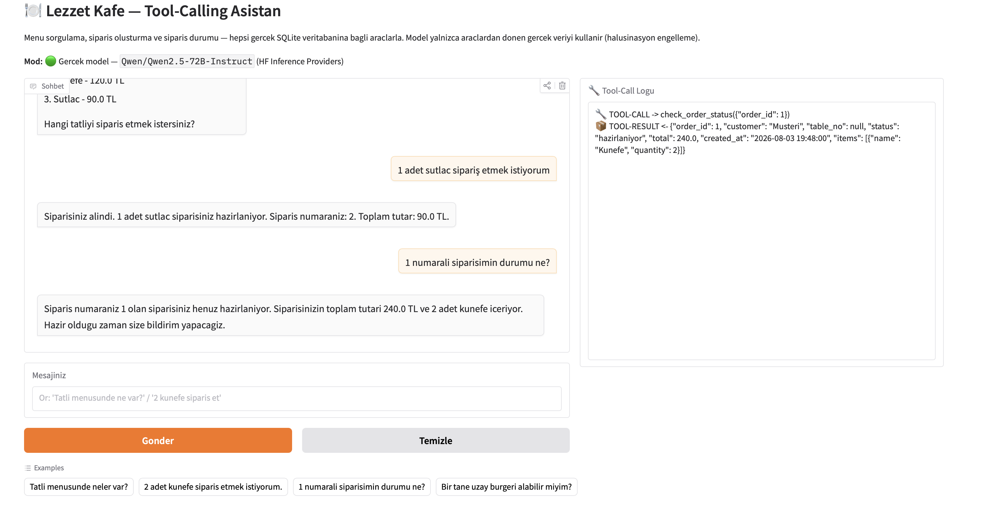

# 🍽️ Lezzet Kafe — Tool-Calling Destekli Sipariş Asistanı

Doğal dille konuşan, arka planda **gerçek fonksiyonlar (tool-call)** çağırarak bir
**SQLite** veritabanı üzerinde işlem yapan restoran sipariş asistanı. Menü sorgulama,
sipariş oluşturma ve sipariş durumu takibini tek bir konuşma akışında yürütür. Model
yalnızca araçlardan dönen gerçek veriye dayanır; veritabanında bulunmayan bir bilgiyi
üretmez.

**🔗 Canlı Demo:** https://huggingface.co/spaces/senemde/tool-call-restaurant

---

## Senaryo

Müşteri menüyü sorar, sipariş verir ve siparişinin durumunu öğrenir. Asistan isteği
anlar, uygun aracı çağırır, araç gerçek veritabanına erişir ve dönen sonuç doğal dilde
müşteriye aktarılır.

---

## Kullanılan Model ve Mimari

### Model
Dil modeli olarak **`Qwen/Qwen2.5-72B-Instruct`**, **Hugging Face Inference Providers**
(OpenAI uyumlu `chat.completions` API'si) üzerinden çağrılır. Tool-calling yeteneği güçlü,
açık kaynak bir modeldir ve `MODEL_ID` değişkeniyle değiştirilebilir.

### Araçlar
Sistem üç araç içerir; ikisi okuma, biri yazma işlemi yapar:

| Araç | Tür | İşlev |
|------|-----|-------|
| `get_menu(category?)` | Okuma | Menüyü (opsiyonel kategori filtresiyle) getirir |
| `create_order(customer, items, table_no?)` | Yazma | Sipariş oluşturur, **stoktan düşer**, tutarı hesaplar |
| `check_order_status(order_id)` | Okuma | Sipariş durumunu ve içeriğini sorgular |

### Veri Akışı
```
Kullanıcı mesajı
      │
      ▼
  agent.chat ──► llm.generate ──►  Model bir tool_call döndürür
      │                                    │
      │            TOOL_REGISTRY üzerinden gerçek fonksiyon çalışır
      │                                    │
      │            SQLite'tan okur / SQLite'a yazar
      │                                    │
      └──◄── sonuç "tool" rolüyle modele geri verilir ──► Model doğal dilde yanıtlar
```

### Proje Yapısı
```
tool-call-restaurant/
├── app.py                 # Gradio arayüzü (canlı demo)
├── chat_template.jinja    # Özel Jinja2 chat template
├── requirements.txt
├── src/
│   ├── database.py        # SQLite bağlantısı, şema ve başlangıç verisi (tek veri katmanı)
│   ├── tools.py           # get_menu / create_order / check_order_status + TOOL_REGISTRY
│   ├── tool_schemas.py    # Araçların modele verilen JSON şemaları
│   ├── llm.py             # Model çağrısı (HF Inference Providers) + tool-call ayrıştırma
│   └── agent.py           # Sohbet döngüsü: prompt yönetimi ve fonksiyon yönlendirme
└── scripts/
    ├── demo_cli.py        # Terminal demosu
    └── test_smoke.py      # Birim testler
```

Kod, sorumlulukları ayrı katmanlara böler: veritabanı erişimi yalnızca `database.py`
içinde toplanır, araçlar `tools.py` içinde tanımlanır, model erişimi `llm.py` ile
soyutlanır ve tüm akış `agent.py` tarafından yönetilir.

---

## Halüsinasyon Engelleme

Nihai yanıtlar **yalnızca araçlardan dönen gerçek veriye** dayanır:

- Menüde olmayan bir ürün istenirse veri katmanı `{"error": "... menüde yok"}` döndürür;
  model ürünü **uydurmaz**.
- Stok yetersizse sipariş **oluşturulmaz**.
- Model yalnızca tanımlı araçları çağırabilir; tanımsız çağrı hata olarak geri döner.

---

## Kurulum ve Çalıştırma

```bash
# Bağımlılıklar
pip install "gradio==5.49.1"
pip install -r requirements.txt

# Birim testler
python -m scripts.test_smoke

# Terminal demosu (anahtarsız test modu)
LLM_BACKEND=mock python -m scripts.demo_cli

# Gerçek model ile
export HF_TOKEN=hf_xxxxx        # HF Inference Providers izinli token
python -m scripts.demo_cli

# Gradio arayüzü
python app.py                   
```

Uygulama iki modda çalışabilir: `HF_TOKEN` tanımlıysa **gerçek model**, tanımlı değilse
anahtarsız çalışabilen **test modu** devreye girer. Arayüz, o an hangi modun aktif
olduğunu üstte gösterir (🟢 gerçek model / 🟡 test modu). Canlı demoda gerçek model,
Space ayarlarındaki `HF_TOKEN` secret'ı ile etkinleştirilmiştir.

---

## Örnek Kullanım ve Tool-Call Çıktısı

Aşağıdaki ekran görüntüsünde, arayüzde bir sipariş konuşması ve sağ panelde arka planda
tetiklenen tool-call'lar ile bunlardan dönen gerçek veritabanı verisi görülmektedir:



---

## Custom Chat Template

`chat_template.jinja`, ChatML tarzı (`<|im_start|> ... <|im_end|>`) özel bir Jinja2
şablonudur ve tool-calling'i tam olarak sarmalar:

- **Roller:** `system`, `user`, `assistant`, `tool`.
- **Araç tanımları:** `tools` değişkeni verildiğinde araç şemaları sistem mesajına
  JSON olarak gömülür.
- **Araç çağrısı:** asistanın `tool_calls` alanı `<tool_call>{...}</tool_call>` olarak
  biçimlenir.
- **Araç sonucu:** `role="tool"` mesajı `<tool_response>...</tool_response>` olarak
  biçimlenir.
- `add_generation_prompt` ile model asistan turuna hazırlanır.

Şablon, `transformers` ile bir tokenizer'a atanıp `apply_chat_template` fonksiyonuyla
kullanılabilir.

---

## Lisans
MIT

