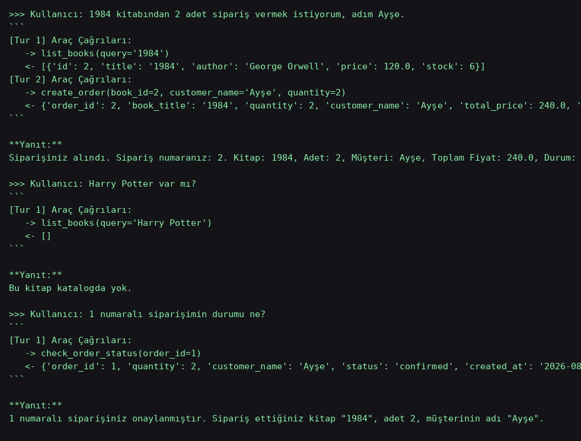

# Kitapçı Asistanı — Tool-Calling Destekli Sipariş Sistemi

## Senaryo Özeti

Kullanıcı, doğal dilde bir kitapçı asistanıyla konuşur: katalogdaki kitapları sorar, sipariş
verir, verdiği siparişin durumunu sorgular. Model hiçbir kitap/stok/fiyat bilgisini
**uydurmaz** — her yanıt gerçek bir SQLite veritabanından tool-call ile çekilen veriye dayanır.

## Model / Mimari

- **LLM:** [Groq](https://console.groq.com/) üzerinden `llama-3.3-70b-versatile`,
  OpenAI-uyumlu native function calling (`tools` / `tool_choice="auto"`).
- **Veritabanı:** SQLite (`kitapci.db`), iki tablo: `books` (id, title, author, price, stock)
  ve `orders` (id, book_id, quantity, customer_name, status, created_at).
- **Araçlar (`db.py`, saf Python fonksiyonları, DB'ye doğrudan bağlanır):**
  - `list_books(query=None)` — katalogu okur (query varsa başlık/yazara göre filtreler).
  - `create_order(book_id, quantity, customer_name)` — stok kontrolü yapar, yeterliyse
    sipariş satırı yazar ve stoktan düşer, yetersizse hata döner.
  - `check_order_status(order_id)` — verilen sipariş numarasının durumunu okur.
- **Arayüz:** Gradio `ChatInterface` (`app.py`).
- **Kod mimarisi:** `db.py` tüm veri erişimini (okuma+yazma) izole eder; `app.py` sadece
  prompt yönetimi, tool-call döngüsü ve Gradio arayüzünden sorumludur — DB koduna dokunmaz.

### Halüsinasyon engelleme

Sistem promptu modele şunu dayatır: kitap bilgisi vermeden/sipariş oluşturmadan önce
**mutlaka** `list_books` çağırması, `book_id`'yi asla tahmin etmemesi, katalogda olmayan
kitap için "katalogda yok" demesi gerektiği. Aşağıdaki örnek log'da "Harry Potter" sorusunda
model tool'u çağırıp boş sonuç aldıktan sonra kitabı uydurmadan reddediyor.

## Yerelde çalıştırma

```bash
pip install -r requirements.txt
export GROQ_API_KEY=your_key_here   # https://console.groq.com/keys üzerinden ücretsiz alınır
python app.py
```

DB dosyası (`kitapci.db`) ilk çalıştırmada otomatik oluşur ve örnek kitaplarla doldurulur.

## Hugging Face Space canlı demo

🔗 https://huggingface.co/spaces/seali/rageval-ai

## Örnek Kullanıcı Girdisi ve Tool-Call Logu



Metin hali (`example_run.log`):

```
>>> Kullanıcı: 1984 kitabından 2 adet sipariş vermek istiyorum, adım Ayşe.
[Tur 1] Araç Çağrıları:
   -> list_books(query='1984')
   <- [{'id': 2, 'title': '1984', 'author': 'George Orwell', 'price': 120.0, 'stock': 6}]
[Tur 2] Araç Çağrıları:
   -> create_order(book_id=2, customer_name='Ayşe', quantity=2)
   <- {'order_id': 2, 'book_title': '1984', 'quantity': 2, 'customer_name': 'Ayşe', 'total_price': 240.0, 'status': 'confirmed'}
Yanıt: Siparişiniz alındı. Sipariş numaranız: 2. Kitap: 1984, Adet: 2, Toplam: 240.0 TL.

>>> Kullanıcı: Harry Potter var mı?
[Tur 1] Araç Çağrıları:
   -> list_books(query='Harry Potter')
   <- []
Yanıt: Bu kitap katalogda yok.

>>> Kullanıcı: 1 numaralı siparişimin durumu ne?
[Tur 1] Araç Çağrıları:
   -> check_order_status(order_id=1)
   <- {'order_id': 1, 'quantity': 2, 'customer_name': 'Ayşe', 'status': 'confirmed', ...}
Yanıt: 1 numaralı siparişiniz onaylanmıştır. Kitap "1984", adet 2.
```

## Dosyalar

- `app.py` — Gradio arayüzü + tool-calling agent döngüsü (prompt yönetimi, fonksiyon yönlendirme)
- `db.py` — SQLite bağlantısı, şema, `list_books` / `create_order` / `check_order_status`
- `requirements.txt` — bağımlılıklar
- `example_run.log` / `example_run.png` — örnek çalıştırma logu
- `README.md` — bu dosya
