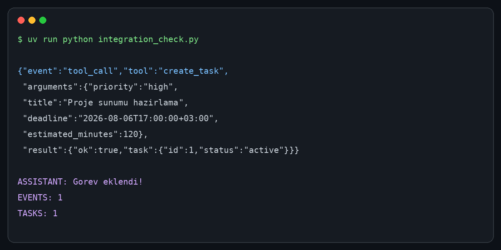

# LLM Destekli Haftalik Planlayici

Bu proje, doğal dilde verilen görevleri gerçek bir SQLite veritabanına
kaydeden ve Ollama üzerinde çalışan `llama3.2:3b` modeliyle haftalık zaman
bloklarına dönüştüren küçük bir tool-calling sistemidir.

Model doğrudan SQL çalıştıramaz. Yalnızca izin verilen üç fonksiyonu çağırır;
fonksiyon argümanları doğrulanır ve kullanıcıya gösterilen görev tabloları
daima SQLite'dan okunur.

## Mimari

```text
Gradio UI
   |
AgentService ---- Ollama / llama3.2:3b
   |                    |
TaskTools <------ function/tool calls
   |
Database ---- SQLite
   |
PlanningService ---- taslak doğrulama ---- kullanıcı onayı
```

Araçlar:

- `create_task(title, deadline, estimated_minutes, priority)`
- `list_tasks(status, date_from, date_to)`
- `update_task_status(task_id, status)`

Plan üretiminde modelin verdiği görev kimlikleri, çalışma saatleri, çakışmalar,
15 dakikalık zaman ızgarası ve deadline koşulları uygulama tarafından yeniden
doğrulanır. Taslak, kullanıcı **Planı Onayla** düğmesine basmadan veritabanına
yazılmaz.

Arayüzde görev ekleme, listeleme ve tamamlama akışlarını gösteren dört
tıklanabilir örnek prompt bulunur. Oluşturulan plan taslak olarak, onaylama
sonrasında ise onaylanmış sürüm olarak PDF biçiminde indirilebilir.

## Yerelde çalıştırma

Gereksinimler: Python 3.11+, [uv](https://docs.astral.sh/uv/) ve
[Ollama](https://ollama.com/).

```bash
ollama pull llama3.2:3b
ollama serve
```

Başka bir terminalde:

```bash
cp .env.example .env
uv sync
uv run python main.py
```

Arayüz `http://localhost:7860` adresinde açılır. Testler:

```bash
uv run pytest
```

## Docker ile çalıştırma

Docker image, Ollama sunucusunu ve `llama3.2:3b` modelini birlikte içerir.
Model build sırasında indirildiği için ilk build birkaç dakika sürebilir.

```bash
docker build -t weekly-planner .
docker run --rm -p 7860:7860 weekly-planner
```

Yalnız Gradio'nun 7860 portu dışarı açılır. Ollama'nın 11434 portu konteyner
içinde kalır.

## Örnek tool-call

Kullanıcı girdisi:

> Perşembe 17.00'ye kadar iki saatlik proje sunumu hazırlamam gerekiyor,
> önceliği yüksek.

Terminal ve arayüz logunda görülen akış:

```json
{
  "event": "tool_call",
  "tool": "create_task",
  "arguments": {
    "title": "Proje sunumu hazırlama",
    "deadline": "2026-08-06T17:00:00+03:00",
    "estimated_minutes": 120,
    "priority": "high"
  },
  "result": {
    "ok": true,
    "task": {
      "id": 1,
      "status": "active"
    }
  }
}
```

Gerçek yerel Ollama çalıştırmasından alınan terminal çıktısı:



## Halüsinasyon önlemleri

- Görevlerle ilgili yanıtlar `list_tasks` sonucuna dayandırılır.
- Modelin çağırabileceği araçlar allowlist ile sınırlandırılır.
- Bütün argümanlar Pydantic modelleriyle kontrol edilir.
- SQL sorguları parametrelidir ve her sorgu oturum kimliğiyle filtrelenir.
- Olmayan görevler güncellenmez; araç hata sonucu döndürür.
- Planlar kaydedilmeden önce deterministik olarak doğrulanır.
- Agent araç döngüsü en fazla altı tur çalışabilir.

## Proje yapısı

```text
main.py                    # giriş noktası
app.py                     # Gradio arayüzü
core/config.py             # ortam ayarları
core/domain.py             # Pydantic modelleri
database/database_layer.py # SQLite erişimi
llm/ollama_client.py       # Ollama yönetimi
services/agent_service.py  # tool-call döngüsü
services/planning_service.py
services/pdf_service.py    # indirilebilir plan PDF'i
tools/task_tools.py        # modele açılan araçlar
tests/                     # otomatik testler
Dockerfile
```
