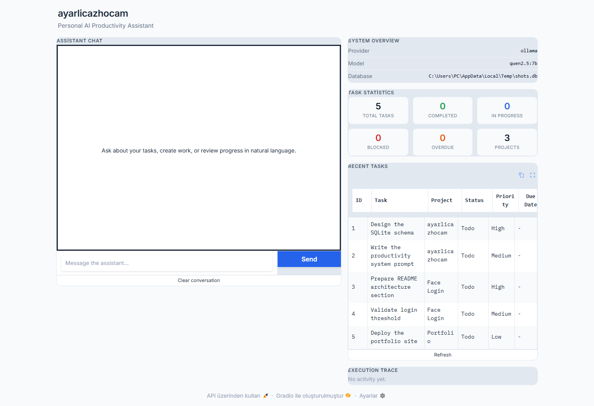
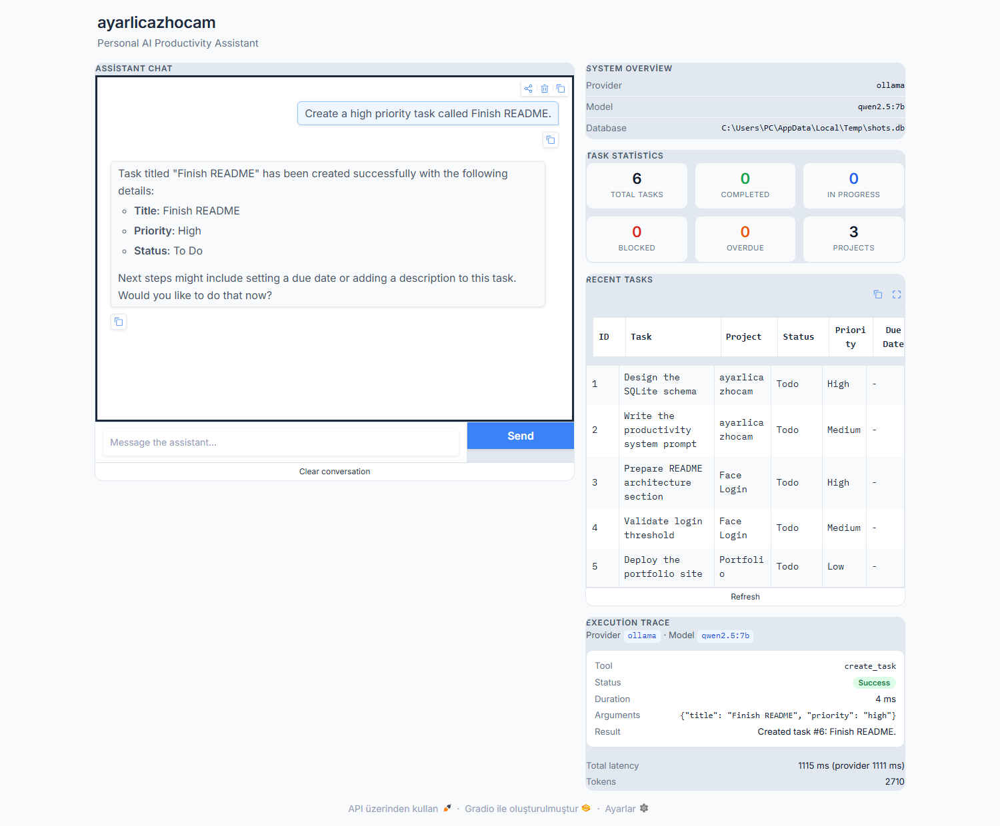
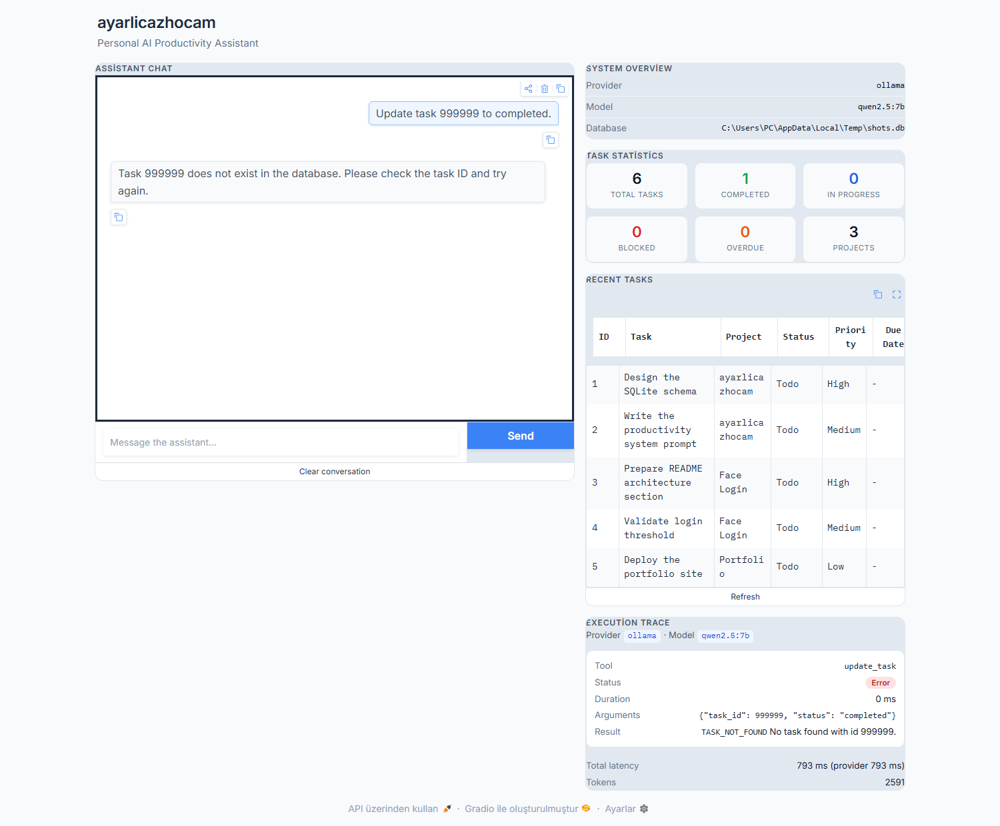

# ayarlicazhocam

`ayarlicazhocam` is a local, database-backed productivity assistant for engineering work.

## Project layout

- `agent/`: provider adapters, prompt, and tool-call orchestrator.
- `database/`: SQLite connection, schema, seed data, and repository helpers.
- `services/`: task validation and task-domain operations.
- `tools/`: LLM-facing schemas and thin task tool adapters.
- `gradio_app.py`: Gradio application entry point.

The current implementation supports creating, listing, and updating tasks via a
local Ollama model (default), Groq, or Google Gemini. The Gradio app exposes
chat, the current task table, database statistics, and an execution trace in one
desktop-friendly view.

By default the assistant runs **fully locally through Ollama** — no API key and
no rate limits — using `qwen2.5:7b`, which emits native tool calls reliably. The
fine-tuned `ayarlicazhocam` model is a one-line switch and also works through
the provider's text-tool-call fallback (see Known limitations). Switching to a
cloud provider is likewise a one-line change in `.env`.

## Quick start

```powershell
# 1. Install dependencies
python -m venv .venv; .\.venv\Scripts\Activate.ps1
pip install -r requirements.txt

# 2. Configure (defaults to local Ollama — no API key needed)
Copy-Item .env.example .env

# 3. Make sure Ollama is running with a tool-calling model
#    (install from https://ollama.com, then:)
ollama pull qwen2.5:7b

# 4. Run
python gradio_app.py
```

Then open the printed URL (defaults to `http://127.0.0.1:7860`; the app
auto-selects the next free port if 7860 is busy). The database is created and
seeded automatically on first launch.

## Features

- Task tools: `create_task`, `get_tasks`, and `update_task`.
- Local Ollama, Groq, and Gemini provider adapters behind one agent interface.
- A bounded tool-calling loop with normalized tool results and execution
  telemetry.
- SQLite persistence with schema initialization and idempotent demo seeding.
- A Gradio presentation layer with chat, task overview, statistics, trace,
  refresh, and clear-conversation controls.

Daily planning, work-session logging, and progress reviews are planned work;
they are not represented as available features.

## Architecture

```text
User
  │
  ▼
Gradio UI (gradio_app.py)
  │
  ▼
Agent / Orchestrator
  │
  ▼
Tool Registry
  │
  ▼
Task Tools
  │
  ▼
TaskService
  │
  ▼
Repository helpers
  │
  ▼
SQLite (data/ayarlicazhocam.db)
```

The UI is presentation-only. Chat requests enter the agent; task writes occur
only through tools, services, and the repository. Its read-only task display
uses the existing task tool and repository read helper to turn project IDs into
project names. No database reset control is included.

See [the current architecture document](docs/current-architecture.md) for the
implemented module boundaries and runtime flow.

## Requirements

- Python 3.11+
- One model provider:
  - **Ollama (default, recommended):** install from <https://ollama.com>, keep
    it running, and have a tool-calling model available (`ollama pull
    qwen2.5:7b`, or the fine-tuned `ayarlicazhocam`). No API key needed.
  - **Or** a Groq / Google Gemini API key for cloud chat.

Install the dependencies in a virtual environment:

```powershell
python -m venv .venv
.\.venv\Scripts\Activate.ps1
pip install -r requirements.txt
```

On macOS or Linux, activate with `source .venv/bin/activate` instead.

## Configure the application

Copy the example configuration, then add the key for the provider you choose:

```powershell
Copy-Item .env.example .env
```

| Variable | Purpose | Default |
| --- | --- | --- |
| `MODEL_PROVIDER` | Provider to use: `ollama`, `groq`, or `gemini` | `ollama` |
| `OLLAMA_MODEL` | Local Ollama model id | `qwen2.5:7b` |
| `OLLAMA_HOST` | Ollama server URL (optional) | `http://localhost:11434` |
| `GROQ_API_KEY` | Required when using Groq | — |
| `GEMINI_API_KEY` | Required when using Gemini | — |
| `GROQ_MODEL` | Groq model id | `llama-3.3-70b-versatile` |
| `GEMINI_MODEL` | Gemini model id | `gemini-2.0-flash` |
| `DATABASE_PATH` | SQLite database file | `data/ayarlicazhocam.db` |
| `GRADIO_SERVER_NAME` | Gradio bind address | `127.0.0.1` |
| `GRADIO_SERVER_PORT` | Gradio port | `7860` |

The project runs out of the box on the local Ollama provider using the
fine-tuned **ayarlicazhocam** model — no API key and no rate limits. Because
model and provider selection are entirely env-driven and the provider layer is
model-agnostic, switching is a one-line change:

- **Local (default):** `MODEL_PROVIDER=ollama`, `OLLAMA_MODEL=qwen2.5:7b` —
  reliable native tool-calling, verified end to end. To run the fine-tuned
  identity model instead, set `OLLAMA_MODEL=ayarlicazhocam:latest`.
- **Cloud:** set `MODEL_PROVIDER=groq` (or `gemini`) and the matching API key.

Keep `.env` private. It is ignored by Git; `.env.example` contains placeholders
only. **Never commit real API keys**, and rotate any key that has been shared or
exposed.

## Run the app

```powershell
python gradio_app.py
```

Open `http://127.0.0.1:7860` unless you changed the host or port. Startup
creates the configured SQLite database when necessary and inserts demo projects
and tasks only when the projects table is empty. It never resets existing data.

The System Overview panel shows the configured provider, model, and resolved
SQLite path.

## Using the interface

- Enter a request in the chat box and press **Send** or Enter.
- Inspect the execution trace to see provider/model telemetry, each tool's
  arguments, result, status, and duration.
- Use **Refresh** to reload the task table and statistics from the current
  database state.
- Use **Clear Conversation** to remove chat and trace history; it does not
  delete or modify database records.

The task overview resolves project IDs to project names for readability. The
statistics panel reports projects, total tasks, completed, in-progress, blocked,
and overdue tasks.

## Tool-calling workflow

The following trace describes the real code path for an explicit task-creation
request:

```text
User request
  ↓
create_task tool call
  ↓
TaskService.create_task()
  ↓
Repository.execute()
  ↓
SQLite
  ↓
Standard success envelope
  ↓
Assistant response and refreshed task table
```

The agent may call only the registered `create_task`, `get_tasks`, and
`update_task` tools. A write is reported as successful only when the tool
returns `success: true`.

## Example prompts

The assistant accepts Turkish or English. For example:

- `Görevlerimi listele`
- `Yüksek öncelikli görevleri göster`
- `Gecikmiş görevler var mı?`
- `Face Login projesi için README taslağı görevi oluştur`
- `1 numaralı görevi tamamlandı olarak işaretle`

For task creation and updates, the model calls the relevant tool and confirms
the result only after the tool reports success. A project must already exist;
task creation does not create projects implicitly.

## Custom Chat Template

The fine-tuned Gemma model needs a deterministic prompt format: it does not
receive the application's Python message dictionaries directly. The custom
template at `templates/chat_template.jinja` converts those dictionaries to
Gemma's `<start_of_turn>` / `<end_of_turn>` format, keeps tool activity
separate from ordinary assistant text, and avoids whitespace drift between
training and inference.

Supported message roles are `system`, `user`, `assistant`, and `tool`.
An initial system message is embedded in the first Gemma user turn. Assistant
`tool_calls` render as `<tool_call>` JSON blocks; consecutive `tool` messages
are grouped in one user turn as `<tool_response>` JSON blocks. The template
also renders optional tool schemas supplied through Transformers' `tools=`
argument.

Load the tokenizer for the fine-tuned model (or an approved Gemma base
tokenizer), then attach the template before calling `apply_chat_template`:

```python
from pathlib import Path
from transformers import AutoTokenizer

tokenizer = AutoTokenizer.from_pretrained("/path/to/ayarlicazhocam-gemma")
tokenizer.chat_template = Path("templates/chat_template.jinja").read_text(
    encoding="utf-8"
)

messages = [
    {"role": "system", "content": "Use tools for stored task data."},
    {"role": "user", "content": "Gecikmiş görevler var mı?"},
]
prompt = tokenizer.apply_chat_template(
    messages, tokenize=False, add_generation_prompt=True
)
```

For an empty conversation, current Transformers releases reject a single
empty list before rendering. A one-item empty batch (`[[]]`) is supported when
that behavior needs to be tested. Normal inference should begin with a user
message.

### Full tool-call example

```python
messages = [
    {"role": "system", "content": "Use tools for stored task data."},
    {"role": "user", "content": "Gecikmiş görevler var mı?"},
    {
        "role": "assistant",
        "content": None,
        "tool_calls": [
            {"function": {"name": "get_tasks", "arguments": {"overdue": True}}}
        ],
    },
    {
        "role": "tool",
        "name": "get_tasks",
        "tool_call_id": "call_1",
        "content": '{"count": 0, "tasks": []}',
    },
    {"role": "assistant", "content": "Gecikmiş görevin yok."},
]
```

```text
<bos><start_of_turn>user
<system>Use tools for stored task data.</system>
Gecikmiş görevler var mı?<end_of_turn>
<start_of_turn>model
<tool_call>{"name": "get_tasks", "arguments": {"overdue": true}}</tool_call><end_of_turn>
<start_of_turn>user
<tool_response>{"name": "get_tasks", "content": "{\"count\": 0, \"tasks\": []}", "tool_call_id": "call_1"}</tool_response><end_of_turn>
<start_of_turn>model
Gecikmiş görevin yok.<end_of_turn>
```

The `<bos>` token comes from the assigned tokenizer. `add_generation_prompt=True`
would append `<start_of_turn>model` after a final user turn when generating a
new assistant response.

## Data integrity and tool responses

SQLite is the source of truth for tasks. The system prompt requires a tool call
for claims about stored tasks, deadlines, or status, and the agent returns tool
errors rather than inventing results. Every tool uses this envelope:

```json
{
  "success": true,
  "data": {},
  "message": "Human-readable result",
  "error": null
}
```

Failures use `success: false` and include a stable error code such as
`TASK_NOT_FOUND`, `PROJECT_NOT_FOUND`, or `VALIDATION_ERROR`.

## Database schema

| Table | Purpose |
| --- | --- |
| `projects` | Project names, state, and optional deadlines. |
| `tasks` | Actionable work, priority, status, estimates, blockers, and completion time. |
| `daily_plans` | Saved daily-plan metadata. |
| `daily_plan_items` | Ordered task allocations within a daily plan. |
| `work_logs` | Time records linked to tasks. |

The currently exposed tools operate on the task domain. The remaining tables
are initialized as part of the stable SQLite schema but their user workflows
are future work.

## Tests

Run the automated tests with:

```powershell
pytest tests -v
```

The suite covers the database layer, task-service validation, tool envelopes,
orchestrator behavior, and provider request/response normalization without
requiring live provider calls.

### Verification evidence — 2026-08-02

All results below were produced against isolated temporary SQLite databases. The
**live** rows are real natural-language turns driven through the full stack
(Gradio handler → orchestrator → provider API → tools → service → SQLite).

**Automated + startup**

| Check | Observed result |
| --- | --- |
| Test suite | **112 passed** (`pytest -q`). |
| Gradio launch | Local server returned **HTTP 200**; auto-selects a free port if 7860 is busy. |
| SQLite initialization | `data/ayarlicazhocam.db` created; 5 tables + indexes. |
| Seed data | **3 projects** and **5 tasks**; **no** work logs / completed tasks seeded. |

**Live local run (default)** — `MODEL_PROVIDER=ollama`, `OLLAMA_MODEL=qwen2.5:7b`.
Verified end to end **through the running Gradio app** with **no API key and no
rate limits**; the dashboard updated live (5 → 6 tasks, 0 → 1 completed):

| Turn | Prompt | Tool call(s) | Result |
| --- | --- | --- | --- |
| Create | *Create a high priority task called Finish README.* | `create_task` | Task **#6** created, priority `high`. |
| List | *Show all my tasks.* | `get_tasks` | Listed all **6** tasks. |
| Update | *Update task 6 to critical priority.* | `update_task` | Row #6 priority → `critical`. |
| Complete | *Mark task 6 as completed.* | `update_task` | Row #6 → `completed`. |
| Invalid | *Update task 999999 to completed.* | `update_task` | Reported "task 999999 does not exist"; **no false success**. |
| Hallucination | *What tasks did I complete in January 2023?* | `get_tasks` | Grounded on the DB; **invented nothing**. |

Provider latency ≈ 0.8–7 s locally depending on model size; DB state confirmed
task #6 = `Finish README / critical / completed`.

**Live Groq run** — `MODEL_PROVIDER=groq`, `llama-3.3-70b-versatile`:

| Turn | Prompt | Tool call(s) | Result |
| --- | --- | --- | --- |
| Create | *Create a task called "Finish README" with high priority.* | `create_task` | Task **#6** created, priority `high` (provider ≈ 0.8 s, tool ≈ 4 ms). |
| List | *Show all my tasks.* | `get_tasks` | Listed all **6** tasks (provider ≈ 1.1 s). |
| Update | *Update task 6 to critical priority.* | `update_task`, `get_tasks` | Row #6 priority → `critical`. |
| Complete | *Mark task 6 as completed.* | `update_task` | Row #6 status → `completed`; `completed_at` = `2026-08-02 08:58:35`. |
| Invalid | *Update task 999999 to completed.* | `update_task` | `error [TASK_NOT_FOUND]`; assistant reported the failure honestly. |
| Hallucination | *What tasks did I complete in January 2023?* | `get_tasks` | Grounded on the DB; **invented nothing**. |

Final DB state confirmed task #6 = `Finish README / critical / completed`.

**Live Gemini run** — `MODEL_PROVIDER=gemini`: the provider initializes, converts
messages, translates tool schemas, and executes tool calls — a `create_task`
turn wrote task #6 to the database. See the known limitation on multi-turn
Gemini tool loops below.

> Groq is a free-tier key, so rapid back-to-back turns intermittently return the
> graceful "provider currently unavailable" message (HTTP 429 rate limit). This
> is handled cleanly — the UI never crashes and no partial write is reported as
> success — and spaced-out turns complete normally, as shown above.

## Screenshots

These are **real captures** of the running app (local Ollama, `qwen2.5:7b`) —
nothing is mocked. Each shows the chat, the live dashboard, and the execution
trace for that turn.

### Interface



The dashboard-style interface: the conversational **Assistant Chat** on the
left; **System Overview**, **Task Statistics**, **Recent Tasks**, and a live
**Execution Trace** on the right. The database is seeded with demo projects and
tasks on first launch.

### Creating a task (tool call → SQLite → response)



The model calls `create_task`; the trace shows **Status: Success**, the exact
arguments, duration, and result (`Created task #6`), and Task Statistics ticks
from 5 to 6.

### Graceful error handling



Updating a non-existent task returns **Status: Error / `TASK_NOT_FOUND`** in the
trace, and the assistant honestly reports that the task does not exist — it never
fakes success.

### Full walkthrough

| File | Shows |
| --- | --- |
| `screenshots/01-home.png` | Initial app: chat, system overview, statistics, seeded tasks |
| `screenshots/02-create-task.png` | Creating "Finish README" — successful `create_task` trace |
| `screenshots/03-list-tasks.png` | Listing all tasks via `get_tasks` |
| `screenshots/04-update-task.png` | Updating task #6 to `critical` priority |
| `screenshots/05-complete-task.png` | Marking task #6 `completed` |
| `screenshots/09-hallucination-test.png` | Grounded answer to an unanswerable history question — invents nothing |
| `screenshots/10-error-handling.png` | `TASK_NOT_FOUND` on an invalid task id |

`screenshots/CAPTURE_GUIDE.md` documents the exact prompts and expected results
for each shot, so the full set can be reproduced in a few minutes.

## Assignment mapping

| Assignment requirement | Evidence in this repository |
| --- | --- |
| Persistent task assistant | SQLite schema, repository helpers, and task service. |
| Tool-calling agent | `agent/orchestrator.py`, tool schemas, and standardized envelopes. |
| Gradio presentation | `gradio_app.py` with chat, trace, task, statistics, and refresh panels. |
| Custom Gemma template | `templates/chat_template.jinja` and tokenizer integration tests. |
| Verification | 112 automated tests plus the live local + cloud provider evidence above. |

## Known limitations and future work

- **Gemini multi-turn tool loops.** Newer Gemini models require an opaque
  `thought_signature` on returned function calls to be echoed back on the next
  turn. The legacy `google-generativeai` SDK does not expose that field, so the
  *final* synthesized answer of a tool-using Gemini turn can fall back to the
  graceful "provider unavailable" message even though the tool ran and wrote to
  the database. Single-turn tool execution and schema translation work; the
  clean fix is migrating the Gemini adapter to the current `google-genai` SDK,
  which handles the signature automatically. The default local Ollama provider
  and Groq are both verified end to end.
- **Cloud provider free tiers rate-limit** rapid successive turns (HTTP 429).
  This is handled gracefully. The default local Ollama provider avoids this
  entirely — no rate limits — which is why it is the recommended setup.
- **Local model / tool-calling reliability.** `qwen2.5:7b` (the default) emits
  native tool calls reliably and is verified across the full loop. Smaller
  fine-tunes such as `ayarlicazhocam:latest` sometimes emit a tool call as
  *text* instead of a native call, or invent an argument (e.g. a `project_id`).
  The `OllamaProvider` includes a **text-tool-call fallback** that recovers
  text-form calls, and the tool schema/system prompt steer models away from
  inventing ids — but for a high-stakes live demo `qwen2.5:7b` is the safest
  choice.
- The exposed tools cover the **task** domain only; daily planning, reviews,
  habits, and work-log tools are scaffolded in the schema but not yet
  implemented.
- The local SQLite database is designed for a single-user local process. One
  shared connection is used across Gradio's worker threads
  (`check_same_thread=False`) and every repository access is serialized by a
  lock, so concurrent requests are safe; it is not intended for concurrent
  multi-process writers. A relative `DATABASE_PATH` is anchored to the project
  root, so the same database is used regardless of the directory the app is
  launched from.

## License

Licensed under the [Apache License 2.0](LICENSE).
