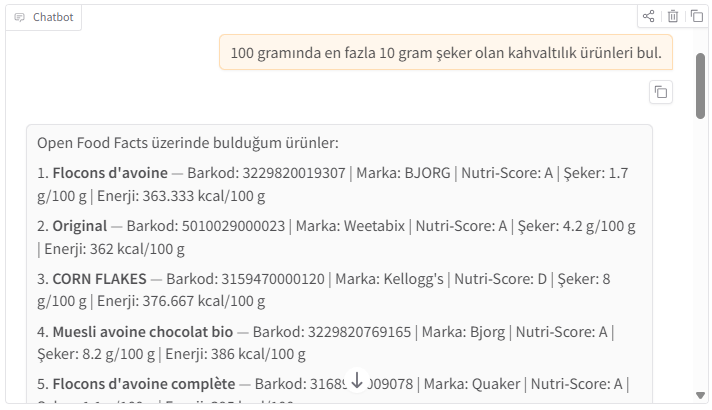
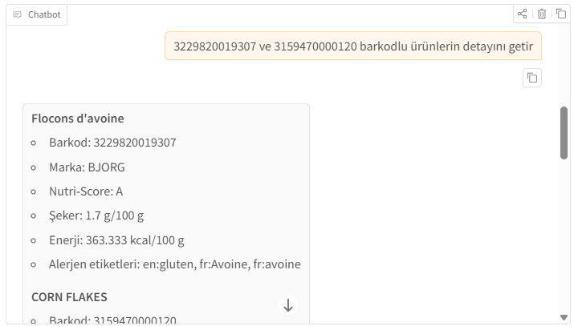
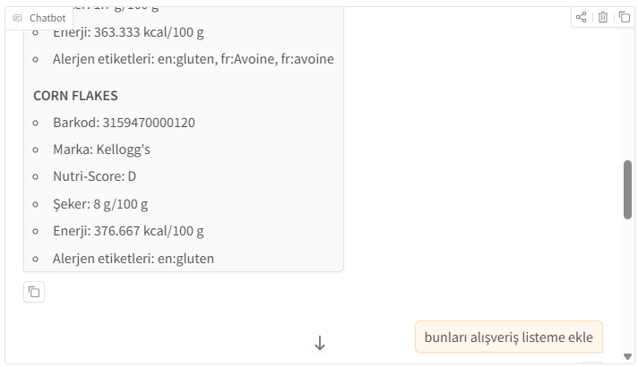
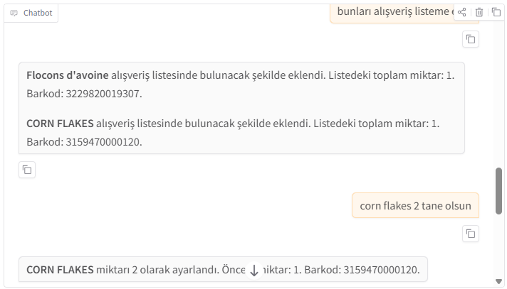
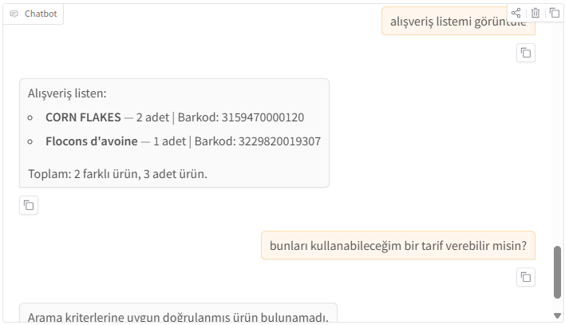
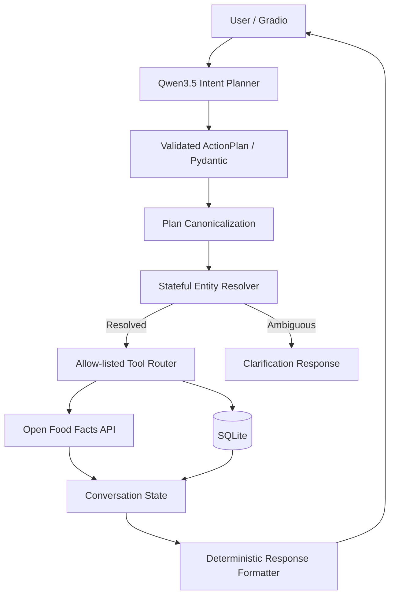

# 🛒 NutriChoice

[](https://huggingface.co/spaces/sedayzc/nutrichoice-tool-calling-grocery-assistant)
[](https://www.python.org/)
[](https://huggingface.co/Qwen/Qwen3.5-0.8B)
[](https://www.gradio.app/)
[](https://www.sqlite.org/)
[](https://world.openfoodfacts.org/)

**NutriChoice**, Türkçe doğal dil isteklerini doğrulanmış eylem planlarına dönüştüren, gerçek market ürünü verilerini **Open Food Facts API** üzerinden okuyan ve alışveriş listesini **SQLite** üzerinde yöneten yerel bir tool-calling asistanıdır.

Proje iki temel çalışmayı tek bir uçtan uca uygulamada birleştirir:

1. `system`, `user`, `assistant` ve `tool` rollerini destekleyen özel bir **Jinja2 chat template**.
2. Harici API okuma, veritabanı okuma/yazma, stateful referans çözümleme, Pydantic doğrulama ve Gradio arayüzü içeren **grounded tool-calling pipeline**.

> **Temel tasarım ilkesi:** Ürün adı, barkod, marka, besin değeri ve alışveriş listesi durumu model tarafından serbestçe üretilmez. Bu bilgiler yalnızca doğrulanmış tool sonuçlarından gelir.

## Bağlantılar


- **Hugging Face Space:** `https://huggingface.co/spaces/sedayzc/nutrichoice-tool-calling-grocery-assistant`


---

## Demo

Aşağıdaki ekran görüntüleri gerçek uygulama akışından alınmıştır.

### 1. Besin filtresiyle ürün arama

<p align="center">
  
</p>

### 2. Barkodlarla ürün detaylarını doğrulama

<p align="center">
  
</p>

### 3. Seçili ürünleri alışveriş listesine ekleme

<p align="center">
  
</p>

### 4. Ürün miktarını güncelleme ve listeyi görüntüleme

<p align="center">
  
</p>

### 5. Desteklenen kapsamın dışında kalan isteklere güvenli yaklaşım

<p align="center">
  
</p>

---

## Neler yapabilir?

| Kullanıcı amacı | Örnek istek | Sistem davranışı |
|---|---|---|
| Ürün arama | `100 gramında en fazla 10 gram şeker olan kahvaltılık ürünleri bul.` | Open Food Facts üzerinde ürün ve besin filtresi uygular. |
| Barkod detayı | `3229820019307 ve 3159470000120 barkodlu ürünlerin detayını getir.` | Her barkodu API üzerinden doğrular. |
| Listeye ekleme | `Bunları alışveriş listeme ekle.` | Son seçilen doğrulanmış ürünleri SQLite'a ekler. |
| Miktar artırma | `Corn Flakes'ten 2 tane daha ekle.` | Mevcut miktara 2 ekler. |
| Kesin miktar ayarlama | `Corn Flakes 2 tane olsun.` | Toplam miktarı tam olarak 2 yapar. |
| Miktar azaltma | `Corn Flakes'ten birini sil.` | Miktarı 1 azaltır. |
| Tamamen kaldırma | `Corn Flakes'i listeden tamamen kaldır.` | Ürünü alışveriş listesinden siler. |
| Liste görüntüleme | `Alışveriş listemi görüntüle.` | SQLite'daki güncel listeyi getirir. |
| Sayım | `Alışveriş listemde kaç ürün var?` | Farklı ürün sayısını ve toplam adedi ayrı verir. |


---

## Kapsam sınırı: neden tarif üretmiyor?

NutriChoice genel amaçlı bir sohbet, tarif veya beslenme tavsiyesi asistanı değildir. Mevcut sürüm yalnızca doğrulanabilir ürün ve alışveriş listesi eylemlerine izin verir.

Örneğin:

```text
Bunları kullanabileceğim bir tarif verebilir misin?
```

isteği geldiğinde sistem serbest biçimli bir tarif üretmez. Bu davranış bir eksiklikten çok **fail-closed güvenlik sınırı** olarak ele alınmıştır.

Bu tercih sayesinde:

- tool dışından ürün veya besin bilgisi üretilmez,
- desteklenmeyen bir yetenek varmış gibi davranılmaz,
- modelin serbest metin halüsinasyonu kullanıcıya aktarılmaz,
- projenin benchmark ve değerlendirme kapsamı net kalır.

---

## Mimari



---

## Tool'lar

| Tool | Veri kaynağı | İşlem |
|---|---|---|
| `search_products` | Open Food Facts | Ürün, kategori, şeker ve içerik filtresiyle arama |
| `get_product_details` | Open Food Facts | Barkodla ürün doğrulama |
| `add_to_shopping_list` | Open Food Facts + SQLite | Mevcut miktara ekleme |
| `ensure_in_shopping_list` | Open Food Facts + SQLite | Ürünün listede bulunmasını sağlama |
| `set_shopping_list_quantity` | Open Food Facts + SQLite | Kesin toplam miktar ayarlama |
| `remove_from_shopping_list` | SQLite | Miktar azaltma veya tamamen kaldırma |
| `get_shopping_list` | SQLite | Liste okuma |

Tool çağrıları ve sonuçları ayrıca SQLite içindeki `tool_call_logs` tablosuna kaydedilir.

---

## Open Food Facts entegrasyonu

NutriChoice, Open Food Facts verisini yalnızca **okuma** amacıyla kullanır.

- Yapılandırılmış ürün ve besin aramalarında `/api/v2/search` kullanılır.
- Barkodla ürün okumada ürün endpoint'i kullanılır.
- Gerekli durumlarda alternatif endpoint fallback'i uygulanır.
- İsteklerde uygulamayı tanımlayan özel bir `User-Agent` gönderilir.
- `500`, `502`, `503` ve `504` cevaplarında yeniden deneme uygulanır.
- `429` rate-limit durumu kullanıcıya açık hata olarak iletilir.
- Doğrulanmış ürünler süreç içi cache ile tekrar kullanılabilir.

Open Food Facts topluluk kaynaklıdır; ürün bilgileri eksik, eski veya hatalı olabilir. Uygulama bu nedenle ambalaj bilgisinin ayrıca kontrol edilmesini hatırlatır.

Resmî kaynaklar:

- [Open Food Facts API](https://openfoodfacts.github.io/documentation/docs/Product-Opener/api/)
- [Structured Search API](https://openfoodfacts.github.io/documentation/docs/Product-Opener/v2/search/get-search/)
- [Open Food Facts](https://world.openfoodfacts.org/)

### HTTP 503 görüldüğünde

Open Food Facts zaman zaman yoğunluk nedeniyle `HTTP 503` döndürebilir. Bu her zaman yerel kodun bozuk olduğu anlamına gelmez. Uygulama otomatik retry uygular; hata devam ederse kısa süre bekleyip aynı sorguyu tekrar deneyin.

---

## Grounding ve halüsinasyon kontrolleri

- Ürün adı, barkod, marka ve besin değerleri yalnızca tool sonuçlarından gelir.
- Modelin normal metinle yazdığı doğrulanmamış ürün iddiaları kullanıcıya gösterilmez.
- Barkodlar string olarak normalize edilir ve doğrulanır.
- Pydantic, izin verilmeyen alanları reddeder.
- Bilinmeyen tool adları çalıştırılmaz.
- Ürün Open Food Facts ile doğrulanmadan SQLite'a yazılmaz.
- Benzer adla birden fazla ürün bulunduğunda sistem rastgele seçim yapmak yerine açıklama ister.
- Her Gradio oturumu ayrı conversation state ve ayrı kullanıcı anahtarı kullanır.
- Son cevaplar doğrulanmış tool sonuçlarından biçimlendirilir.

---

## Özel Jinja2 chat template

Template dosyası:

```text
chat_template/chat_template.jinja
```

Desteklenen özellikler:

- `system`, `user`, `assistant` ve `tool` rolleri,
- tool tanımlarının template'e aktarılması,
- tekli ve çoklu tool çağrıları,
- tool çağrısı ile tool sonucunun ilişkilendirilmesi,
- generation prompt,
- açık mesaj ve tool-result sınırları.

Template'i model yüklemeden test etmek için:

```bash
python chat_template/test_template.py
```

Hazır render örneği:
- [`chat_template/tool_definitions.json`](chat_template/tool_definitions.json)

---

## Proje yapısı

```text
nutrichoice-tool-calling-grocery-assistant/
├── assistant/                # Planner, state, resolver ve formatter
├── chat_template/            # Jinja2 chat template ve örnekleri
├── data/                     # Lokal SQLite dosyası için çalışma dizini
├── database/                 # SQLite bağlantısı, şema ve repository katmanı
├── screenshots/              # chat1.png ... chat5.png
├── services/                 # Open Food Facts API istemcisi
├── tests/                    # Unit ve entegrasyon testleri
├── tools/                    # Tool şemaları, tanımları ve router
├── .env.example              # Ortam değişkeni şablonu
├── .gitignore
├── app.py                    # Gradio uygulaması
├── demo_direct_tools.py      # Model yüklemeden doğrudan tool demosu
├── pyproject.toml            # Pytest ayarları
├── README.md
├── requirements-cuda.txt     # NVIDIA CUDA PyTorch override
└── requirements.txt          # Ana uygulama ve model bağımlılıkları
```

---

# Lokal kurulum

## 1. Repository'yi klonlayın

```bash
git clone https://github.com/ssedayzc/nutrichoice-tool-calling-grocery-assistant.git
cd nutrichoice-tool-calling-grocery-assistant
```

## 2. Bağımlılıkları kurun

### CPU veya Hugging Face Space

```bash
python -m pip install --upgrade pip
python -m pip install -r requirements.txt
```

### NVIDIA GPU

Önce genel bağımlılıkları, ardından CUDA PyTorch paketlerini kurun:

```powershell
python -m pip install --upgrade pip
python -m pip install -r requirements.txt
python -m pip install --force-reinstall -r requirements-cuda.txt
```

`requirements-cuda.txt` projede doğrulanan CUDA wheel'larını içerir. Farklı CUDA sürümü kullanan sistemlerde PyTorch paketlerini kendi sürücünüze göre güncellemeniz gerekebilir.

## 3. Ortam dosyasını oluşturun

### Windows PowerShell

```powershell
Copy-Item .env.example .env
```

## 4. Veritabanını hazırlayın

```bash
python -m database.initialize
```

Uygulama başlangıçta da veritabanını kontrol eder; bu komut kurulumun doğru olduğunu ayrıca doğrulamak için önerilir.

## 5. Testleri çalıştırın

```bash
pytest -q
```

## 6. Uygulamayı başlatın

```bash
python app.py
```

### Modelin ilk yüklenmesi

İlk çalıştırmada `Qwen/Qwen3.5-0.8B` model dosyaları Hugging Face üzerinden indirilir. İlk başlangıç sonraki çalıştırmalardan daha uzun sürebilir.

---

## Model yüklemeden doğrudan tool testi

Open Food Facts, SQLite ve tool router katmanlarını model yüklemeden görmek için:

```bash
python demo_direct_tools.py
```

Bu script örnek bir barkodu doğrular, ürünü listeye ekler, miktarı günceller ve listeyi okur.

---

## Doğrulanan geliştirme ortamı

- Windows 11
- Python 3.11
- NVIDIA RTX 4050 Laptop GPU, 6 GB VRAM
- PyTorch `2.12.1+cu130`
- Transformers `5.14.0`
- Gradio `6.5.1`

---

# Testler

Tüm testleri çalıştırmak için:

```bash
pytest -q
```

Test kapsamının başlıca bölümleri:

- chat template render ve rol sırası,
- Qwen XML tool-call parser,
- bozuk fakat kurtarılabilir parametre formatları,
- Pydantic schema validation,
- Open Food Facts retry ve fallback davranışı,
- stateful context referansları,
- benzer ürün adı grounding'i,
- bileşik alışveriş listesi işlemleri,
- miktar artırma, kesin ayarlama ve azaltma semantiği,
- oturum izolasyonu,
- deterministic response formatting.

---

# Bilinen sınırlamalar

- Open Food Facts verileri topluluk kaynaklıdır.
- Harici API zaman zaman `429` veya `503` döndürebilir.
- Küçük yerel model hatalı action plan üretebilir; parser, validation, canonicalization ve fallback katmanları riski azaltır fakat doğal dilin tüm varyasyonlarını garanti edemez.
- Tarif, günlük beslenme planı ve tıbbi beslenme tavsiyesi kapsam dışıdır.
- Uygulama sağlık veya tıbbi tavsiye vermez.
- Hugging Face Space üzerindeki SQLite kalıcılığı garanti edilmez.

---

# Veri kaynağı ve üçüncü taraf atfı

Bu proje ürün verileri için Open Food Facts API'yi kullanır. Open Food Facts veri ve görsellerinin yeniden kullanımı kendi lisans koşullarına tabidir.

Bu proje Open Food Facts ile bağlantılı veya Open Food Facts tarafından onaylanmış resmî bir uygulama değildir.
