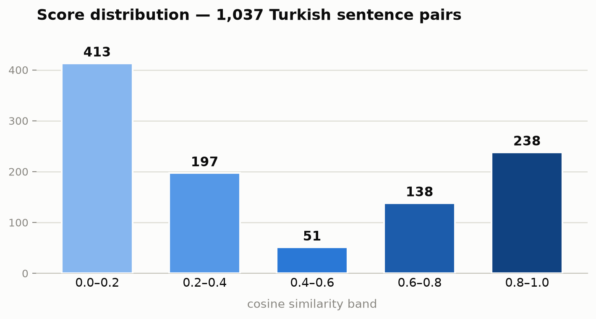

# Turkish STS — sentence pairs score [](https://huggingface.co/datasets/gorkemergune/stsb-tr)

[](https://www.gnu.org/licenses/gpl-3.0)
[](#)
[](#)

A Turkish **Semantic Textual Similarity (STS)** dataset. Each row is a pair of
sentences plus a similarity **score** produced by the
[`magibu/embeddingmagibu-200m`](https://huggingface.co/magibu/embeddingmagibu-200m)
embedding model — **cosine similarity over L2-normalized embeddings**, the exact
method used by the [reference Space](https://huggingface.co/spaces/magibu/embeddingmagibu-200m).

Unlike paraphrase-only sets, this one **spans the full similarity range** with a
deliberately large number of near-zero (unrelated) pairs, so you can use it to
**calibrate similarity thresholds**, not just detect paraphrases.

<p align="center">
  
</p>

---

## At a glance

|                               |                                       |
| ----------------------------- | ------------------------------------- |
| Total pairs                   | **1,037**                             |
| Manually collected (`manual`) | 38                                    |
| Synthetic (`synthetic`)       | 999                                   |
| Splits                        | train**933** / test **104** (90 / 10) |
| Near-zero pairs (< 0.2)       | **413**                               |
| Language                      | Turkish (`tr`)                        |
| Score                         | cosine similarity, ≈`-0.04` … `0.97`  |

**Score means:** close to `1.0` → sentences are near-identical / paraphrases;
close to `0` → unrelated.

---

## Examples

| `sentence1`                                                             | `sentence2`                                                            |  `score`  |
| ----------------------------------------------------------------------- | ---------------------------------------------------------------------- | :-------: |
| Sevilen komedyen eşiyle Antalya'da tatil yaparken görüntülendi.         | Sevilen komedyen ve eşinin Antalya tatilinden kareler paylaşıldı.      | **0.969** |
| Yapay zeka destekli tanı sistemi hastanelerde kullanılmaya başlandı.    | Hastaneler teşhis süreçlerinde yapay zekadan yararlanmaya başladı.     | **0.867** |
| İstanbul'da düzenlenen operasyonda çok sayıda şüpheli gözaltına alındı. | İstanbul'da çıkan yangın itfaiye ekiplerince söndürüldü.               | **0.434** |
| Bistte yükseliş başladı mı yoksa sadece tepki mi?                       | Borsa İstanbul Bist 100 endeksi günü yüzde 2,07 değer kazarak kapattı. | **0.326** |
| Gaziantep FK teknik direktörüyle yollarını ayırdı.                      | Meteoroloji Aydın için kuvvetli yağış uyarısı yaptı.                   | **0.042** |

---

## Columns

| Column                   | Description                                                    |
| ------------------------ | -------------------------------------------------------------- |
| `sentence1`, `sentence2` | The two compared Turkish sentences                             |
| `score`                  | Cosine similarity from`magibu/embeddingmagibu-200m`            |
| `source`                 | `manual` (hand-collected) or `synthetic`                       |
| `pair_type`              | `manual` / `unrelated` / `related` / `paraphrase`              |
| `topic`                  | Topic of the synthetic pair (`unrelated` shows both as `a\|b`) |
| `split`                  | `train` or `test`                                              |

### Score by pair type (synthetic)

| `pair_type`  |   n |  mean |    min |   max |
| ------------ | --: | ----: | -----: | ----: |
| `unrelated`  | 450 | 0.148 | −0.039 | 0.456 |
| `related`    | 250 | 0.406 |  0.068 | 0.938 |
| `paraphrase` | 299 | 0.844 |  0.446 | 0.969 |

---

## Usage

```python
from datasets import load_dataset

ds = load_dataset("gorkemergune/stsb-tr")
print(ds)                       # train / test splits
print(ds["train"][0])

# keep only strongly-similar pairs
paraphrases = ds["train"].filter(lambda r: r["score"] >= 0.8)
```

Score any new pair yourself with the same model:

```python
from sentence_transformers import SentenceTransformer, util

model = SentenceTransformer("magibu/embeddingmagibu-200m")
a, b = model.encode(["Dolar yükseldi.", "Döviz kuru arttı."], normalize_embeddings=True)
print(float(util.cos_sim(a, b)))   # ≈ high similarity
```

---

## How it was built

**Manual pairs (38).** Real Turkish sentence pairs (news headlines and reworded
versions), collected by hand and scored with the model.

**Synthetic pairs (999).** Template-generated sentences in the style of Turkish
news pages, across nine topics — **magazine/celebrity, sports, economy, politics,
weather, crime & accidents, health, technology, world** — built at three
relatedness levels so scores cover the whole range:

- `unrelated` — two sentences from **different** topics → **near-zero** score
- `related` — **same** topic, different event → low/medium score
- `paraphrase` — the **same** event phrased two ways → high score

Every pair is scored by the same model, then exact duplicates and
identical-sentence pairs are removed. Reproduce end-to-end:

```bash
pip install -r requirements.txt
python src/build_dataset.py     # score the manual pairs        -> dataset/data.csv
python src/gen_synthetic.py     # generate + score 1000 synthetic -> synthetic.csv
python src/assemble.py          # merge, dedup, split           -> hf_dataset/{train,test}.csv
python src/make_chart.py        # render the chart              -> assets/score_distribution.png
```

## Limitations

- Synthetic sentences are **not** real news content; they imitate the style of the
  referenced outlets and are template-generated. No real article text is reproduced.
- `score` is a **model output**, not a human judgment — a _silver_ label that
  reflects `magibu/embeddingmagibu-200m`'s notion of similarity (and its biases).
- Synthetic paraphrases are cleaner and more regular than natural text, so that
  band may be easier than real-world data.

## License

Released under the **GNU General Public License v3.0** (see [LICENSE](LICENSE)).
Please also credit the underlying model `magibu/embeddingmagibu-200m`.
