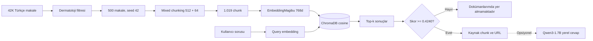

# Türkçe Tıbbi Vektör Arama ve Güvenli Reddetme

`magibu/embeddingmagibu-200m`, ChromaDB ve kalibre edilmiş cosine similarity
eşiğiyle geliştirilmiş, tamamen yeniden üretilebilir Türkçe dermatoloji bilgi
erişim projesi.

Bu repo ana ödev kapsamını içerir. Dinamik dosya yükleme, Traditional RAG,
Agentic RAG ve Hugging Face Space uygulaması ayrı bonus repoda geliştirilecektir.

## Teslim bağlantıları

- **Kaynak kod ve deney raporları:**
  [GitHub — turkish-medical-vector-search](https://github.com/berkbirkan/turkish-medical-vector-search)
- **Nihai chunk + embedding veri kümesi:**
  [Hugging Face — turkish-dermatology-rag-dataset](https://huggingface.co/datasets/berkbirkan/turkish-dermatology-rag-dataset)
- **Ana notebook:**
  [`notebooks/turkish_medical_vector_search.ipynb`](notebooks/turkish_medical_vector_search.ipynb)
- **30 soruluk bağımsız test seti:**
  [`data/benchmark/test.jsonl`](data/benchmark/test.jsonl)

Hugging Face teslim reposu veri dosyasının yanında yeniden üretim kodlarını,
konfigürasyonu, notebook'u, benchmark sorularını ve metrik raporlarını da içerir.

## Kısa sonuç

- `umutertugrul/turkish-medical-articles` kaynağından 500 dermatoloji makalesi
- Paragraf → cümle → token öncelikli mixed chunking
- 512 token hedefi ve 64 token overlap
- 1.019 adet chunk
- Yerel `magibu/embeddingmagibu-200m` ile 768 boyutlu normalize vektörler
- Cosine ChromaDB koleksiyonu
- Threshold kalibrasyonu için ekstra 20 soru
- Ödev için bağımsız 20 pozitif + 10 negatif soru
- Seçilen threshold: `0.4240`
- Testte 19/20 pozitif kabul ve 10/10 negatif ret
- Parent-document Recall@5: `0.85`

> Bu sonuçlar küçük ve kontrollü benchmark'a aittir. Klinik doğruluk veya farklı
> veri dağılımlarına genellenebilirlik iddiası taşımaz.

## Mimari



Threshold geçilmeden üretken model çağrılmaz. Böylece cevaplanamayan sorularda
LLM'in genel bilgisinden tahmin yürütmesi engellenir.

## Proje yapısı

```text
configs/
  default.yaml                    Deney ve çalışma ayarları
data/
  benchmark/                      Kalibrasyon ve bağımsız test soruları
  raw/                            İndirilen kaynak; Git dışında
  interim/                        Seçilen 500 makale; Git dışında
  processed/                      Chunk ve vektör çıktıları; Git dışında
notebooks/
  turkish_medical_vector_search.ipynb
reports/
  figures/                        Yeniden üretilen grafikler
  metrics/                        JSON, JSONL ve CSV deney sonuçları
scripts/                          Tekrarlanabilir CLI adımları
src/turkish_medical_vector_search/
  chunking/                       Mixed chunker
  data/                           Seçim ve kalite kontrolleri
  embeddings/                     Yerel model adaptörü
  retrieval/                      Threshold-aware arama
  vectorstore/                    ChromaDB katmanı
tests/                            Birim ve veri sözleşmesi testleri
```

## Gereksinimler ve kurulum

- Python `3.10+`
- Ana hat CPU'da çalışabilir; Apple Silicon MPS veya CUDA işlemi hızlandırır.
- Kaynak veri gated olduğu için Hugging Face hesabı ve erişim onayı gerekir.
- Opsiyonel Qwen bölümü için ücretsiz Colab GPU önerilir.

```bash
python -m venv .venv
source .venv/bin/activate
python -m pip install --upgrade pip
python -m pip install -e ".[dev,notebook]"
```

Opsiyonel yerel LLM bağımlılıkları:

```bash
python -m pip install -e ".[llm]"
```

### Hugging Face erişimi

Önce veri seti sayfasındaki koşulları kabul edin:

<https://huggingface.co/datasets/umutertugrul/turkish-medical-articles>

Ardından standart Hugging Face oturumu veya ortam değişkeni kullanılabilir:

```bash
export HF_TOKEN="hf_..."
```

Token hiçbir zaman notebook'a, `.env` dosyasına, çıktılara veya Git geçmişine
yazılmamalıdır.

## Baştan sona yeniden üretme

```bash
python scripts/download_source.py
python scripts/select_articles.py
python scripts/chunk_articles.py
python scripts/embed_chunks.py
python scripts/build_chroma.py
python scripts/prepare_benchmark.py
python scripts/evaluate_benchmark.py
python scripts/generate_figures.py
python scripts/export_hf_dataset.py
pytest
```

`export_hf_dataset.py`, teslim paketini `hf_dataset/` altında oluşturur ve
satır sayısı, zorunlu sütunlar, 768 boyutlu sonlu/L2-normalized vektörler,
Parquet round-trip ve SHA-256 kontrollerini uygular. Dataset card:
[`hf_dataset/README.md`](hf_dataset/README.md).

Embedding işlemi 32'lik batch'ler halinde fingerprint'li `.npy` checkpoint'ler
yazar. İşlem kesilirse tamamlanan batch'ler yeniden hesaplanmaz. Fingerprint;
kaynak chunk dosyasına, modele, boyuta, normalizasyona ve batch ayarına bağlıdır.

## 1. Veri seti seçimi

Kaynak veri seti yaklaşık 42 bin Türkçe tıbbi makale içerir. Tam indirilen
Parquet dosyasında 41.804 satır bulundu. `branch` değeri büyük-küçük harften
bağımsız tam eşleşmeyle `Dermatoloji` olarak filtrelendi.

| Kontrol | Sayı |
|---|---:|
| Kaynak satır | 41.804 |
| Dermatoloji satırı | 1.061 |
| Eksik zorunlu alan | 3 |
| 200 karakterden kısa | 1 |
| Yinelenen metin | 1 |
| Seçime uygun | 1.056 |
| Seçilen | 500 |

Seçim öncesinde URL'ye göre sıralama yapılır ve `seed=42` ile örneklenir. Bu,
kaynak Parquet'in satır sırası değişse bile örneklemi kararlı tutar. `parent_id`,
kaynak URL'nin SHA-256 özetinden türetilir.

Kaynak satır sonları korunur. URL, başlık ve kısa metadata alanlarında boşluklar
normalize edilirken makale içindeki tek `\n` sınırları silinmez.

Detay: [`reports/metrics/selection_summary.json`](reports/metrics/selection_summary.json)

## 2. Chunking stratejisi

Tam semantik chunking ek model ve değişken kararlar gerektirirken salt sabit
karakter bölme cümleleri rastgele keser. Bu nedenle deterministik mixed chunking
seçildi:

1. Kaynak satır/paragraf sınırlarını koru.
2. Token bütçesini aşan paragrafları cümle sonlarından böl.
3. Tek başına çok uzun cümleleri tokenizer tokenlarına göre böl.
4. Küçük birimleri 512 token bütçesine kadar birleştir.
5. Ardışık chunk'lar arasında 64 token overlap bırak.
6. Çok kısa son chunk için önceki bağlamdan overlap'i kontrollü genişlet.
7. Makale başlığını her chunk'ın başına ekle ve bu başlığı 512 bütçesine dahil et.

Token hesabı doğrudan embedding modelinin tokenizer'ıyla yapılır.

| Chunk metriği | Değer |
|---|---:|
| Makale | 500 |
| Chunk | 1.019 |
| Minimum token | 83 |
| Medyan token | 428 |
| Ortalama token | 385,02 |
| Maksimum token | 512 |
| Sınırı aşan | 0 |
| Temsil edilmeyen makale | 0 |

Detay: [`reports/metrics/chunking_summary.json`](reports/metrics/chunking_summary.json)

## 3. Embedding modeli

Model: [`magibu/embeddingmagibu-200m`](https://huggingface.co/magibu/embeddingmagibu-200m)

Seçilme nedenleri:

- Ödevde önerilen modeldir.
- Türkçe odaklıdır.
- Yaklaşık 200 milyon parametreyle yerel kullanım için görece hafiftir.
- 8.192 token context window sunar.
- 768 boyutlu, L2-normalized sentence embedding üretir.
- Sentence Transformers ile query/document ayrımlı kodlamayı destekler.

Üretilen Parquet alanı gerçek `fixed_size_list<float32>[768]` tipindedir.

| Doğrulama | Sonuç |
|---|---:|
| Vektör | 1.019 |
| Boyut | 768 |
| Minimum L2 norm | 0,99999988 |
| Ortalama L2 norm | 1,0 |
| Maksimum L2 norm | 1,00000012 |
| NaN/∞ | Yok |

Modelin yayımlanmış tokenizer config'indeki `extra_special_tokens` alanı yeni
Transformers sürümlerinde mapping olarak beklendiğinden yüklemede boş mapping ile
override edilir. Modelin custom pre-tokenizer'ı boşluk tabanlı `Split` yapısıdır;
genel Mistral regex yaması bu yapıya uygulanamaz. Aynı tokenizer hem chunking hem
embedding aşamasında kullanılarak iç tutarlılık korunur.

Detay: [`reports/metrics/embedding_summary.json`](reports/metrics/embedding_summary.json)

## 4. Çıktı şeması

Zorunlu ödev alanları ilk üç satırdadır:

| Alan | Tip | Açıklama |
|---|---|---|
| `url` | string | Orijinal makale bağlantısı |
| `chunk_text` | string | Başlık dahil chunk içeriği |
| `chunk_vector` | fixed-size float list, 768 | Normalize embedding |
| `chunk_id` | string | Benzersiz chunk kimliği |
| `parent_id` | string | Makale kimliği |
| `title` | string | Makale başlığı |
| `branch` | string | `Dermatoloji` |
| `chunk_index` | int | Makale içindeki sıra |
| `token_count` | int | Gerçek tokenizer sayımı |
| `embedding_model` | string | Model repo kimliği |

## 5. ChromaDB ve cosine similarity

ChromaDB yerel, kurulumu kolay, metadata filtreli ve bu ölçekte yeterli olduğu
için PGVector yerine seçildi. Üretim ortamında mevcut bir PostgreSQL altyapısı
varsa PGVector uygun bir alternatiftir.

Koleksiyon:

```text
name: turkish_dermatology_articles
metric: cosine
records: 1019
```

Chroma cosine distance döndürür. Kullanıcıya ve threshold analizine verilen skor:

```text
cosine_similarity = 1 - chroma_cosine_distance
```

Örnek:

```bash
python scripts/search.py "Cildimizi kışa hazırlamak için neler yapmalıyız?"
```

## 6. Benchmark tasarımı

Threshold'u test setinde seçmek veri sızıntısı oluşturacağı için iki set vardır:

| Set | Pozitif | Negatif | Kullanım |
|---|---:|---:|---|
| Kalibrasyon | 10 | 10 | Threshold seçimi |
| Bağımsız test | 20 | 10 | Nihai değerlendirme |

Pozitif sorular 30 farklı evidence chunk'a bağlanmıştır. Her satır; beklenen
cevap, chunk, parent, URL, başlık ve kanıt terimlerini içerir. Negatifler; zor
tıbbi kapsam dışı sorular ve tıp dışı sorular içerir. Ayırt edici yokluk terimleri
tüm 1.019 chunk'ta sıfır geçişle doğrulanır.

## 7. Threshold analizi

Yanlış bir tıbbi soruyu kabul etmek, cevaplanabilir bir soruyu reddetmekten daha
riskli görüldü. Kalibrasyonda yanlış kabul maliyeti `2`, yanlış ret maliyeti `1`
olarak tanımlandı.

| Kalibrasyon skoru | Değer |
|---|---:|
| En yüksek negatif | 0,41676 |
| En düşük pozitif | 0,43128 |
| Orta nokta | 0,42402 |
| Uygulama threshold'u | **0,4240** |

Sınıflar ayrıldığı için eşik iki sınırın orta noktasından seçildi. Threshold
yalnızca kalibrasyon sorularıyla belirlenmiş ve sonrasında dondurulmuştur.

Threshold altında kesin çıktı:

> Bu sorunun cevabı dokümanlarımda yer almamaktadır.

## 8. Sonuçlar

### Answerability sınıflandırması

| Metrik | Kalibrasyon | Test |
|---|---:|---:|
| TP / FN | 10 / 0 | 19 / 1 |
| TN / FP | 10 / 0 | 10 / 0 |
| Precision | 1,00 | 1,00 |
| Recall | 1,00 | 0,95 |
| F1 | 1,00 | 0,9744 |
| Negatif ret oranı | 1,00 | 1,00 |

### Retrieval

| Metrik | Kalibrasyon | Test |
|---|---:|---:|
| Exact chunk Recall@1 | 0,60 | 0,50 |
| Exact chunk Recall@3 | 0,80 | 0,70 |
| Exact chunk Recall@5 | 0,90 | 0,85 |
| Parent document Recall@1 | 0,70 | 0,50 |
| Parent document Recall@3 | 0,80 | 0,70 |
| Parent document Recall@5 | 0,90 | 0,85 |

Answerability başarısı ile exact evidence sıralaması aynı şey değildir. Örneğin
PRP veya göz çevresi sorularında aynı bilgiyi taşıyan alternatif makaleler,
elle bağlanan expected chunk'ın önüne çıkmıştır. Bu nedenle hem exact-chunk hem
parent-document metrikleri raporlanmıştır.

Tam rapor:
[`reports/metrics/threshold_evaluation.json`](reports/metrics/threshold_evaluation.json)

## 9. Opsiyonel yerel LLM

Ana ödev bir embedding ve vektör arama çalışmasıdır; cevap üreten LLM zorunlu
değildir. Ek deney olarak `Qwen/Qwen3-1.7B` 4-bit yüklenebilir. Notebook'ta
`RUN_OPTIONAL_LOCAL_LLM = False` varsayılanıdır. Bu hücre çalıştırılmadan tüm
ödev yükümlülükleri tamamlanabilir.

LLM yalnızca threshold geçildiğinde çağrılır ve yalnızca getirilen chunk'larla
cevap vermesi istenir. Üretilen cevaplar retrieval benchmark metriklerine dahil
edilmez.

EmbeddingMagibu ve Qwen arasında özel bir model ailesi veya vektör boyutu
uyumluluğu aranmaz. Magibu sorgu/chunk vektörlerini arama için üretir; Qwen'e
768 boyutlu vektörler değil, kabul edilmiş chunk metinleri verilir. Bu standart
RAG sözleşmesi sayesinde herhangi bir metin üreten yerel LLM kullanılabilir.

Colab'da opsiyonel kurulum:

```bash
pip install -e ".[llm]"
```

Ardından notebook'ta `RUN_OPTIONAL_LOCAL_LLM = True` yapılır. Varsayılan 4-bit
ayar CUDA GPU gerektirir; ücretsiz Colab T4 bu küçük deney için hedef ortamıdır.
CPU/macOS ortamında bu hücreyi kapalı bırakmak ana akışı etkilemez.
Kullanım ayrıntıları ve non-thinking üretim ayarları için
[resmî Qwen3-1.7B model kartı](https://huggingface.co/Qwen/Qwen3-1.7B)
esas alınmıştır.

## Testler

```bash
pytest
```

Test kapsamı:

- Konfigürasyon sözleşmesi
- Türkçe `İ/i` normalizasyonu
- Deterministik parent ID
- Chunk token sınırı ve başlık tekrarı
- Benchmark dağılımı ve evidence zorunluluğu
- Chroma cosine distance dönüşümü
- Threshold kabul ve kesin ret mesajı
- Batch sıralaması

## Sınırlılıklar

- Kaynak içerik halka açık sağlık makaleleridir; klinik kılavuz değildir.
- 500 makale ve 50 soru tüm dermatoloji alanını temsil etmez.
- Negatifler doğrulanmış olsa da bilinmeyen tüm sorgu türlerini kapsamaz.
- Perfect answerability skoru kontrollü ve küçük benchmark'ta elde edilmiştir.
- Embedding veya veri dağılımı değiştiğinde threshold yeniden kalibre edilmelidir.
- Exact chunk Recall@1, alternatif geçerli kaynaklar ve benzer konular nedeniyle
  answerability skorundan düşüktür.
- OCR, tablo, görsel ve çoklu belge muhakemesi ana ödev kapsamında değildir.

## Etik ve güvenlik

Bu proje eğitim ve bilgi erişimi amaçlıdır. Tanı, tedavi, ilaç dozu veya kişiye
özel tıbbi öneri sistemi değildir. Kullanıcı arayüzlerinde bu uyarı görünür
olmalıdır. Kaynak URL her sonuçla birlikte gösterilir. Cevap yoksa üretken model
genel bilgisini kullanarak boşluğu dolduramaz.

Kaynak veri CC BY 4.0 olarak sunulmaktadır; kod MIT lisanslıdır. Türetilmiş veri
yayımlanırken kaynak atfı ve Hugging Face veri erişim koşulları korunmalıdır.

## Notebook

[`notebooks/turkish_medical_vector_search.ipynb`](notebooks/turkish_medical_vector_search.ipynb)
hem Google Colab hem yerel Jupyter için tasarlanmıştır. Her aşama ayrı açıklama
ve kod hücresindedir. Gizli bilgiler notebook çıktısına yazılmaz.
