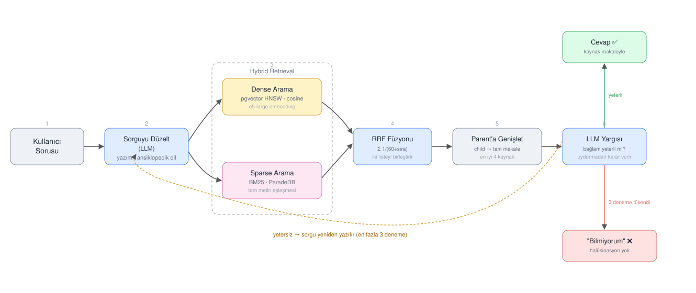

# Hybrid Agentic Child-Parent RAG (Türkçe Wikipedia 2023)

2023 Türkçe Wikipedia dump'ı üzerine kurulu bir RAG sistemi: sorguyu
düzeltir, dense+sparse hybrid retrieval ile ilgili makaleleri bulur,
bulamazsa sorguyu kendi kendine yeniden yazıp tekrar dener, hâlâ
bulamazsa uydurmadan "bilmiyorum" der. 100 soruluk benchmark'ta
**%94 accuracy, 0.94 F1**.



## Veri seti

348.751 makale, her biri **1 parent chunk** (tam makale — LLM'e bağlam
olarak verilir) ve birkaç **child chunk**'a (küçük parça — arama
bunlarla yapılır) bölündü.

| | |
|---|---|
| Makale | 348.751 |
| Embedded child chunk | 1.308.623 |
| Embedding modeli | `intfloat/multilingual-e5-large`, 1024 boyut |
| Lisans | CC BY-SA 3.0 |
| HF linki | [SalihHub/Wikipedia-TR-2023-Embedded-Dump](https://huggingface.co/datasets/SalihHub/Wikipedia-TR-2023-Embedded-Dump) |

Child-parent ayrımının nedeni basit: küçük chunk'lar arama isabetini
artırır ama bağlamı yarım keser, tam makale ise bağlamı korur ama
aramada gürültü yaratır. İkisini ayırınca hem hassas arama hem tam
bağlamlı cevap mümkün oluyor.

## Nasıl çalışıyor

1. **Sorguyu düzelt** — LLM, ham soruyu yazım hatalarından arındırıp
   ansiklopedik bir arama ifadesine çevirir.
2. **Hybrid arama** — aynı anda dense (pgvector, kosinüs benzerliği) ve
   sparse (ParadeDB BM25) arama yapılır.
3. **RRF füzyonu** — iki sonuç listesi Reciprocal Rank Fusion ile tek
   sıralamaya birleştirilir.
4. **Parent'a genişlet** — en iyi çıkan child chunk'ların ait olduğu
   tam makaleler (en fazla 4) bağlam olarak alınır.
5. **LLM yargısı** — bağlam soruyu cevaplıyorsa cevap üretilir;
   cevaplamıyorsa model yeni bir arama sorgusu önerir ve 2-4 adımı en
   fazla 3 kez tekrarlar.
6. **Ret** — üç denemeden sonra hâlâ bulunamazsa sistem açıkça
   cevaplayamadığını söyler, asla uydurmaz.

`python3 rag.py "soru"` çalıştırıldığında her adımın kosinüs/BM25
skorları ve seçilen kaynaklar terminale açıklamalı basılır
(`explain.py`) — retrieval'ın neden o sonuca vardığını görmek için.

## Vektör depolama

**PGVector (PostgreSQL) + ParadeDB** — aynı tabloda hem HNSW (dense)
hem BM25 (sparse) index birlikte çalışıyor, tek SQL katmanı yetiyor.

| Kolon | Anlamı |
|---|---|
| `documents.title` / `source_url` | makale başlığı / kaynak linki |
| `document_chunks.text` | chunk metni |
| `document_chunks.embedding` | `vector(1024)`, sadece child satırlarda |
| `document_chunks.parent_chunk_id` | child → parent bağlantısı |
| `document_chunks.chunk_type` | `"parent"` / `"child"` |

## Benchmark

[`benchmark.json`](benchmark.json): 100 soru — 50 **answerable**
(cevabı dump'ta var, kategoriler: tarih/coğrafya/bilim/edebiyat/spor/
sanat/teknoloji/siyaset) + 50 **unanswerable** (2024+ olaylar, uydurma
varlıklar, tahminler, öznel görüşler, anlık veri, notability altı
kişiler).

`python3 run_benchmark.py` koşusu sonunda bir confusion matrix ve
kategori bazlı doğruluk kırılımı basar:

```
┌─────────────────────────┬───────────────┬───────────────┐
│                         │ tahmin: cevap │ tahmin: ret   │
├─────────────────────────┼───────────────┼───────────────┤
│ gerçek: answerable      │  TP    48     │  FN     2     │
│ gerçek: unanswerable    │  FP     4     │  TN    46     │
└─────────────────────────┴───────────────┴───────────────┘

  precision 0.92   recall 0.96   f1 0.94   accuracy 0.94   (100 soru)
```

2 kaçırılan cevaptan biri gerçek bir retrieval açığı ("CPU" sorgusu
dump'taki "Mikroişlemci" makalesini yakalayamadı), diğeri modelin aşırı
temkinli davranması. 4 yanlış cevabın tamamı "şu anki/gelecekteki/
sence" gibi zamansal veya öznel çerçeveli sorularda — dump'ta konuyla
gerçekten ilgili içerik bulunduğu için model bunu yeterli sanmış.
Kategori kırılımı bu zayıf noktaları (`teknoloji 1/2`, `gercek_zamanli
7/9` gibi) tek bakışta gösteriyor.

## Kurulum

```bash
pip install -r requirements.txt
cp .env.example .env   # OPENROUTER_API_KEY, HF_DATASET_REPO, Postgres bilgileri
```

Veritabanını docker ile sıfırdan kurup dump'ı yüklemek için:

```bash
./setup.sh              # tüm dump
./setup.sh 5000          # ilk 5000 chunk (hızlı test)
```

> `docker-compose.yml`'deki container adı/portu (`wiki-import-db` /
> `5433`) mevcut geliştirme ortamıyla çakışabilir; aynı anda ikisini
> çalıştırmayın.

Kullanım:

```bash
python3 rag.py "Kapadokya hangi ilde yer alır?"   # tek soru, açıklamalı log
python3 run_benchmark.py                          # tüm 100 soru
python3 run_benchmark.py --limit 10                # hızlı smoke test
```

## Dosyalar

| Dosya | Görev |
|---|---|
| `db.py` | pgvector/ParadeDB erişimi: dense/sparse arama, parent/doküman lookup |
| `embedder.py` | sorgu embedding'i (e5, `"query: "` prefix'i) |
| `explain.py` | retrieval skorlarını açıklamalı loglayan yardımcılar |
| `rag.py` | ana pipeline: rewrite → hybrid retrieval → yargı → retry |
| `run_benchmark.py` | benchmark'ı koşturup TP/FP/TN/FN + precision/recall/F1 hesaplar |
| `benchmark.json` | 100 soruluk test seti |
| `docker-compose.yml`, `schema.sql` | Postgres/pgvector/ParadeDB'yi sıfırdan kurar |
| `load_dump.py`, `setup.sh` | HF'deki dump'ı indirip veritabanına yükler |

## Rubrikten sapmalar

| Konu | Rubrik | Bizim seçim | Neden |
|---|---|---|---|
| Embedding modeli | önerilen 4 modelden biri | `multilingual-e5-large` | dump zaten bu modelle embed edildi, sorgu tarafında aynı model zorunlu |
| Benchmark boyutu | 30 (20+10) | 100 (50+50) | daha geniş kategori kapsamı |
| Ret mekanizması | sabit kosinüs eşiği | agentic LLM yargısı + retry | tek eşik farklı chunk uzunluklarında kırılgan kalıyor; LLM içeriği okuyup karar veriyor, retry ile ilk aramada kaçırılan cevapları da yakalayabiliyor |
