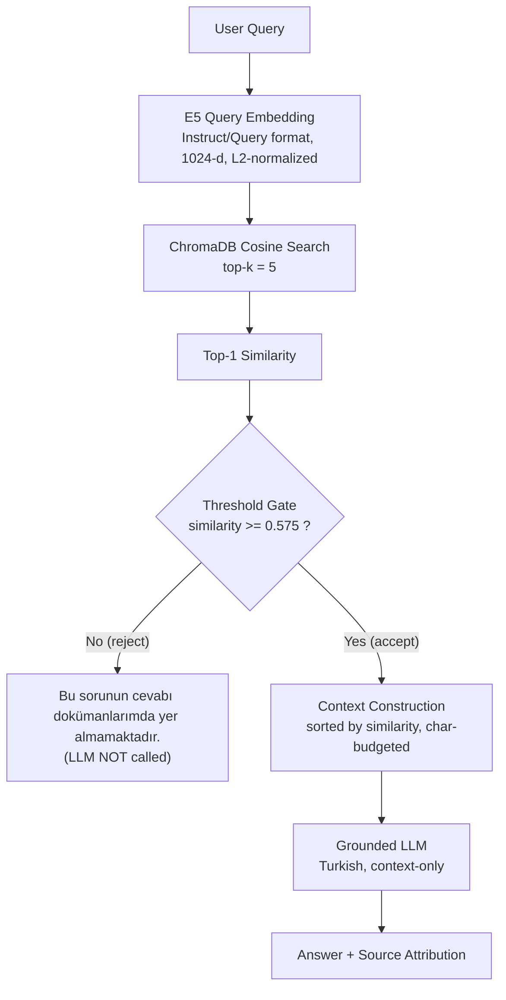

# Turkish Medical RAG

A Turkish medical document **retrieval + RAG** system built for an academic
assignment. The primary objective is **retrieval correctness and threshold-based
rejection** — the system must retrieve relevant evidence for answerable questions
and _refuse_ to answer questions whose answer is not present in the corpus,
rather than hallucinating. Answer generation is a thin, gated layer on top.

---

## 1. Project Overview

The pipeline selects Turkish hospital medical articles, chunks them
deterministically, embeds them with a Turkish-specialized model, stores them in a
persistent cosine vector database, and answers questions **only when** the top
retrieved evidence clears a calibrated similarity threshold. Below the threshold,
the system returns a fixed Turkish rejection message and **never calls the LLM**.

The project was built phase-by-phase (dataset → chunking → embedding → vector DB
→ benchmark → threshold → RAG → evaluation); every phase writes reproducible
artifacts and has tests.

---

## 2. Architecture



Text form: `User Query → Query Embedding → ChromaDB → Top-K Retrieval → Threshold Gate → Context Construction → Grounded LLM → Answer / Rejection`.

---

## 3. Dataset

- **Used dataset:** [`umutertugrul/turkish-hospital-medical-articles`](https://huggingface.co/datasets/umutertugrul/turkish-hospital-medical-articles).
- **Why the alternate:** The originally configured `umutertugrul/turkish-medical-articles`
  is **gated** on the Hugging Face Hub and could not be accessed with the available
  credentials. `CLAUDE.md` explicitly permits either dataset, so the accessible
  hospital dataset was used. This substitution is documented in `configs/config.yaml`.
- **Source scale:** **24,612** articles across **14 hospital splits** (acibadem,
  anadolusaglik, atlas, baskentistanbul, bayindir, florence, guven, liv,
  medicalpark, medicalpoint, medicana, medipol, memorial, yeditepe). The split
  name is preserved per document as the `source` metadata field.
- **Cleaning:** empty-text records (336) removed; exact-text **deduplication**
  removed 2,114 duplicates → **22,162** valid unique documents.
- **Selection:** **300** documents chosen with a fixed **`seed = 42`**, sampled
  from a stably-sorted pool so the result is independent of load order and
  byte-reproducible.
- **Required metadata per document:** `url`, `title`, `text`, plus derived
  `source` (hospital split) and a deterministic `doc_id`.

Confirmed dataset fields (not assumed): `text_field=text`, `url_field=url`,
`title_field=title`. Output: `data/processed/selected_documents.jsonl`; stats:
`artifacts/dataset_statistics.json`.

---

## 4. Chunking

Strategy: **`paragraph_then_token`** (deterministic).

1. Split each document into **paragraph units on newline boundaries** (this
   corpus uses single `\n` separators, not blank lines).
2. Greedily **group** consecutive units until the joined text would exceed
   **`max_tokens = 512`**.
3. If a single unit alone exceeds `max_tokens`, fall back to a token-measured
   **word-boundary window split** with **`overlap_tokens = 64`** (word boundaries
   avoid splitting multi-byte Turkish characters, preserving UTF-8 exactly).
4. Merge any chunk below **`min_tokens = 30`** into a neighbor — no tiny chunks,
   no empty chunks, no discarded text.

- **Tokenizer for sizing:** **`tiktoken` `cl100k_base`** (explicit, documented).
- **Result:** **2,072** chunks; mean **6.91** chunks/doc.
- **Token statistics (cl100k):** min 31 · median 445 · mean 412.6 · P95 509 ·
  max 531. Four chunks slightly exceed 512 tokens as the deliberate result of the
  sub-`min_tokens` merge (reported as `oversized_chunks`).
- **Integrity:** 0 empty chunks, 0 documents without chunks, **0 lost words**
  across 282,224 source words (`coverage_ok: true`).
- **Why this strategy:** it respects natural document structure while enforcing a
  hard token ceiling and never truncating content — a good fit for retrieval,
  and fully reproducible.

**Model-tokenizer cross-check:** the chunk sizes were independently re-tokenized
with the Phase-3 embedding model's own tokenizer — **all 2,072 chunks fit within
the model's 512-token context** (max observed 379). `cl100k_base` was a
conservative proxy; no re-chunking was needed. Output:
`data/processed/chunks.jsonl`; stats: `artifacts/chunk_statistics.json`.

---

## 5. Embedding Model

**`ytu-ce-cosmos/turkish-e5-large`** — revision `02e2362d503bbdeafcb17143b2165c0743f9fdb1`.

- **Dimension:** **1024** (verified at load).
- **E5-instruct convention** (implemented centrally so evaluation and production
  cannot diverge):
  - **Documents/chunks:** raw text, **no prefix**.
  - **Queries:** `Instruct: Given a Turkish search query, retrieve relevant passages written in Turkish that best answer the query\nQuery: <question>`.
- **L2-normalized** embeddings; **cosine** similarity.
- Same model for both documents and queries. All 2,072 vectors validated
  (dim 1024, no NaN/Inf, unit norms, 1:1 aligned to chunks).

**Why this model (over alternatives):** A controlled **pilot** compared the two
strongest candidates (`turkish-e5-large` vs `BAAI/bge-m3`) on the existing chunks
using each model's correct encoding. Both matched on retrieval relevance, but
turkish-e5-large gave **cleaner positive/negative score separation** — the
property the threshold gate depends on — while being Turkish-specialized, 1024-d,
and MIT-licensed. The other candidates (`magibu/embeddingmagibu-200m`,
`trmteb/turkish-embedding-model`) were ruled out on capacity, track record, and
(for trmteb) an _uncased_ Turkish base and unstated license.

> The pilot used throwaway diagnostic queries and is **not** the official
> benchmark; those pilot queries are not reused anywhere in the benchmark.

Output: `artifacts/embeddings.npz` (generated, gitignored); metadata:
`artifacts/embedding_statistics.json`.

---

## 6. Vector Database

- **ChromaDB**, persistent client at `artifacts/chroma/` (gitignored).
- Collection **`turkish_medical_chunks`**, created explicitly with
  **`hnsw:space = cosine`** (not relying on the default metric).
- Embeddings supplied **explicitly** (`embedding_function=None`) — no default
  embedding model is ever invoked.
- **Metadata per record:** `url`, `title`, `source`, `parent_id`. The chunk text
  is stored once as ChromaDB's document field (not duplicated into metadata).
- **2,072 records.** **Persistence verified**: ingest → close client → new client
  → count remains 2,072 (also re-confirmed in a separate process).

Metadata: `artifacts/vectorstore_statistics.json`.

---

## 7. Retrieval

- The query is embedded with the same E5 model + instruct format, L2-normalized.
- ChromaDB returns the **top-k = 5** nearest chunks by **cosine distance**.
- The application converts distance to similarity: **`similarity = 1 - distance`**
  — the raw Chroma distance is never exposed as the app's score.
- Results are ranked by descending similarity and expose: rank, `chunk_id`,
  similarity, `chunk_text`, `url`, `title`, `source`, `parent_id`.

---

## 8. Threshold

**`threshold = 0.575`** — decision rule: **accept if `similarity >= 0.575`, else reject.**

Selected in Phase 6 from the top-1 cosine scores of the frozen 30-question benchmark:

- 20 positive questions, top-1 min = **0.583**.
- 10 negative questions, top-1 max = **0.567**.
- The two sets are perfectly separable; the threshold is the **midpoint of the
  separating gap** (≈ 0.5749), rounded to **0.575** — giving equal margin to both
  classes and identical benchmark performance across the perfect band.

> **This threshold is calibrated on the benchmark and is NOT independently
> validated for generalization.** The separating gap is **narrow (0.0161)** — the
> perfect-separation band is only ≈ [0.57, 0.58]. At 0.56 two negatives are
> falsely accepted; at 0.59 one positive is falsely rejected. Real-world
> performance will very likely be below 100%.

Analysis: `artifacts/threshold_analysis.json`; ASCII distribution:
`artifacts/score_distribution.txt`.

---

## 9. Benchmark

**30 frozen questions** in `data/benchmark/benchmark.json` (tracked): **20 positive**,
**10 negative**.

- **Positives** span 20 diverse documents across 11 hospital sources (hematology,
  hepatology, GI/autoimmune, pharmacology, psychiatry, endocrinology,
  rheumatology, infectious disease, parasitology, nutrition, oncology, cardiology,
  pulmonology, ENT, genetics, neurology, urology, toxicology). Each records its
  `expected_chunk_ids`, `expected_parent_ids`, `expected_urls`, and an **exact
  evidence excerpt** located in the referenced chunk (build-time verified).
- **Negatives** are realistic medical questions on topics with **zero lexical
  presence** in the corpus (Ebola, Kolera, Şarbon, Kabakulak, Kırım-Kongo,
  Huntington, Renk körlüğü, Narkolepsi, Kekemelik, Kleptomani), each further
  confirmed unanswerable by ChromaDB top-5 inspection.
- **Why the negatives are relatively "easy":** they are clean, clearly
  out-of-domain topics chosen so absence is unambiguous and strictly verifiable.
  Harder in-domain near-miss negatives would raise negative scores and shrink the
  separation gap — a deliberate, documented trade-off.

The benchmark is deterministic and rebuildable (`scripts/build_benchmark.py`) and
semantically re-checkable (`scripts/verify_benchmark.py`).

---

## 10. Final Results

Source of truth: `artifacts/final_evaluation.json` (Phase 8), produced by running
all 30 benchmark questions through the **real** retrieval pipeline at the frozen
threshold. Values are measured, not invented.

**Retrieval metrics (deterministic):**

| Metric                                          | Value              |
| ----------------------------------------------- | ------------------ |
| Positive expected-parent retrieved at**rank 1** | **20 / 20 (100%)** |
| Positive expected-chunk retrieved in**top-5**   | **20 / 20 (100%)** |

**Threshold / gate metrics at 0.575 (deterministic):**

|                                  |                     |
| -------------------------------- | ------------------- |
| TP / TN / FP / FN                | **20 / 10 / 0 / 0** |
| Accuracy                         | **1.000**           |
| Precision                        | **1.000**           |
| Recall (sensitivity)             | **1.000**           |
| Specificity (negative rejection) | **1.000**           |
| F1                               | **1.000**           |
| False acceptance rate            | **0.000**           |
| False rejection rate             | **0.000**           |

**Score statistics (top-1 cosine):**

| Set           | min   | max   | mean  | median | std   |
| ------------- | ----- | ----- | ----- | ------ | ----- |
| Positive (20) | 0.583 | 0.838 | 0.709 | 0.720  | 0.069 |
| Negative (10) | 0.459 | 0.567 | 0.527 | 0.534  | 0.031 |

> These perfect gate numbers are **on the calibration set**. Because the threshold
> was selected on this same 30-question benchmark, they are an
> evaluation/calibration result, not a generalization estimate.

**RAG answer evaluation — STRUCTURAL / OFFLINE only.** No `ANTHROPIC_API_KEY` was
available, so the answer layer was verified structurally with a `FakeLLMClient`
(no real LLM API call; fake results are **not** substituted for real ones):

- 20/20 accepted positives built non-empty grounded context + sources and called
  the (fake) LLM exactly once.
- 10/10 rejected negatives returned the exact rejection message and **never**
  called the LLM.

A real-LLM answer-grounding evaluation requires configuring
`llm.provider: anthropic`, `pip install anthropic`, and an API key — see §13.

---

## 11. RAG Answering

- **The threshold gate runs before any LLM call.** Rejected queries return the
  exact message `Bu sorunun cevabı dokümanlarımda yer almamaktadır.` and the LLM
  is never invoked.
- Accepted queries build context from the retrieved chunks, **sorted by
  descending similarity** and capped at **`rag.max_context_chars = 6000`**.
- The prompt separates `SYSTEM INSTRUCTIONS` / `USER QUESTION` / `RETRIEVED CONTEXT`. The system prompt enforces: answer **only** from context, no outside
  knowledge, no invented medical facts, explicitly say when context is
  insufficient, respond in **Turkish**, be concise. The threshold decision is
  **not** in the prompt.
- **Source attribution** (title, URL, similarity, ids) is returned separately
  from the answer and only from metadata ChromaDB actually returned.
- The LLM is behind an `LLMClient` abstraction (`FakeLLMClient` /
  `AnthropicLLMClient`) so the pipeline is provider-agnostic and offline-testable.

---

## 12. Project Structure

```
configs/config.yaml         # single source of truth for all parameters
src/
  config.py                 # centralized config loader
  tokenizer.py              # tiktoken wrapper (chunk sizing)
  data/loader.py            # dataset load + normalize
  data/selector.py          # validation, dedup, seeded selection
  data/chunker.py           # deterministic paragraph_then_token chunker
  embeddings/embedder.py    # E5 encoding + validation
  vectorstore/chroma_store.py  # ChromaDB cosine store + retrieval
  evaluation/threshold.py   # threshold sweep / metrics
  rag/llm.py                # LLM abstraction (Fake / Anthropic)
  rag/prompt.py             # context, prompt, source construction
  rag/pipeline.py           # threshold-gated RAG pipeline
scripts/
  download_dataset.py       # Phase 1
  build_chunks.py           # Phase 2
  build_embeddings.py       # Phase 3
  build_vector_db.py        # Phase 4
  build_benchmark.py        # Phase 5 (writes tracked benchmark)
  verify_benchmark.py       # Phase 5 semantic audit
  evaluate.py               # Phase 6 threshold analysis
  final_evaluation.py       # Phase 8 final evaluation
tests/                      # pytest suite (offline)
data/
  processed/                # generated: selected_documents.jsonl, chunks.jsonl (gitignored)
  benchmark/benchmark.json  # TRACKED — academic deliverable
artifacts/                  # generated stats + embeddings + chroma (gitignored)
```

**Source (tracked):** everything under `src/`, `scripts/`, `tests/`, `configs/`,
plus `data/benchmark/benchmark.json` and the docs. **Generated (gitignored):**
everything under `data/processed/`, `data/raw/`, and `artifacts/` (including
`embeddings.npz`, the `chroma/` DB, and all `*_statistics.json` /
`final_evaluation.json`).

---

## 13. Reproduction

Requires **Python 3.10+** (developed on 3.12).

```bash
# 1. Install (core deps: pyyaml, datasets, tiktoken, numpy,
#    sentence-transformers, chromadb) + dev tools
pip install -e ".[dev]"

# 2. Dataset acquisition + seeded selection of 300 documents  (Phase 1)
python scripts/download_dataset.py

# 3. Deterministic chunking -> 2072 chunks                     (Phase 2)
python scripts/build_chunks.py

# 4. Embeddings (turkish-e5-large, 1024-d, normalized)         (Phase 3)
python scripts/build_embeddings.py

# 5. Build persistent ChromaDB cosine collection               (Phase 4)
python scripts/build_vector_db.py

# 6. (Re)build + verify the 30-question benchmark              (Phase 5)
python scripts/build_benchmark.py
python scripts/verify_benchmark.py

# 7. Threshold analysis on the benchmark (already frozen at 0.575)  (Phase 6)
python scripts/evaluate.py

# 8. Final evaluation artifact                                 (Phase 8)
python scripts/final_evaluation.py

# Tests
pytest -q
```

**Generated artifacts are intentionally gitignored** (large model vectors, the
Chroma DB, and per-phase stats). A fresh checkout regenerates all of them by
running steps 2–8 above — no large model files or database files need to be
committed. `data/benchmark/benchmark.json` **is** tracked.

**Optional — real LLM answering.** Set `llm.provider: anthropic` in
`configs/config.yaml` (already the default), then:

```bash
pip install anthropic
export ANTHROPIC_API_KEY=...        # never commit this
python -c "from src.config import load_config; from src.rag.pipeline import build_pipeline; \
           print(build_pipeline(load_config()).answer('Hipertansiyon nedir?'))"
```

API usage note: with `provider: anthropic`, accepted queries make one Claude API
call each; rejected queries make none. No key is read from or written to source.

### Interfaces (CLI and Web UI)

Two thin demo layers sit on top of the same production pipeline (they do **not**
change retrieval/threshold/RAG behaviour):

```bash
# Terminal CLI
python scripts/chat.py --question "Anemi nedir?"   # one-shot
python scripts/chat.py                             # interactive

# Web UI (Streamlit) — real E5 model + real ChromaDB retrieval
pip install -e ".[dev]"       # installs streamlit
streamlit run scripts/app.py
```

The Streamlit UI shows the full evidence chain (question → retrieved chunks →
similarity → threshold → accepted/rejected) using the real corpus. **It works
without a Claude API key:** when `ANTHROPIC_API_KEY` is not set, accepted
questions run in **retrieval-only** mode — the real retrieved chunks, similarity,
and context are displayed, but Claude is not called (no crash). With a key set,
accepted questions additionally show the grounded Claude answer. Rejected
questions never call the LLM in either interface.

---

## 14. Testing

`pytest -q` → **107 tests passing** (config, dataset, chunker, embedder,
vector-store, benchmark, threshold, RAG, plus CLI and Web-UI logic). All tests are
offline (no network, no LLM API, no Streamlit runtime) — model-backed and UI logic
is covered via pure helpers and injected fakes.

---

## 15. Limitations

- **Threshold calibrated on only 30 benchmark questions**, with no held-out set —
  the perfect gate metrics are a calibration result, not a generalization estimate.
- **Narrow separation margin of 0.0161** — the perfect-separation band (≈ [0.57,
  0.58]) is thin and fragile.
- **Negatives are relatively easy**, clean out-of-domain topics; harder in-domain
  negatives would likely shrink the margin.
- **No independent held-out threshold validation.**
- **The retrieval gate uses top-1 cosine similarity only** (no rank/aggregation
  signals).
- **CPU / model-version numerical variation** (~1e-6) can shift scores slightly
  across environments.
- **No medical validation** — this is a retrieval/RAG engineering assignment, not
  a clinically validated system; answers must not be used for medical decisions.
- **Real LLM answer evaluation depends on external API availability** — it was not
  performed here (no API key), and fake results are never substituted for real ones.

---

_The dataset substitution, the benchmark-calibrated threshold, the narrow margin,
and the structural-only RAG evaluation are stated plainly above rather than
hidden. `configs/config.yaml` is the single source of truth for all parameters._
