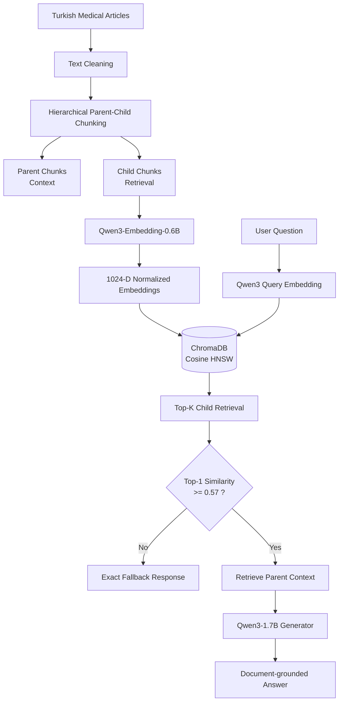

# 🩺 Turkish Medical RAG

<p align="center">
  <strong>Hierarchical Parent–Child Retrieval-Augmented Generation for Turkish Medical Documents</strong>
</p>

<p align="center">
  <a href="https://huggingface.co/datasets/sedayzc/turkish-medical-rag">
    
  </a>
  <a href="https://huggingface.co/spaces/sedayzc/turkish-medical-rag-demo">
    
  </a>
</p>

<p align="center">
  
  
  
  
  
  
</p>

---

## 📌 Proje Hakkında

Bu proje, Türkçe tıbbi dokümanlar üzerinde çalışan uçtan uca bir
**Retrieval-Augmented Generation (RAG)** sistemi geliştirmek amacıyla hazırlanmıştır.

Sistem bir kullanıcı sorusu aldığında önce doküman koleksiyonundaki küçük ve
anlamsal olarak odaklı parçalar (**child chunks**) üzerinde dense vector retrieval
gerçekleştirir.

En iyi retrieval sonucunun cosine similarity değeri daha önce benchmark üzerinden
belirlenen eşik değerinin altındaysa sistem dokümanlarda yeterli kanıt olmadığını
kabul eder ve doğrudan:

> **Bu sorunun cevabı dokümanlarımda yer almamaktadır**

cevabını üretir.

Eşik değerini geçen sorgularda ise bulunan child chunk'ın ait olduğu daha geniş
**parent chunk** modele context olarak verilir ve cevap yalnızca elde edilen
dokümanlara dayanılarak üretilir.

Bu sayede sistem iki farklı problemi birlikte çözmeyi amaçlar:

- doğru dokümanı yüksek hassasiyetle bulmak,
- koleksiyonda bulunmayan sorulara modelin kendi bilgisinden cevap uydurmasını
  engellemek.

---

# 🏗️ Sistem Mimarisi



---

# 📊 Temel Proje İstatistikleri

| Özellik | Değer |
|---|---:|
| Kaynak doküman | 500 |
| Parent chunk | 895 |
| Child chunk | 3,259 |
| Embedding modeli | `Qwen/Qwen3-Embedding-0.6B` |
| Embedding dimension | 1024 |
| Vector database | ChromaDB |
| Distance metric | Cosine |
| Benchmark sorusu | 30 |
| Pozitif soru | 20 |
| Negatif soru | 10 |
| Final threshold | **0.57** |
| Benchmark Accuracy | **1.00** |
| Benchmark Precision | **1.00** |
| Benchmark Recall | **1.00** |
| Benchmark F1 | **1.00** |

> Benchmark sonuçları yalnızca oluşturulan 30 soruluk test seti üzerindeki
> performansı ifade eder ve sistemin tüm olası kullanıcı sorgularında %100
> doğruluk sağlayacağı anlamına gelmez.

---

# 📚 Veri Seti

Kaynak olarak Hugging Face üzerindeki:

```text
umutertugrul/turkish-hospital-medical-articles
```

veri setinin Memorial hastane içeriklerini içeren bölümü kullanılmıştır.

Kaynak dosya:

```text
memorial.parquet
```

Temizleme sonrasında kullanılabilir 5,264 doküman içerisinden sabit random seed
kullanılarak **500 makale** seçilmiştir.

```python
RANDOM_SEED = 42
```

Oluşturulan temel veri seti:

```text
data/articles_500.parquet
```

şeklinde saklanmaktadır.

Her makale için temel olarak şu bilgiler korunmuştur:

```text
parent_id
url
title
text
publish_date
update_date
scrape_date
source
```

Bu seçim ile sistem hem yeterince geniş bir tıbbi konu çeşitliliğine sahip
olurken hem de lokal ortamda tekrar üretilebilir ve deney yapılabilir bir
koleksiyon boyutunda tutulmuştur.

---

# ✂️ Chunking Stratejisi

## Neden klasik fixed-size chunking kullanılmadı?

RAG sistemlerinde çok büyük chunk'lar kullanıldığında retrieval sonucuna
gereksiz metinler dahil olabilir.

Çok küçük chunk'lar kullanıldığında ise doğru metin bulunmasına rağmen
cevap üretmek için gereken bağlam parçalanabilir.

Bu projede bu iki problemin birlikte azaltılması amacıyla
**Hierarchical Parent–Child Chunking** yaklaşımı kullanılmıştır.

---

## Parent–Child Yaklaşımı

Her doküman iki farklı seviyede parçalanmaktadır:

### Child Chunk

Child chunk'lar retrieval için kullanılır.

Daha küçük olmaları nedeniyle kullanıcının sorusuyla ilgili spesifik cümle
veya paragrafları daha hassas şekilde temsil ederler.

```text
Maximum child size : 320 token
Minimum target     : 80 token
```

Child chunk'lar embedding modeline gönderilir ve ChromaDB içerisinde
indekslenir.

---

### Parent Chunk

Parent chunk'lar doğrudan vector search için kullanılmaz.

Bir child chunk başarılı şekilde retrieve edildiğinde, ilgili child'ın bağlı
olduğu daha geniş parent chunk modele context olarak gönderilir.

```text
Maximum parent size : 1200 token
Minimum target      : 200 token
```

Böylece:

```text
küçük chunk → daha hassas retrieval
büyük parent → daha zengin generation context
```

avantajları birlikte kullanılmaktadır.

---

## Chunk Sınırları

Chunking yalnızca karakter sayısına göre yapılmamıştır.

Öncelikle:

- paragraf yapıları,
- cümle sınırları,
- soru-cevap blokları,
- liste yapıları,
- anlamsal bölümler

korunmaya çalışılmıştır.

Child seviyesinde gerektiğinde **1 semantic unit overlap** kullanılmaktadır.

Parent chunk'larda ise overlap kullanılmamaktadır.

```text
Parent overlap : 0
Child overlap  : 1 semantic unit
```

---

## Chunk Tokenizer

Chunk geometrisini ölçmek için:

```text
BAAI/bge-m3
```

tokenizer'ı kullanılmıştır.

Bu model burada embedding üretmek amacıyla değil, yalnızca metinlerin token
uzunluğunu güvenilir biçimde ölçmek amacıyla kullanılmıştır.

Retrieval embedding'leri daha sonraki aşamada ayrı olarak
`Qwen3-Embedding-0.6B` ile üretilmiştir.

Chunk tokenizer ile embedding tokenizer'ın farklı olması bir problem değildir;
kritik gereksinim document ve query embedding'lerinin aynı embedding modeliyle
üretilmesidir.

Bu projede her ikisi de:

```text
Qwen/Qwen3-Embedding-0.6B
```

ile üretilmektedir.

---

## Chunk Temizleme

Web tabanlı tıbbi makalelerde menüler, tekrar eden başlıklar ve navigation
blokları bulunduğu için chunking öncesinde ve sırasında ek temizleme
uygulanmıştır.

Uygulanan işlemler arasında:

- consecutive duplicate segment temizleme,
- adjacent phrase duplicate temizleme,
- chunk boundary duplicate temizleme,
- navigation / table-of-contents bloklarının temizlenmesi,
- gereksiz tekrarların kaldırılması

bulunmaktadır.

Bununla birlikte gerçek FAQ ve doktor soru listelerinin yanlışlıkla
silinmemesi için agresif global deduplication uygulanmamıştır.

Final chunk sonucu:

```text
500 article
895 parent chunk
3259 child chunk
```

olarak elde edilmiştir.

---

# 🧠 Embedding Modeli

Retrieval embedding modeli olarak:

```text
Qwen/Qwen3-Embedding-0.6B
```

kullanılmıştır.

Model çıktısı:

```text
1024 dimension
```

dense embedding vektörlerinden oluşmaktadır.

---

## Neden Qwen3-Embedding-0.6B?

Model seçiminde yalnızca model büyüklüğü değil aşağıdaki kriterler dikkate
alınmıştır:

- çok dilli retrieval desteği,
- Türkçe metinlerle çalışabilmesi,
- retrieval odaklı embedding mimarisi,
- instruction-aware query embedding desteği,
- lokal GPU üzerinde çalıştırılabilmesi,
- embedding kalitesi / kaynak tüketimi dengesi.

Daha büyük embedding modelleri daha yüksek kaynak tüketimine neden olduğundan
bu proje için `0.6B` sürümü performans ve donanım gereksinimi açısından dengeli
bir tercih olarak değerlendirilmiştir.

---

## Document ve Query Embedding

Dokümanlar doğrudan encode edilmektedir.

```python
embedding_model.encode(
    chunk_texts,
    normalize_embeddings=True
)
```

Query tarafında ise modelin retrieval query prompt'u kullanılmaktadır:

```python
embedding_model.encode(
    question,
    prompt_name="query",
    normalize_embeddings=True
)
```

Bu ayrım modelin sorgu ve doküman rollerini daha doğru temsil etmesini sağlar.

---

## L2 Normalization

Tüm embedding'ler `float32` formatına dönüştürülmüş ve ayrıca NumPy ile tekrar
L2 normalize edilmiştir.

Sonuç olarak vektör normları yaklaşık:

```text
mean = 1.000000
```

seviyesindedir.

Normalize embedding kullanımı cosine similarity hesaplarının daha tutarlı
olmasını sağlar.

---

# 🗄️ Vector Database

Vector database olarak:

```text
ChromaDB
```

kullanılmıştır.

Collection:

```text
turkish_medical_chunks
```

olarak oluşturulmuştur.

Distance metric:

```text
cosine
```

şeklindedir.

ChromaDB içerisine embedding'ler tekrar hesaplanmadan doğrudan eklenmiştir.

Her child için:

```text
child_id
chunk_vector
chunk_text
parent_id
article_id
title
url
```

bilgileri saklanmaktadır.

Parent metinleri ise tekrar tekrar Chroma metadata içerisinde tutulmak yerine
Parquet dosyasından `parent_id` kullanılarak alınmaktadır.

Bu nedenle sistemde:

```text
ChromaDB → retrieval index
Parquet  → document / parent store
```

ayrımı bulunmaktadır.

---

# 🎯 Threshold Analizi

RAG sisteminin en önemli parçalarından biri, vector search her zaman bir
"en yakın" doküman döndürdüğü için bu sonucun gerçekten alakalı olup
olmadığını belirlemektir.

Örneğin koleksiyonda otomobil bilgisi bulunmamasına rağmen:

```text
Toyota Corolla'nın motor hacmi kaç cc?
```

sorgusu için Chroma yine matematiksel olarak en yakın tıbbi chunk'ı
döndürmektedir.

Bu nedenle yalnızca Top-1 document almak yeterli değildir.

---

## Benchmark

Threshold belirlemek için toplam **30 soru** hazırlanmıştır:

```text
20 positive
10 negative
```

### Positive

Cevabı mevcut tıbbi doküman koleksiyonunda bulunan sorular:

```text
Angelman sendromunun belirtileri nelerdir?
Bradikardi nedir ve belirtileri nelerdir?
Migrene ne iyi gelir?
...
```

### Negative

Cevabı doküman koleksiyonunda bulunmayan sorular:

```text
Toyota Corolla'nın motor hacmi kaç cc?
Python'da bir liste nasıl sıralanır?
Fransa'nın başkenti neresidir?
SQL'de iki tablo nasıl JOIN edilir?
...
```

---

## Similarity Dağılımı

Benchmark sonucunda:

| Grup | Mean | Minimum | Maximum |
|---|---:|---:|---:|
| Positive | 0.758692 | **0.604484** | 0.838436 |
| Negative | 0.347229 | 0.262362 | **0.534648** |

En düşük pozitif skor:

```text
0.604484
```

En yüksek negatif skor:

```text
0.534648
```

olmuştur.

İki sınıf arasında:

```text
0.604484 - 0.534648
= 0.069836
```

bir ayrım gözlenmiştir.

---

## Threshold Seçimi

Negatif maksimum değer ile pozitif minimum değer arasındaki orta nokta
hesaplanmıştır:

```text
(0.534648 + 0.604484) / 2

= 0.569566
```

Bu değer final uygulamada okunabilirlik amacıyla:

```text
THRESHOLD = 0.57
```

olarak kullanılmıştır.

Karar mekanizması:

```python
if top1_similarity >= 0.57:
    retrieve_parent_context()
    generate_answer()

else:
    return "Bu sorunun cevabı dokümanlarımda yer almamaktadır"
```

şeklindedir.

---

## Threshold Scan

Ayrıca:

```text
0.200 → 0.800
```

aralığında:

```text
0.001
```

adımla toplam **601 threshold değeri** taranmıştır.

Her threshold için:

- True Positive
- True Negative
- False Positive
- False Negative
- Accuracy
- Precision
- Recall
- Specificity
- F1
- Balanced Accuracy

hesaplanmıştır.

Seçilen `0.57` threshold değerinde benchmark sonucu:

```text
TP = 20
TN = 10
FP = 0
FN = 0
```

olarak elde edilmiştir.

Buna karşılık:

```text
Accuracy          = 1.00
Precision         = 1.00
Recall            = 1.00
Specificity       = 1.00
F1                = 1.00
Balanced Accuracy = 1.00
```

sonuçları elde edilmiştir.

Bu değerler yalnızca oluşturulan benchmark üzerinde gözlenen sonuçlardır ve
genel kullanım için %100 başarı iddiası olarak değerlendirilmemelidir.

---

# 🤖 Answer Generation

Retrieval sonucunda threshold'u geçen sorgular için generation modeli olarak:

```text
Qwen/Qwen3-1.7B
```

kullanılmıştır.

Akış:

```text
User Question
      ↓
Child Retrieval
      ↓
Threshold
      ↓
Unique Parent Selection
      ↓
Parent Context
      ↓
Qwen3-1.7B
      ↓
Final Turkish Answer
```

Generator'a verilen system prompt modeli yalnızca retrieve edilen context
içerisindeki bilgilere göre cevap vermeye yönlendirmektedir.

Modelden:

- dış bilgi kullanmaması,
- tahmin yapmaması,
- dokümanda bulunmayan bilgi eklememesi,
- Türkçe ve doğrudan cevap vermesi

istenmektedir.

---

# 🚫 Cevabı Olmayan Sorular

Top-1 similarity:

```text
similarity < 0.57
```

olduğunda generator model **çalıştırılmaz**.

Sistem doğrudan ve tam olarak:

```text
Bu sorunun cevabı dokümanlarımda yer almamaktadır
```

cevabını üretir.

Bu yaklaşım:

- hallucination riskini azaltır,
- gereksiz LLM inference maliyetini önler,
- sistem davranışını deterministik hale getirir.

---

# 🧪 Final RAG Testi

30 soruluk benchmark final RAG pipeline üzerinden tekrar çalıştırılmıştır.

Sonuç:

```text
30 / 30 threshold decision correct
```

olarak gözlenmiştir.

Örnek pozitif sorgu:

```text
Soru:
Angelman sendromunun belirtileri nelerdir?

Similarity:
~0.816

Threshold:
0.57

Decision:
ACCEPT
```

İlgili `Angelman Sendromu` dokümanı retrieval ile bulunmuş ve parent
context kullanılarak cevap oluşturulmuştur.

Örnek negatif sorgu:

```text
Soru:
Toyota Corolla'nın motor hacmi kaç cc?

Similarity:
~0.33

Threshold:
0.57

Decision:
REJECT
```

Sistem:

```text
Bu sorunun cevabı dokümanlarımda yer almamaktadır
```

cevabını üretmiştir.

---

# 🧩 Script Açıklamaları

| Script | Görev |
|---|---|
| `01_collect_articles.py` | Kaynak tıbbi makaleleri indirir, temizler ve 500 doküman seçer |
| `02_chunk_articles.py` | Hierarchical parent-child chunk'ları oluşturur |
| `02_1_inspect_chunks.py` | Chunk boyut ve geometri kontrollerini gerçekleştirir |
| `02_2_inspect_content_quality.py` | Chunk içerik kalitesini ve olası tekrarları inceler |
| `03_embed_chunks.py` | Child chunk embedding'lerini üretir |
| `04_build_chroma.py` | Embedding'leri ChromaDB cosine index'e ekler |
| `05_test_retrieval.py` | Pozitif/negatif retrieval smoke test gerçekleştirir |
| `06_run_benchmark.py` | 30 soruluk benchmark retrieval çalıştırır |
| `07_select_threshold.py` | Threshold taraması ve final eşik seçimi yapar |
| `08_final_rag.py` | Interactive final RAG uygulamasını çalıştırır |
| `09_run_rag_questions.py` | 30 benchmark sorusunu final RAG üzerinden çalıştırıp cevapları kaydeder |

---

# 🚀 Kurulum

Repository, final RAG pipeline'ını çalıştırmak için gerekli hazırlanmış
artifact'ları içerir. Bu nedenle veri toplama, chunking ve embedding
aşamalarının tekrar çalıştırılması zorunlu değildir.

## 1. Repository'yi klonlayın

```bash
git clone <https://github.com/ssedayzc/turkish-medical-rag.git>
cd turkish-medical-rag
```

## 2. Bağımlılıkları yükleyin

Python 3.11 önerilmektedir.

```bash
python -m pip install -r requirements.txt
```

## 3. Final benchmark'ı çalıştırın

```bash
python 09_run_rag_questions.py
```

Script repository içerisindeki hazır:

- benchmark questions,
- child embeddings,
- ChromaDB vector index,
- parent documents,
- selected threshold

artifact'larını kullanarak 30 benchmark sorusunu final RAG pipeline
üzerinden yeniden çalıştırır.

İlk çalıştırmada Hugging Face modelleri otomatik olarak indirilecektir.

---

# 👀 Çalıştırmadan Sonuçları İnceleme

Final sonuçları görmek için herhangi bir model indirmeniz veya kod
çalıştırmanız gerekmez.

Hazır sonuçlar:

```text
analysis/rag_question_answers.txt
analysis/rag_question_answers.json
analysis/benchmark_results.csv
analysis/threshold_scan.csv
analysis/selected_threshold.json
```

dosyalarında bulunmaktadır.

Özellikle:

```text
analysis/rag_question_answers.txt
```

dosyası benchmark sorularını, retrieval kararlarını, similarity skorlarını,
üretilen cevapları ve kullanılan kaynakları insan tarafından okunabilir
formatta içerir.

---

# 🔄 Pipeline'ı Baştan Yeniden Üretme

Hazır artifact'ları kullanmak yerine tüm pipeline'ı sıfırdan yeniden üretmek
isteyen kullanıcılar aşağıdaki adımları çalıştırabilir:

```bash
python 01_collect_articles.py
python 02_chunk_articles.py
python 02_1_inspect_chunks.py
python 02_2_inspect_content_quality.py
python 03_embed_chunks.py
python 04_build_chroma.py
python 05_test_retrieval.py
python 06_run_benchmark.py
python 07_select_threshold.py
python 09_run_rag_questions.py
```

Interactive RAG uygulaması ayrıca:

```bash
python 08_final_rag.py
```

ile çalıştırılabilir.

`01_collect_articles.py` kaynak Hugging Face datasetine eriştiğinden,
pipeline'ı sıfırdan çalıştırmak isteyen kullanıcının dataset erişim
koşullarını kabul etmiş olması gerekebilir.

Gerekirse:

```bash
hf auth login
```

kullanılabilir.

# 📤 Üretilen Çıktılar

Final benchmark aşağıdaki çıktıları üretir:

```text
analysis/rag_question_answers.csv
analysis/rag_question_answers.json
analysis/rag_question_answers.txt
```

Her kayıt içerisinde:

```text
question
question_type
top1_similarity
decision
answer
source_titles
source_urls
embedding_seconds
search_seconds
generation_seconds
total_seconds
```

gibi bilgiler bulunmaktadır.


---

# 🧾 Özet

Bu projede:

```text
500 Turkish medical articles
        ↓
Hierarchical Parent-Child Chunking
        ↓
3259 Child Chunks
        ↓
Qwen3-Embedding-0.6B
        ↓
1024-D Dense Embeddings
        ↓
ChromaDB / Cosine Search
        ↓
0.57 Similarity Threshold
        ↓
Parent Context Retrieval
        ↓
Qwen3-1.7B
        ↓
Grounded Turkish Answer
```

pipeline'ı oluşturulmuştur.

Ana tasarım hedefi yalnızca doğru dokümanı bulmak değil, aynı zamanda cevabı
doküman koleksiyonunda bulunmayan soruların güvenilir şekilde filtrelenmesidir.

---
