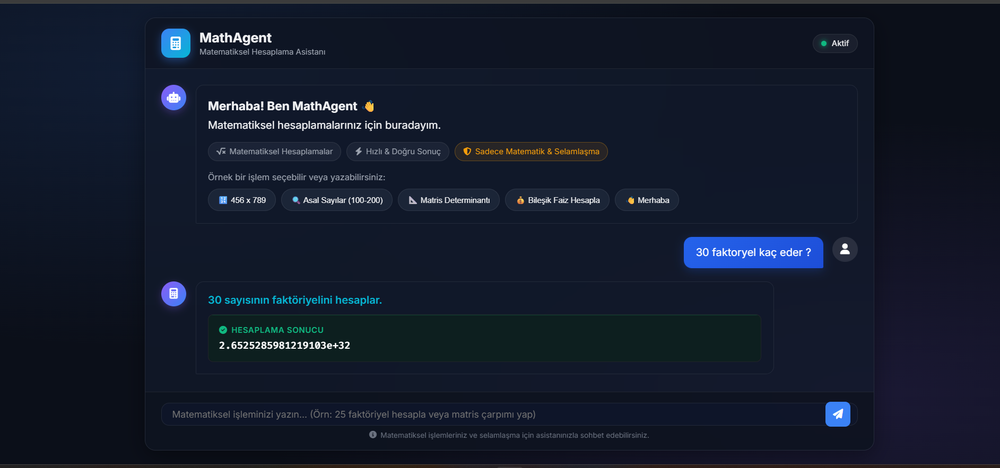
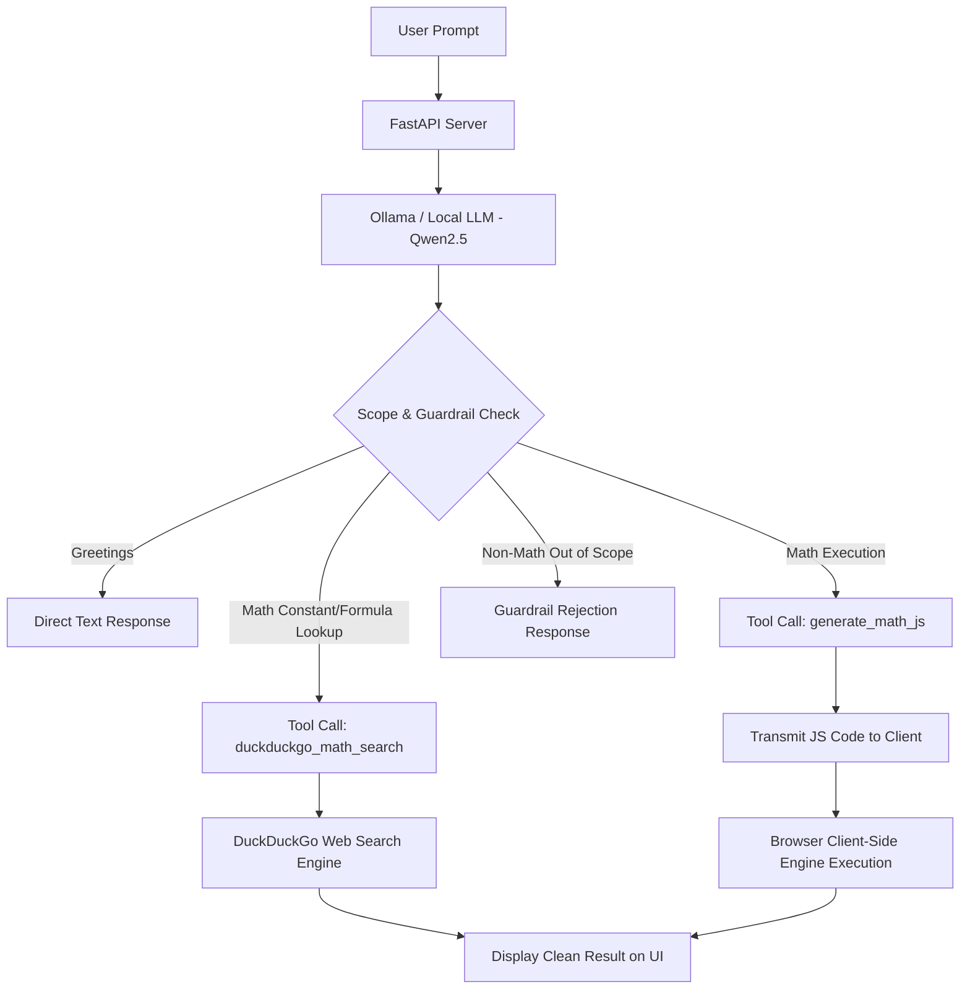

# MathAgent - Intelligent Math & Client-Side Execution Assistant

MathAgent is a modern AI chat assistant that handles complex mathematical calculations, prime factorizations, factorials, calculus (derivatives/integrals), and matrix operations by generating JavaScript code via **LLM Tool-Calling** and executing it safely on the **client side (Browser JavaScript Engine)**.

---

## 📸 Interface Preview & Example Output



---

## 📌 Architecture Overview

Unlike traditional AI systems, MathAgent does not rely on the Generative Large Language Model (LLM) to calculate math results directly. Instead, it utilizes a **Tool-Calling** mechanism: the LLM generates a clean JavaScript algorithm, which is then dynamically executed inside the user's web browser using the browser's native **V8 Engine**.



---

## 🎯 Why Use Tool-Calling Instead of Direct LLM Calculation?

1. **Deterministic Accuracy (Probabilistic vs. Deterministic):**
   * LLMs are generative, probabilistic language models. While excellent at processing natural language, they tend to guess numbers when computing operations like $30!$ (30 Factorial) or $50 \times 50$ matrix multiplication, introducing a high risk of **hallucination** and precision errors.
   * Code execution engines are deterministic. A generated `for` loop or math algorithm produces **100% accurate results** every single time.

2. **Computational Complexity & Limits:**
   * LLMs struggle with multi-step iterative loops and often hit context/token limits. Delegating computations to a code execution tool allows thousands of algorithmic iterations to solve in microseconds.

3. **Separation of Concerns:**
   * **LLM:** Specialized in logic, natural language understanding, and code generation.
   * **JavaScript Engine:** Specialized in fast, precise arithmetic and numerical processing.

---

## 🛡️ Why Client-Side Execution Instead of Server-Side?

1. **Server Security & Sandboxing (Preventing RCE):**
   * Executing dynamic code from user prompts on the server using Python (`exec()`) or Node.js (`eval()`) creates severe **Remote Code Execution (RCE)** vulnerabilities.
   * Executing the generated JS code inside the user's own browser (`new Function(...)`) isolates the server completely from malicious code execution.

2. **Zero Server Load & High Scalability:**
   * Heavy CPU computation (e.g., intensive matrix math or prime finding) is offloaded to the client's device. The backend server remains lightweight, serving only as a static host and Ollama API proxy.

3. **Zero Server Execution Latency:**
   * As soon as code reaches the client browser, it executes instantly without waiting for server queueing or network round-trips.

---

## ⚖️ Architecture Trade-Off Matrix

| Approach | Advantages | Disadvantages / Risks | MathAgent Decision |
| :--- | :--- | :--- | :--- |
| **1. Direct LLM Calculation** | Requires no code execution engine. | Prone to hallucinations, off-by-one errors, lacks 100% precision on large numbers. | ❌ Rejected (Unreliable) |
| **2. Server-Side Execution (Python `exec`)** | Access to powerful server libraries (NumPy, SciPy). | Severe RCE security risks, high server CPU/RAM consumption. | ❌ Rejected (Security Risk) |
| **3. Client-Side Execution + Tool-Call** | **100% Precision**, **Zero Server Security Risk**, **Microsecond Latency**, **Clean UI**. | Limited to client browser JavaScript capabilities (BigInt & native Math standard library). | **✅ Adopted (MathAgent Core Architecture)** |
| **4. Multi-Turn LLM Loop (Feedback Loop)** | LLM can read the result and format a custom text paragraph. | Doubles response time (2x LLM Latency), risk of LLM hallucinating when re-formatting numbers. | ❌ Optional (Single-turn selected for Speed & Accuracy) |

---

## 🚀 Features

* **Strict Guardrails:** Restricts conversations to Turkish Greetings and Mathematical Tasks. General knowledge queries are politely declined.
* **Hidden Code Interface:** Keeps the chat UI clean by hiding raw JavaScript code blocks, displaying only the **Calculation Description** and **Result Card**.
* **BigInt Support:** Handles large integers (e.g., $30!$) without precision loss or overflow to `Infinity`.
* **Live Healthcheck:** Monitors Ollama service connectivity in real-time with an active status badge.

---

## 🛠️ Installation & Getting Started

### Prerequisites
* Python 3.10+
* [Ollama](https://ollama.ai/) (Local LLM Runner)

### 1. Pull the Local LLM Model
```bash
ollama pull qwen2.5:7b
```

### 2. Install Dependencies
```bash
pip install -r requirements.txt
```

### 3. Run the Application
```bash
python app.py
```

Navigate to `http://localhost:8000` in your web browser to start using MathAgent.
