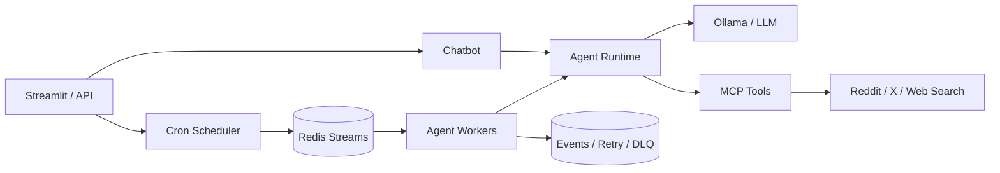

# X Agent Automation

Reddit, X ve web kaynaklarında araştırma yapabilen; chatbot olarak kullanılabilen
ve zamanlanmış görevler çalıştırabilen agent otomasyon platformu.

## Magibu Ödev Bilgileri

- **Canlı uygulama:** [magibu-odev1.berkbirkan.com](https://magibu-odev1.berkbirkan.com/)
- **GitHub reposu:** [github.com/berkbirkan/x-agent-automation](https://github.com/berkbirkan/x-agent-automation)

Bu ödevin amacı, kullanıcıların yapay zeka agentlarıyla doğrudan sohbet
edebildiği ve aynı agent yeteneklerini periyodik otomasyonlara dönüştürebildiği
bir altyapı geliştirmektir. Mevcut prototip; Streamlit arayüzü, Ollama üzerinde
çalışan `qwen3:8b` modeli ve Xquik remote MCP entegrasyonundan oluşur.

## Kullanım Senaryoları

### Chatbot ve otomasyon

Kullanıcı doğal dilde araştırma veya içerik görevi verebilir. Aynı görev bir
cron ifadesiyle zamanlanarak arka planda düzenli çalıştırılabilir. Scheduler,
zamanı gelen işleri Redis Stream'e yazar; consumer group içindeki worker'lar
işleri paralel biçimde işler. Başarılı işler `ACK` edilir, geçici hatalar
exponential backoff ile yeniden denenir ve tekrar sınırını aşan işler
dead-letter stream'e taşınır. At-least-once teslimat nedeniyle harici aksiyonlar
`job_id` üzerinden idempotent tasarlanacaktır.

### Reddit & X agentı

Agent, Reddit ve X'te belirli sorunları yaşayan veya çözüm arayan kullanıcıları
tespit edip konuşmanın bağlamını analiz edebilir. Örneğin Bitcoin alanında bir
ürün geliştiren ekip, ilgili problemleri tartışan kişileri keşfedebilir ve
platform kuralları ile kullanıcı izinleri dahilinde faydalı, bağlama uygun
yanıtlar veren bir agentic otomasyon kurgulayabilir ve bunları belirli zaman aralıklarında çalıştırabilir. Bu yaklaşım doğrudan ürün keşfine, indekslenen içerikler
üzerinden SEO'ya ve üretken yapay zeka motorlarındaki görünürlük üzerinden
GEO'ya katkı sağlayabilir.

Agent yalnızca sabit anahtar kelime eşleşmesiyle çalışmaz; niyet, konuşma tonu,
kaynak güvenilirliği ve konu uygunluğuna göre paylaşım yapmaya, yanıt vermeye
veya hiç aksiyon almamaya karar verebilir. Riskli yazma işlemleri insan onayına
gönderilir.

### Keyword research ve SEO içerik otomasyonu

Keyword research ve web search araçlarına sahip agentlar; arama niyetlerini,
güncel kaynakları, rakip içerikleri ve Reddit/X konuşmalarını birlikte analiz
edebilir. Elde edilen bulgularla SEO uyumlu başlıklar, içerik planları, makale
taslakları ve sosyal medya paylaşımları üretilebilir. Bu akış cronjob ve Redis
Streams ile periyodik hale getirilerek araştırma, içerik üretimi, insan onayı ve
yayın adımları uçtan uca otomasyona bağlanabilir.

## Hedef Mimari



Docker Compose; uygulama, model servisi ve ileride eklenecek Redis/worker
bileşenlerini ayrı container'larda çalıştırmak için kullanılacaktır. Bu yapı
servislerin bağımsız ölçeklenmesini, health check uygulanmasını ve geliştirme
ortamının tek komutla kurulmasını sağlar.

> Redis Streams, cron scheduler, Reddit, keyword research ve web search
> otomasyonları hedef mimarinin parçalarıdır; mevcut repodaki çalışan sürüm
> chatbot prototipidir.

## Yerelde Çalıştırma

Docker ve Docker Compose kurulu bir ortamda:

```bash
docker compose up --build
```

Arayüz `http://localhost:8501` adresinde açılır. Xquik API anahtarı kalıcı bir
dosyaya yazılmaz; yalnızca kullanıcının Streamlit oturumunda tutulur.
