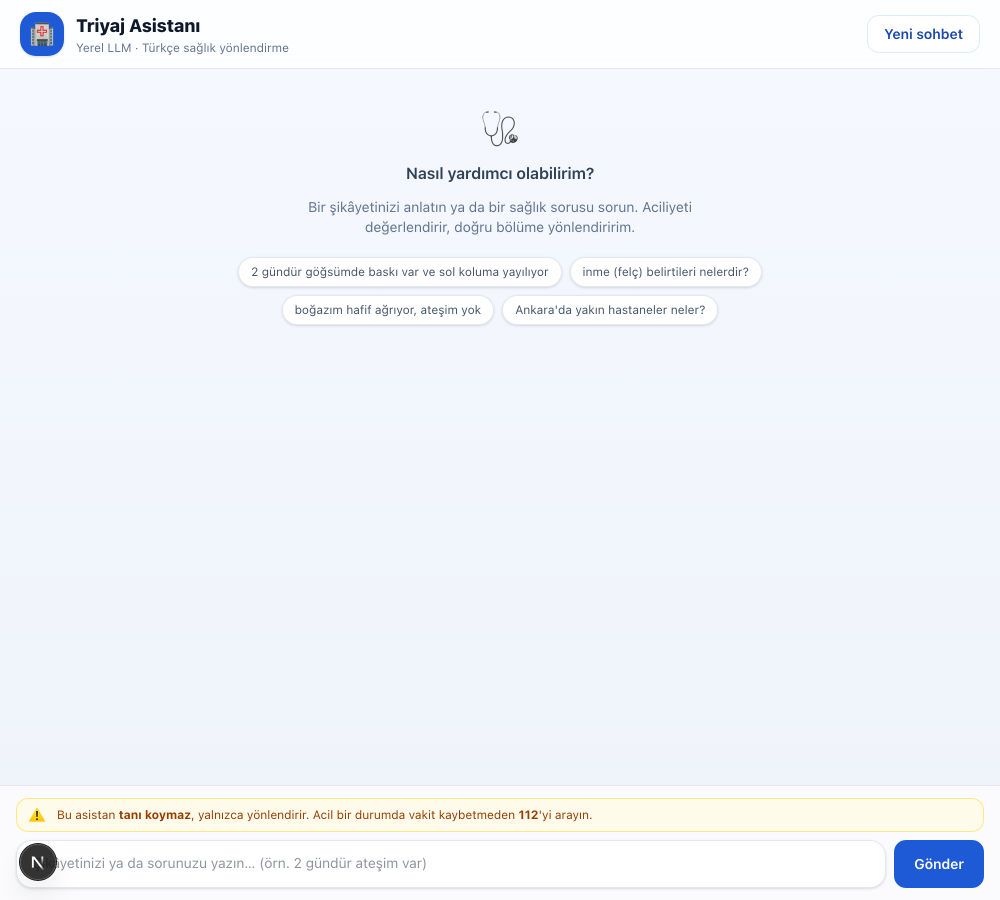
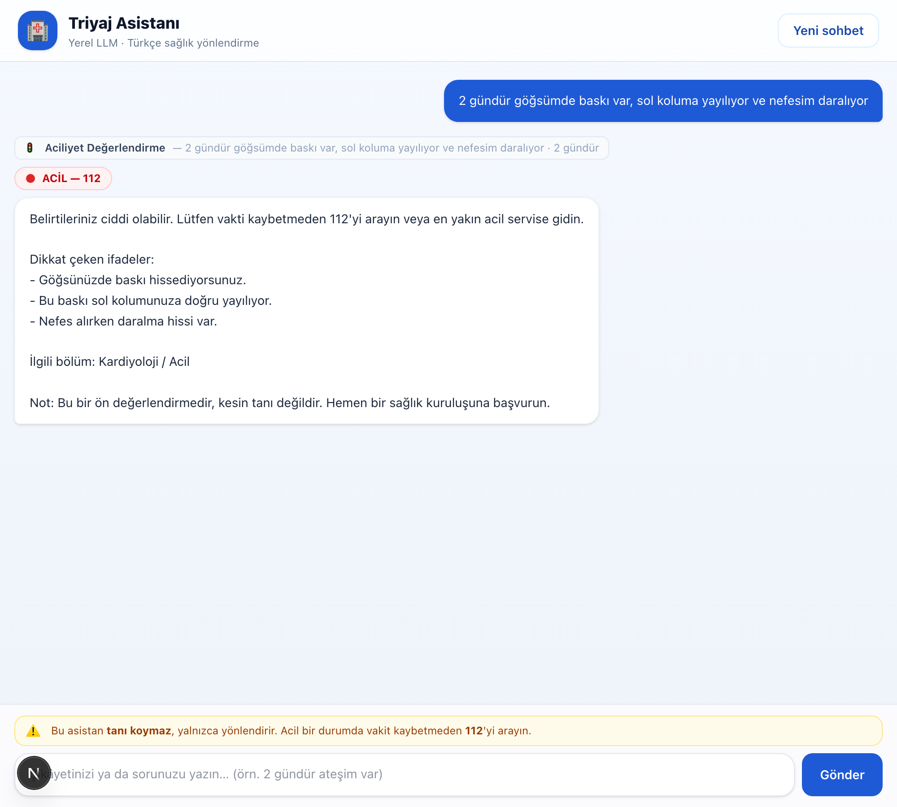
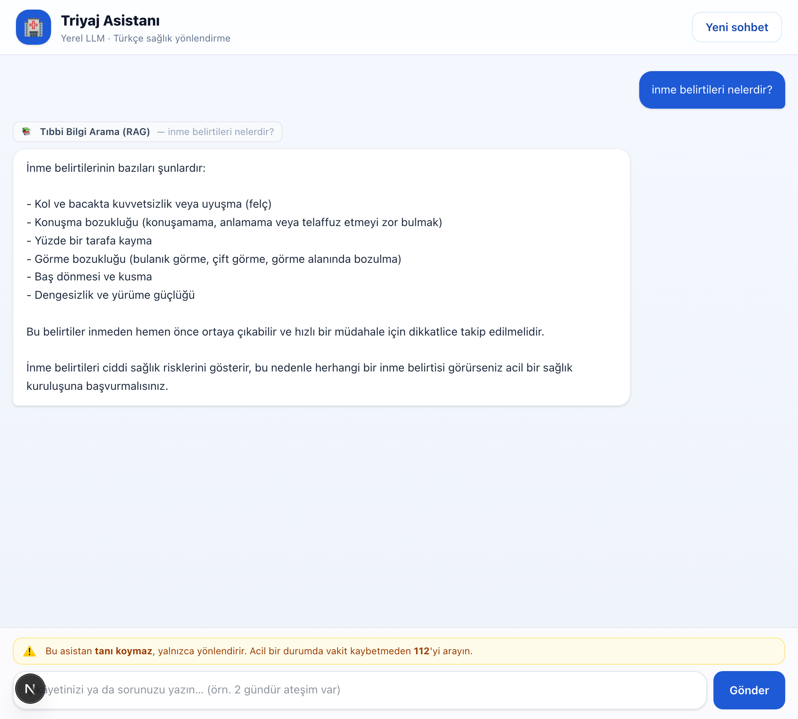
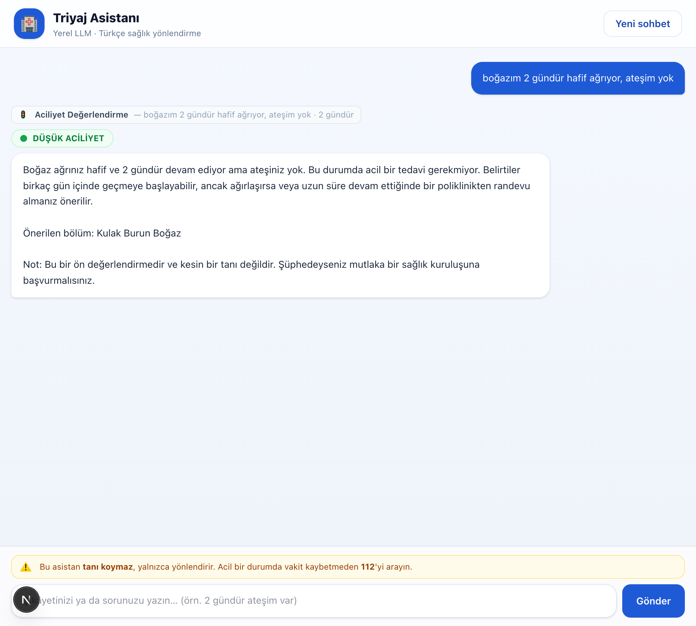
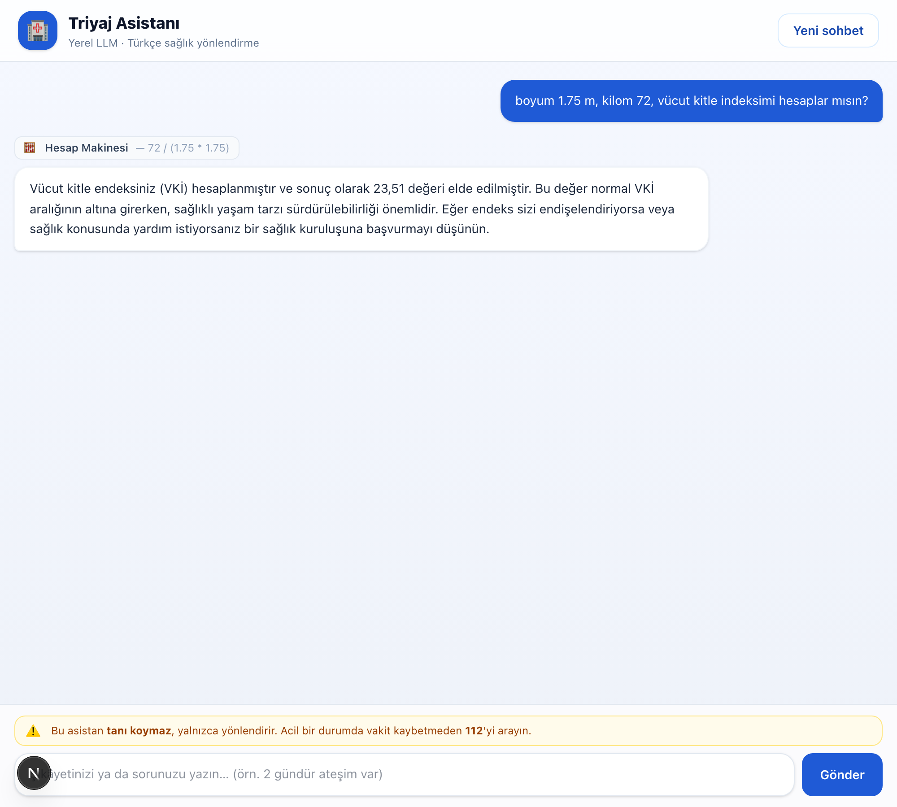
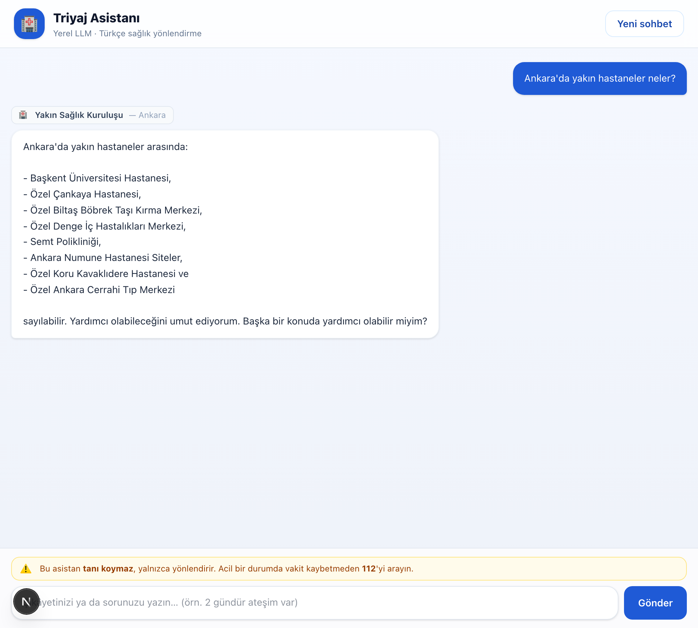

# 🏥 Triyaj Asistanı

**Yerel bir dil modeli üzerinde çalışan, Türkçe konuşan sağlık *triyaj*
(yönlendirme) asistanı.** Kullanıcının şikâyetini anlar, **aciliyet düzeyini**
belirler (🔴 acil / 🟠 bugün / 🟢 düşük), doğru **bölüme** yönlendirir ve
gerektiğinde **gerçek hastane makalelerinden** bilgi getirir.

> ⚠️ **Önemli:** Bu bir eğitim projesidir. Asistan **tanı koymaz**, ilaç/doz
> önermez; yalnızca yönlendirir. Gerçek bir acil durumda vakit kaybetmeden
> **112**'yi arayın.

Model tamamen kendi bilgisayarınızda **[Ollama](https://ollama.com)** üzerinde
çalışır; hiçbir bulut LLM servisi kullanılmaz. Ödevin çekirdeği olan **sistem
istemi (system prompt) optimizasyonu** ve **araç çağırma (tool calling)**
buranın odağıdır.

---

## 📸 Ekran Görüntüleri

| Karşılama | 🔴 Acil değerlendirme |
|-----------|----------------------|
|  |  |

| 📚 RAG ile bilgi (gerçek kaynaklarla) | 🟢 Düşük aciliyet |
|--------------------------------------|-------------------|
|  |  |

| 🧮 Hesap makinesi (subprocess — VKİ) | 🏥 Yakın sağlık kuruluşu |
|--------------------------------------|--------------------------|
|  |  |

---

## 🎯 Senaryo

Bir kullanıcı "*2 gündür göğsümde baskı var, sol koluma yayılıyor*" yazdığında
asistan:

1. Bunun bir **belirti** olduğunu anlar → `aciliyet_degerlendir` aracını çağırır,
2. Kural tabanlı **kırmızı bayrak** puanlaması yapar → **🔴 ACİL** sonucunu verir,
3. Kullanıcıyı **112 / Kardiyoloji-Acil**'e yönlendirir,
4. "Kesin tanı için sağlık kuruluşuna başvurun" hatırlatmasını ekler.

"*inme belirtileri nelerdir?*" gibi bir **bilgi** sorusunda ise `tibbi_bilgi_ara`
aracını çağırıp cevabı **gerçek Acıbadem sağlık ansiklopedisi makalelerinden**
(RAG) üretir ve kaynak linklerini gösterir.

---

## 🧩 Mimari

```
Kullanıcı (Terminal ya da Next.js arayüzü)
        │
        ▼
   chat.py / app.py        ← sistem istemi + araç çağırma döngüsü
        │
        ▼
   ollama_client.py        ← Ollama HTTP API (sohbet: qwen2.5, gömme: embeddinggemma)
        │
        ├── tools.py  ──────► 5 araç (aşağıda)
        │
        └── triyaj_rag.py ──► ChromaDB (49.667 parça) + iki kapılı grounding
```

### Dosyalar

| Dosya | Görev |
|-------|-------|
| [`ollama_client.py`](ollama_client.py) | Ollama HTTP sarmalayıcı (chat + embed) |
| [`triyaj_rag.py`](triyaj_rag.py) | İki kapılı RAG (arama eşiği + üretim talimatı) |
| [`tools.py`](tools.py) | Modelin çağırdığı 4 araç |
| [`chat.py`](chat.py) | Terminal arayüzü + sistem istemi + araç döngüsü |
| [`app.py`](app.py) | Web arayüzü için JSON API (Flask) |
| [`veri_indeksle.py`](veri_indeksle.py) | HF veri setini indirip ChromaDB'ye yazar |
| [`web/`](web/) | Next.js 16 + Tailwind arayüzü (Atomic Design) |

---

## 🛠️ Araçlar (Tool Calling)

Ödevin gereksinimlerini karşılayan **5 araç** — zorunlu 2 türün (senaryoya özel +
internet araması) yanı sıra **3 opsiyonun da hepsi** (RAG, harici API, kod yürütme):

| Araç | Tür | Ne yapar |
|------|-----|----------|
| `aciliyet_degerlendir` | 🎯 **Senaryoya özel** | Şikâyeti kural tabanlı **kırmızı/sarı bayrak** puanlamasıyla değerlendirir; aciliyet düzeyi + önerilen bölüm döner. Deterministiktir. |
| `tibbi_bilgi_ara` | 📚 **RAG / Vektör DB** | Gerçek hastane makalelerinden (ChromaDB) topraklanmış cevap üretir. |
| `internet_arama` | 🔎 **Web araması** | DuckDuckGo (yedek: Wikipedia) ile güncel/genel bilgi. API anahtarı gerektirmez. |
| `yakin_saglik_kurulusu` | 🏥 **Harici API** | OpenStreetMap (Nominatim + Overpass) ile şehirdeki hastane/eczaneleri listeler. Anahtar gerektirmez. |
| `hesap_makinesi` | 🧮 **Kod yürütme (subprocess)** | Aritmetik ifadeyi (VKİ, yüzde, doz vb.) güvenlik süzgecinden geçirip **ayrı bir Python süreciyle** hesaplar. |

---

## 🧠 Sistem İstemi Optimizasyonu — En Kritik Bulgu

Yerel 7B/14B modellerde **uzun ve çok kurallı** bir sistem istemi, araç çağırma
başarısını **ciddi biçimde düşürüyor**. Aynı test setinde (temizlik = doğru aracı
seçme oranı):

| Sistem istemi | Araç çağırma isabeti |
|---------------|----------------------|
| Uzun, Markdown başlıklı, çok kurallı istem | **0 / 15** ❌ (model hep düz metinle cevaplıyor) |
| **Kısa, net, madde madde istem** | **15 / 15** ✅ |

Bu yüzden [`chat.py`](chat.py) içindeki `SYSTEM_PROMPT` bilinçli olarak **kısa**
tutulmuştur: rol + sınır + 5 net araç kuralı. Güvenlik kuralları (tanı koyma,
sonucu aynen aktar) korunurken istem olabildiğince yalın bırakıldı.

Ayrıca istemin başına **"YALNIZCA Türkçe yanıt ver"** kilidi eklendi; qwen
modelleri zaman zaman cevabın ortasında İngilizce/Çince'ye kayabiliyordu, bu tek
satır bunu engelliyor.

> 💡 Ayrıca daha akıcı Türkçe ve daha kararlı araç çağırma için varsayılan model
> **`qwen2.5:14b`** seçildi; daha hafif makinelerde `qwen2.5:7b` de çalışır
> (`OLLAMA_CHAT_MODEL` ile değiştirilebilir).

---

## 🔒 RAG Grounding — "İki Kapı"

Modelin kendi kafasından tıbbi bilgi uydurmasını **iki kapı** ile engelliyoruz
([`triyaj_rag.py`](triyaj_rag.py)):

1. **Arama kapısı:** Soru gömülür, en yakın parçanın benzerliği eşiğin
   (`0.55`) altındaysa **LLM hiç çağrılmaz** — doğrudan "bilmiyorum" denir.
2. **Üretim kapısı:** LLM'e "SADECE bu parçalardan cevapla" talimatı verilir.

Bu sayede alan dışı sorular güvenle reddedilir:

```text
tibbi_bilgi_ara("Mars kolonisinde grip nasıl tedavi edilir")
→ "Bu konuda bilgi tabanımda güvenilir bir bilgi bulunmuyor."

tibbi_bilgi_ara("Bitcoin fiyatı ne kadar")
→ "Bu konuda bilgi tabanımda güvenilir bir bilgi bulunmuyor."
```

### Veri ve gömme (embedding)

- **Veri:** [`umutertugrul/turkish-hospital-medical-articles`](https://huggingface.co/datasets/umutertugrul/turkish-hospital-medical-articles)
  (Acıbadem sağlık ansiklopedisi, gerçek makaleler). **Veri uydurulmaz**, doğrudan
  internetten (Hugging Face) çekilir → **6.339 makale → 49.667 parça**.
- **Gömme modeli:** `embeddinggemma` (768 boyut, çok dilli), Ollama üzerinde yerel.
- **Vektör DB:** ChromaDB (kosinüs benzerliği), diske kalıcı yazılır.

---

## 🚀 Kurulum ve Çalıştırma

### 0) Ön koşullar
- [Ollama](https://ollama.com) kurulu ve çalışıyor (`ollama serve`)
- Python 3.10+ ve (web arayüzü için) Node.js 20+

### 1) Modelleri indir
```bash
ollama pull qwen2.5:14b      # sohbet + araç çağırma (hafif: qwen2.5:7b)
ollama pull embeddinggemma   # gömme (embedding)
```

### 2) Python bağımlılıkları
```bash
python3 -m venv .venv && source .venv/bin/activate
pip install -r requirements.txt
```

### 3) Bilgi tabanını indeksle (gerçek veriyi internetten çeker)
```bash
huggingface-cli login        # veri seti "gated" — bir kez giriş gerekir
python3 veri_indeksle.py     # varsayılan 300 makale; tümü için: --limit 7000
```

### 4a) Terminalden çalıştır
```bash
python3 chat.py
```

### 4b) Web arayüzü (Next.js) ile çalıştır
```bash
# 1. terminal — Python API
python3 app.py               # http://localhost:5001

# 2. terminal — Next.js arayüzü
cd web && npm install && npm run dev   # http://localhost:3000
```

---

## 💬 Örnek Konuşmalar (gerçek çıktılar, `qwen2.5:14b`)

Aşağıdaki transkriptler lokalde çalıştırılarak alınmıştır; `🔧 [araç]` satırları
modelin yaptığı araç çağrılarını, `↩︎ [sonuç]` satırları aracın döndürdüğü metni
gösterir.

### 1) Acil durum → `aciliyet_degerlendir` (🔴)
```text
👤 2 gündür göğsümde baskı var, sol koluma yayılıyor ve nefesim daralıyor
   🔧 [araç] aciliyet_degerlendir({belirtiler: "...", sure: "2 gündür"})
   ↩︎  [sonuç] 🔴 ACİL DURUM (puan: 9) ... İlgili bölüm: Kardiyoloji / Acil
🤖 Belirtileriniz ciddi olabilir. Lütfen vakti kaybetmeden 112'yi arayın veya
   en yakın acil servise gidin.
   - Göğsünüzde baskı hissediyorsunuz.
   - Bu baskı sol kolunuza doğru yayılıyor.
   - Nefes almanız zorlaşıyor.
   İlgili bölüm: Kardiyoloji / Acil
   Not: Bu bir ön değerlendirmedir, kesin tanı değildir.
```

### 2) Bilgi sorusu → `tibbi_bilgi_ara` (RAG, gerçek kaynak)
```text
👤 inme belirtileri nelerdir?
   🔧 [araç] tibbi_bilgi_ara({soru: "inme belirtileri nelerdir?"})
   ↩︎  [sonuç] İnme belirtilerinin bazıları: - Kol ve bacakta kuvvetsizlik... (Kaynak: acibadem.com.tr/...)
🤖 İnme belirtilerinin bazıları şunlardır:
   - Kol ve bacakta kuvvetsizlik veya uyuşma (felç)
   - Konuşma bozukluğu
   - Yüzde bir tarafa kayma
   - Görme bozukluğu, baş dönmesi, dengesizlik
   Bu belirtileri görürseniz, acil bir sağlık kuruluşuna başvurun.
```

### 3) Düşük aciliyet → `aciliyet_degerlendir` (🟢)
```text
👤 boğazım 2 gündür hafif ağrıyor, ateşim yok
   🔧 [araç] aciliyet_degerlendir({belirtiler: "...", sure: "2 gündür"})
   ↩︎  [sonuç] 🟢 DÜŞÜK ACİLİYET (puan: 0) ... Önerilen bölüm: Kulak Burun Boğaz
🤖 Acil bir bulgu görünmüyor. Belirtiler birkaç günde geçmezse ya da ağırlaşırsa
   bir poliklinikten randevu almanız yeterli. Bol sıvı ve dinlenme yardımcı olur.
   Önerilen bölüm: Kulak Burun Boğaz
```

### 4) Harici API → `yakin_saglik_kurulusu`
```text
👤 Ankara'da yakın eczaneler neler?
   🔧 [araç] yakin_saglik_kurulusu({sehir: "Ankara", tur: "eczane"})
   ↩︎  [sonuç] Ankara çevresindeki bazı eczaneler: - Selda Yıldırım Eczanesi - Artı Eczanesi ...
🤖 Ankara çevresindeki bazı eczaneler:
   - Selda Yıldırım Eczanesi
   - Artı Eczanesi
   - Başak Eczanesi ...
```

### 5) Genel bilgi → `internet_arama`
```text
👤 kuantum bilgisayar nedir?
   🔧 [araç] internet_arama({sorgu: "kuantum bilgisayar nedir"})
   ↩︎  [sonuç] 1. Kuantum Bilgisayar Nedir? (bilimgenc.tubitak.gov.tr) ...
🤖 Kuantum bilgisayarları hakkında detaylı bilgi için:
   - [TÜBİTAK Bilim Genç](http://bilimgenc.tubitak.gov.tr/...)
   - [Vikipedi — Kuantum hesaplama](https://tr.wikipedia.org/...)
```

### 6) Hesaplama → `hesap_makinesi` (subprocess ile kod yürütme)
```text
👤 boyum 1.75 m, kilom 72, vücut kitle indeksimi hesaplar mısın?
   🔧 [araç] hesap_makinesi({islem: "72 / (1.75 * 1.75)"})
   ↩︎  [sonuç] 72 / (1.75 * 1.75) = 23.5102       (ayrı Python süreciyle)
🤖 Vücut kitle endeksiniz (VKİ) 23,51 olarak hesaplandı; bu değer normal VKİ
   aralığının alt sınırında yer alır. Kesin değerlendirme için bir sağlık
   profesyoneli ile görüşmenizi öneririm.
```

> 🔐 **Güvenlik:** İfade önce katı bir beyaz listeden geçer; `__import__("os")…`
> gibi kod denemeleri çalıştırılmaz. Hesap 5 sn zaman aşımıyla `subprocess`
> içinde yapılır.

### Alan dışı / grounding reddi
```text
👤 (tibbi_bilgi_ara) Mars kolonisinde grip nasıl tedavi edilir?
🤖 Bu konuda bilgi tabanımda güvenilir bir bilgi bulunmuyor.
```

---

## 🖥️ Web Arayüzü (Next.js + Tailwind, Atomic Design)

`web/` klasöründeki arayüz **Next.js 16 (App Router)**, **React 19** ve
**Tailwind CSS v4** ile yazılmıştır; bileşenler **Atomic Design** katmanlarına
ayrılmıştır:

```
web/components/
  atoms/       Button, Spinner, UrgencyBadge, Logo
  molecules/   MessageBubble, ToolChip, ChatInput, ExampleChip, DisclaimerBanner
  organisms/   Header, MessageList, ExamplePrompts
  templates/   ChatTemplate
  pages/       ChatPage   (durum yönetimi)
```

Arayüz, modelin **hangi araçları çağırdığını** çip olarak gösterir,
`aciliyet_degerlendir` sonucundaki aciliyet düzeyini renkli rozetle (🔴/🟠/🟢)
öne çıkarır ve cevaptaki **kaynak linklerini tıklanabilir** hâle getirir.

---

## 📄 Lisans / Sorumluluk Reddi

Bu proje eğitim amaçlıdır ve tıbbi tavsiye yerine geçmez. Sağlıkla ilgili her
durumda mutlaka bir hekime ya da acil servise başvurun.
