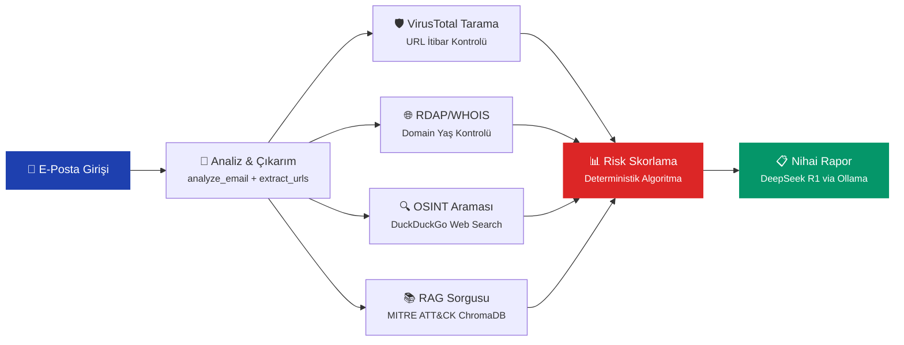
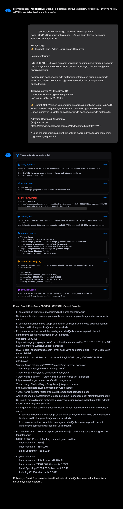
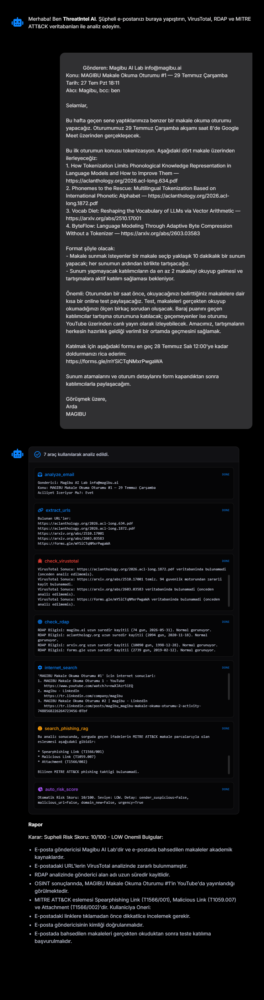

<div align="center">

# 🛡️ ThreatIntel AI

### Yapay Zeka Destekli Otonom Oltalama (Phishing) Analiz Asistanı

**Şüpheli e-postalarınızı yapıştırın — yerel yapay zeka ile saniyeler içinde analiz edin.**

[](https://python.org)
[](https://flask.palletsprojects.com)
[](https://ollama.com)
[](https://attack.mitre.org)
[](LICENSE)

<br/>


<br/>

[Özellikler](#-neler-yapabilir) · [Nasıl Çalışır](#-nasıl-çalışır) · [Ekran Görüntüleri](#-ekran-görüntüleri) · [Kurulum](#-kurulum) · [Teknik Altyapı](#-teknik-altyapı) · [Kaynaklar](#-kaynaklar-ve-referanslar)

</div>

---

## ❓ ThreatIntel AI Nedir?

ThreatIntel AI, gelen kutunuza düşen şüpheli e-postaları **yerel yapay zeka (Local LLM)** ile analiz eden otonom bir siber güvenlik asistanıdır. E-postadaki linkleri tespit eder, VirusTotal üzerinden güvenilirliğini kontrol eder, alan adlarının geçmişini (RDAP/WHOIS) sorgular ve **RAG** entegrasyonu sayesinde saldırganların kullandığı taktikleri [MITRE ATT&CK](https://attack.mitre.org/) çerçevesiyle eşleştirir.

> **Bulut yok. Verileriniz cihazınızdan çıkmaz.** Tüm yapay zeka modelleri [Ollama](https://ollama.com) üzerinden yerel olarak çalışır.

---

## ✨ Neler Yapabilir?

| Özellik | Açıklama |
|---|---|
| 🛡️ **Akıllı Karar Motoru** | Oltalama e-postalarındaki sosyal mühendislik taktiklerini (Korku, Aciliyet, Fırsat) algılayarak hangi araçları (API'leri) kullanması gerektiğine otonom olarak karar verir. |
| 📚 **Yerel RAG Sistemi** | 178 ayrı MITRE ATT&CK oltalama tekniğini `nomic-embed-text` ile vektörleştirerek ChromaDB'de saklar. Spesifik taktik ID'lerini tespit ederek raporlar. |
| 🔍 **VirusTotal Entegrasyonu** | Şüpheli URL'lerin malware/phishing geçmişini canlı olarak denetler. |
| 🌐 **RDAP/WHOIS Sorgusu** | Domain kayıt tarihini kontrol ederek yeni açılmış sahte siteleri anında yakalar. |
| 🕵️ **Kimliğe Bürünme Tespiti** | Gönderici adı ile e-posta adresi arasındaki uyumsuzluğu otomatik olarak algılar (Masquerading Detection). |
| 📊 **Otomatik Risk Skorlama** | Tüm araç sonuçlarını deterministik bir algoritmayla harmanlayarak 0-100 arası risk skoru üretir. |
| 🎨 **Modern Web Arayüzü** | Flask backend ile haberleşen, duyarlı (responsive) ve estetik bir siber güvenlik paneline sahiptir. |

---

## 🧠 Nasıl Çalışır?



**Analiz Adımları:**

1. **Çıkarım** — E-postadan gönderici, konu, aciliyet ve gömülü URL'ler otomatik olarak ayrıştırılır.
2. **Kimlik Doğrulama** — Gönderici adı ile e-posta adresi karşılaştırılarak kimliğe bürünme (masquerading) tespiti yapılır.
3. **URL Tarama** — Tespit edilen bağlantılar VirusTotal'de 90+ güvenlik motoruyla taranır.
4. **Domain Kontrolü** — RDAP ile alan adının kayıt tarihi sorgulanır; yeni açılmış sahte siteler yakalanır.
5. **OSINT Araştırması** — İlgili şirket ve kampanya hakkında güncel dolandırıcılık bilgileri aranır.
6. **Taktik Eşleştirme** — RAG sistemi üzerinden MITRE ATT&CK veritabanında anlamsal arama yapılır.
7. **Skorlama & Rapor** — Tüm bulgular deterministik algoritmayla skorlanır ve LLM tarafından Türkçe rapor üretilir.

---

## 📸 Ekran Görüntüleri

<div align="center">

### Şüpheli (Spam) Mail Analizi
Sahte bir oltalama e-postasına sistemin verdiği yanıt, araç kullanımı ve risk skoru.



### Normal Mail Analizi
Zararlı bağlantı içermeyen sıradan bir e-postanın temiz olarak sınıflandırılması.



</div>

---

## 🛠️ Kurulum

### Gereksinimler

| Gereksinim | Versiyon | Amaç |
|---|---|---|
| [Python](https://python.org) | 3.10+ | Backend çalışma ortamı |
| [Ollama](https://ollama.com) | Güncel | Yerel yapay zeka sunucusu |
| [VirusTotal API Key](https://www.virustotal.com/) | Ücretsiz | URL itibar sorgusu |

### 1. Repoyu İndirin

```bash
git clone https://github.com/MertAlii/ThreatIntel_AI.git
cd ThreatIntel_AI
```

### 2. Yapay Zeka Modellerini İndirin

```bash
ollama pull deepseek-r1:7b
ollama pull nomic-embed-text
```

### 3. Bağımlılıkları Yükleyin

```bash
pip install -r requirements.txt
```

### 4. Ortam Değişkenlerini Ayarlayın

Proje ana dizinine bir `.env` dosyası oluşturun:

```env
VIRUSTOTAL_API_KEY=buraya_kendi_api_anahtarinizi_yazin
```

### 5. RAG Veritabanını Oluşturun (Sadece İlk Kurulumda)

```bash
python index_phishing.py
```

### 6. Sunucuyu Başlatın

```bash
python app.py
```

Tarayıcınızdan `http://localhost:5000` adresine giderek ThreatIntel AI'yi kullanmaya başlayın! 🎉

---

## 🏗️ Teknik Altyapı

<div align="center">

| Katman | Teknoloji | Rol |
|---|---|---|
| **Backend** | Flask, Python 3.10+ | REST API ve analiz pipeline'ı |
| **LLM** | DeepSeek R1 7B (Ollama) | Akıl yürütme ve rapor üretimi |
| **Embedding** | nomic-embed-text (Ollama) | Metin vektörleştirme |
| **Vektör DB** | ChromaDB | Anlamsal arama indeksi |
| **Frontend** | HTML5, TailwindCSS, Vanilla JS | Modern web arayüzü |
| **Dış API'ler** | VirusTotal, RDAP, DuckDuckGo | Canlı tehdit istihbaratı |

</div>

---

## 📁 Proje Yapısı

```
ThreatIntel_AI/
├── app.py                  # Flask sunucusu ve analiz pipeline'ı
├── tools.py                # Araç tanımları (VirusTotal, RDAP, RAG vb.)
├── ollama_client.py        # Ollama API istemcisi ve embedding yönetimi
├── phishing_rag.py         # RAG: vektör arama ve grounded cevap üretimi
├── index_phishing.py       # MITRE ATT&CK verilerini ChromaDB'ye indeksleme
├── chat.py                 # Komut satırı sohbet arayüzü
├── requirements.txt        # Python bağımlılıkları
├── .env                    # API anahtarları (git'e dahil edilmez)
├── static/
│   ├── index.html          # Web arayüzü
│   ├── app.js              # Frontend mantığı
│   └── style.css           # Stil dosyası
├── tests/
│   ├── test_rag.py         # RAG birim testi
│   └── test_ollama.py      # Ollama bağlantı testi
├── assent/                 # Ekran görüntüleri
└── chroma_db/              # Vektör veritabanı (git'e dahil edilmez)
```

---

## 🔧 Araçlar (Tool Calling)

| Araç | Açıklama | Veri Kaynağı |
|---|---|---|
| `analyze_email` | E-postadan gönderici, konu, aciliyet ve kimliğe bürünme tespiti | Yerleşik (Regex) |
| `extract_urls` | E-posta içindeki tüm URL'leri tespit eder | Yerleşik (Regex) |
| `check_virustotal` | URL'lerin güvenilirliğini 90+ motorla tarar | [VirusTotal API](https://www.virustotal.com/) |
| `check_rdap` | Domain kayıt tarihini ve yaşını sorgular | [RDAP Protokolü](https://about.rdap.org/) |
| `internet_search` | OSINT için web araması yapar | [DuckDuckGo](https://duckduckgo.com/) |
| `search_phishing_rag` | MITRE ATT&CK veritabanında anlamsal arama | [MITRE ATT&CK](https://attack.mitre.org/) |
| `calculate_risk_score` | Deterministik risk skoru hesaplar (0-100) | Yerleşik (Algoritma) |

---

## 📚 Kaynaklar ve Referanslar

| Kaynak | Açıklama | Bağlantı |
|---|---|---|
| MITRE ATT&CK | Siber saldırı taktikleri ve teknikleri çerçevesi | [attack.mitre.org](https://attack.mitre.org/) |
| VirusTotal | URL ve dosya güvenilirlik analiz platformu | [virustotal.com](https://www.virustotal.com/) |
| Ollama | Yerel yapay zeka model sunucusu | [ollama.com](https://ollama.com/) |
| ChromaDB | Açık kaynak vektör veritabanı | [trychroma.com](https://www.trychroma.com/) |
| DeepSeek R1 | Akıl yürütme odaklı açık kaynak LLM | [deepseek.com](https://www.deepseek.com/) |
| DuckDuckGo | Gizlilik odaklı arama motoru | [duckduckgo.com](https://duckduckgo.com/) |
| Temel Kod Yapısı | Projenin temel alındığı kaynak repo | [ollama_asistan](https://github.com/malibayram/single_letter_transformers/tree/main/ollama_asistan) |

---

## 📜 Lisans

Bu proje açık kaynaklıdır ve [MIT Lisansı](LICENSE) altında sunulmaktadır.

---

<div align="center">

**Geliştirici: [Alkan](https://github.com/MertAlii)**

</div>