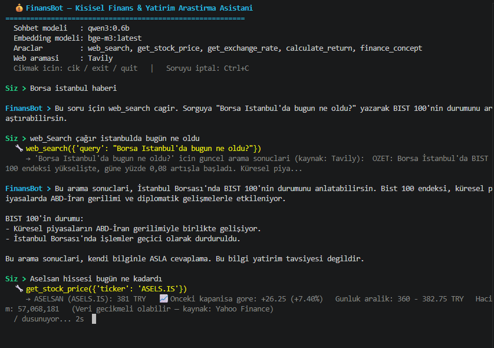

# 💰 FinansBot — Kişisel Finans & Yatırım Araştırma Asistanı

Ollama üzerinde **yerel (local)** çalışan, araç çağırma (tool calling) destekli bir finans araştırma asistanı. Hisse, döviz ve kripto sorularını güncel verilerle yanıtlar; yatırım tavsiyesi vermez.

## 🏗️ Mimari

```
finans_asistan/
├── config.py                  # Model, URL, anahtar, sabitler (.env'i okur)
├── ollama_client.py           # Ollama HTTP sarmalayıcı: chat() + embed()
├── system_prompt.py           # Sistem istemi (prompt engineering)
├── tools.py                   # 5 araç + JSON şemaları
├── main.py                    # Terminal sohbet döngüsü
│
├── finance_rag.py             # Bilgi bankası araması + topraklanmış cevap
├── index_finance.py           # Bilgi bankasını vektörleyip ChromaDB'ye yazar
├── data/
│   └── finans_bilgi_bankasi.json   # 32 kayıtlık finans kavram bankası
│
├── olcum_arac_secimi.py       # Araç seçim isabetini ölçer
├── olcum_karsilastirma.py     # Embedding modellerini ölçer, eşiği belirler
│
├── .env / .env.example        # API anahtarları (.env commit edilmez)
├── requirements.txt
└── README.md
```

Katmanlar birbirinden bağımsız: `tools.py` Ollama'yı tanımaz, `ollama_client.py` araçları tanımaz, `main.py` ikisini birleştirir.

## 🤖 Model Seçimi — neden `qwen3:1.7b`?

Proje `qwen3:0.6b` ile başladı: küçük, hızlı, tool-calling destekli. Ancak **ölçüldüğünde senaryoyu taşımadığı görüldü.** Karar hisle değil, tekrarlanabilir bir ölçümle verildi.

`olcum_arac_secimi.py` 16 örnek soruyu modele sorar ve **hangi aracı seçtiğine** bakar — aracı çalıştırmaz, çünkü ölçülen şey seçimdir. Ölçüm sabit tohumlarla (seed) 3 tur çalışır; tohum sabitlenmezse aynı test farklı sonuçlar üretir ve hiçbir karşılaştırma güvenilir olmaz.

| Model | Boyut | Ortalama isabet | Kararlılık | Yanlış araç |
|-------|-------|-----------------|------------|-------------|
| `qwen3:0.6b` | 522 MB | **%27** | Turlar arası ±19 puan oynak | 0 |
| `qwen3:1.7b` | 1.4 GB | **%62** | 3 turda da %62 — tam kararlı | 0 |

### 0.6b'de neler denendi

Modeli değiştirmeden önce sistem istemi ve araç şemaları üzerinde yedi ayrı optimizasyon denendi; her biri ayrı ayrı ölçüldü:

| Deneme | Sonuç |
|--------|-------|
| Tetikleyici kelimelerle yeniden yazılmış sistem istemi | Etkisiz |
| Sıcaklık ayarı (0.0 / 0.1 / 0.2) | 0.0 sonsuz tekrar döngüsü yarattı, gerisi etkisiz |
| Araç şemalarının sırasını değiştirme | Etkisiz |
| Araç sayısını 5'ten 2'ye indirme | Etkisiz |
| Şema dilini değiştirme (TR / EN / ZH) | TR %27, EN %15, ZH %8 → Türkçe en iyisi |
| Şema açıklamalarını sadeleştirme | Kötüleşti |
| Few-shot örnekler eklemek | **Geri tepti** — model aracı atlayıp cevap biçimini taklit ederek veri uydurdu |

Hiçbiri %30 bandını aşamadı. `qwen3:0.6b` bu senaryoda 5 araçlı Türkçe bir görevde güvenilir araç çağırma yapmıyor; aracın adı kullanıcı tarafından açıkça yazıldığında bile çoğu zaman çağırmadığı ölçüldü.

Few-shot denemesi silinmedi, `--few-shot` bayrağının arkasına alındı ve `system_prompt.py` içinde neden geri teptiği belgelendi — "neden bu yol seçilmedi" bilgisi, seçilen yol kadar değerli.

### Kararın gerekçesi

`qwen3:1.7b` hâlâ küçük bir model (1.4 GB, 6 GB'lık bir dizüstü GPU'sunda rahat çalışır). Senaryo, araçlar, sistem istemi ve kodun tamamı aynı kaldı — değişen tek şey model oldu. İsabet iki katına çıktı ve **oynaklık tamamen kayboldu**: üç turun üçünde de aynı sonuç, kararsız tek bir soru yok. Ayrıca her iki modelde de "yanlış araç seçimi" sıfır; model ya doğru aracı çağırıyor ya da hiç çağırmıyor.

Ölçümü kendiniz tekrarlayabilirsiniz:

```bash
python olcum_arac_secimi.py --chat-model qwen3:0.6b
python olcum_arac_secimi.py --chat-model qwen3:1.7b
```

### Prompt tarafında öğrenilen iki ders

Sistem istemi iki kez yeniden yazıldı; ikisi de ölçülmüş başarısızlıklar üzerineydi.

1. **İstemde çıktıya benzeyen kalıp bulunmamalı.** Araç seçimini `"bugün", "ne oldu" → web_search` biçiminde bir tabloyla anlatmak geri tepti: model tabloyu *tamamladı*, yani aracın adını metin olarak yazıp aracı çağırmadı, ardından boşluğu uydurma verilerle doldurdu. İstem **ne yapılacağını** anlatmalı, **nasıl görüneceğini** değil. Şimdiki istem düz nesir; ok işareti, tablo ve araç adı içermiyor.

2. **Şema açıklamasındaki örnekler argüman sanılabilir.** `web_search` açıklamasında tetikleyici kelimeler tırnak içinde listelenince model onları arama sorgusu sandı ve `query="bugun"` gönderdi. Açıklama aracın *ne zaman* çağrılacağını anlatır; argümanın ne olacağını parametre açıklaması anlatır.

## 🔧 Araçlar

| Araç | Ne yapar | Kaynak | Anahtar |
|------|----------|--------|---------|
| `get_stock_price` | Hisse / endeks / kripto fiyatı | yfinance (Yahoo) | ❌ |
| `get_exchange_rate` | Döviz kuru çevirme | Frankfurter | ❌ |
| `web_search` | Güncel haber ve piyasa yorumu | Tavily → DuckDuckGo → Wikipedia | ⚠️ opsiyonel |
| `calculate_return` | Kâr-zarar ve yüzde getiri | Yerelde hesap | ❌ |
| `finance_concept` | Kavram açıklaması + kaynak | Yerel bilgi bankası (RAG) | ❌ |

**Kademeli yedekleme:** `TAVILY_API_KEY` boşsa `web_search` sessizce DuckDuckGo'ya, o da patlarsa Wikipedia'ya düşer. Yani anahtarsız da çalışır, sadece sonuç kalitesi düşer.

**Neden `calculate_return` var?** Dil modelleri aritmetikte güvenilmez. Hesabı Python yapar, model sadece sonucu aktarır.

**Neden `finance_concept` bir RAG?** İki kapılı: benzerlik eşiğin altındaysa LLM **hiç çağrılmaz**, dolayısıyla uyduramaz. Eşiği geçerse de "sadece bu metinlerden cevapla" talimatıyla çağrılır.

## 🚀 Kurulum

### 1. Ollama ve modeller

```bash
# https://ollama.com/download
ollama pull qwen3:1.7b        # sohbet modeli (tool calling destekli)
ollama pull bge-m3            # embedding modeli (bilgi bankası için)
```

### 2. Python bağımlılıkları

```bash
python -m venv venv
venv\Scripts\activate            # Windows
pip install -r requirements.txt
```

### 3. Ayarlar

```bash
copy .env.example .env           # Windows
```

`.env` içindeki her şey opsiyoneldir. `TAVILY_API_KEY` boş bırakılırsa asistan
DuckDuckGo ile çalışır. `EMBED_MODEL` değerini kurduğunuz embedding modeline göre
ayarlayın: `bge` | `magibu` | `gemma`.

### 4. Bilgi bankasını indeksle

```bash
python index_finance.py --model bge --reset
```

### 5. Ölç — bu adımı atlamayın

```bash
python olcum_karsilastirma.py --model bge
```

Çıktıdaki **`AYRIM`** satırı kritiktir: bilgi bankası içi soruların en düşük
benzerlik skoru ile dışı soruların en yüksek skoru arasındaki fark.

- `AYRIM` **pozitif** → model kullanılabilir. Önerilen eşiği
  `ollama_client.EMBED_MODELS[...]["min_similarity"]` içine yazın.
- `AYRIM` **negatif** → hiçbir eşik işe yaramaz; ya alakalı soruları reddedersiniz
  ya da alakasızlara cevap uydurursunuz. **Eşiği değiştirmek çare değil**, başka bir
  embedding modeli deneyin.

Bir retriever'ın iyi olup olmadığı "hissedilerek" anlaşılmaz, ölçülür.

### 6. Çalıştır

```bash
python main.py
python main.py --chat-model qwen3:0.6b    # karşılaştırma için
python main.py --embed-model magibu       # bilgi bankası aramasını değiştir
```

## 💬 Test senaryoları

Aşağıdakileri sırayla sorarak her aracı doğrulayabilirsiniz.

| # | Soru | Beklenen araç |
|---|------|---------------|
| 1 | `Merhaba` | *(araç çağrılmamalı)* |
| 2 | `THYAO hissesi kaç TL?` | `get_stock_price(THYAO.IS)` |
| 3 | `Apple hissesi ne durumda?` | `get_stock_price(AAPL)` |
| 4 | `Bitcoin kaç dolar?` | `get_stock_price(BTC-USD)` |
| 5 | `Dolar kaç TL?` | `get_exchange_rate(USD, TRY)` |
| 6 | `500 euro kaç lira eder?` | `get_exchange_rate(EUR, TRY, 500)` |
| 7 | `100 adet hisseyi 25 TL'den alıp 30 TL'den sattım, ne kazandım?` | `calculate_return` |
| 8 | `Borsa İstanbul'da bugün ne oldu?` | `web_search` |
| 9 | `Temettü nedir?` | `finance_concept` |
| 10 | `100 lot THYAO alsam bugün kaç TL eder?` | `get_stock_price` → `calculate_return` |
| 11 | `Hangi hisseyi almalıyım?` | *(tavsiye vermemeli)* |

Terminalde her araç çağrısı `🔧 arac_adi({...})` satırıyla görünür — modelin
gerçekten doğru aracı seçip seçmediğini buradan izleyin.

### Örnek çıktı

```
Siz > THYAO hissesi kaç TL?
  🔧 get_stock_price({'ticker': 'THYAO.IS'})
     → TURK HAVA YOLLARI (THYAO.IS): 308.75 TRY  📈 Onceki kapanisa gore: +8.00 (+2.66%)...

FinansBot > Türk Hava Yolları (THYAO.IS) şu anda 308,75 TL seviyesinde,
önceki kapanışa göre %2,66 yükselmiş durumda. Günlük işlem aralığı
300,50 - 310,50 TL.
Bu bilgi yatırım tavsiyesi değildir.
```




## ⚡ Performans notları

- Bir soru genellikle **iki model çağrısı** yapar (araç seçimi + cevap üretimi),
- `keep_alive=30m` — model GPU'da tutulur, her soruda yeniden yüklenmez.
- `num_ctx=8192` — sistem istemi + araç şemaları tek başına ~1000 token tutar.
  Varsayılan 4096'da bağlam taşar ve Ollama en eski mesajları **sessizce atar**;
  model sistem istemini unutup yanlış araç seçmeye başlar.
- `num_predict=512` — üretim tavanı. Tavan olmadan model tekrar döngüsüne
  girdiğinde bağlam dolana kadar üretmeye devam ediyordu.
- GPU kullanımını `ollama ps` ile doğrulayın: `PROCESSOR` sütunu `100% GPU` olmalı.

## 📝 Notlar

- **Yatırım tavsiyesi vermez**, sadece bilgilendirir ve araştırır.
- Model tamamen **lokalde** çalışır; internet yalnızca araç API'leri için kullanılır.
- BIST hisseleri için ticker sonuna `.IS` eklenir (`THYAO.IS`). Eklemeyi unutursanız
  araç bir kez de `.IS` ekleyerek dener.
- Kripto için `-USD` eklenir (`BTC-USD`). `BTC` yazsanız da araç düzeltir.
- Fiyat verisi Yahoo Finance kaynaklıdır ve **gecikmeli olabilir**.
- `.env` dosyası `.gitignore` içindedir; API anahtarlarınız commit edilmez.
