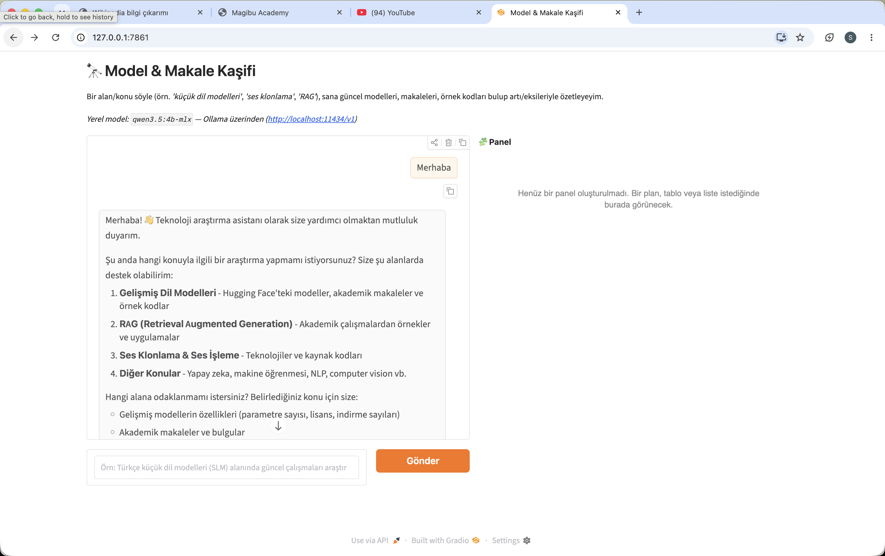
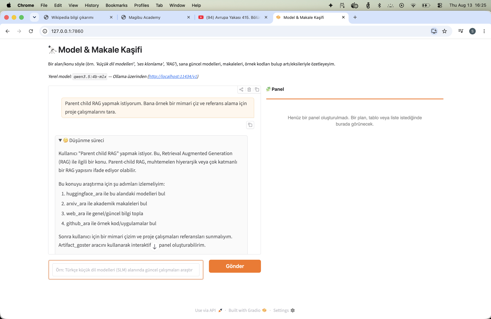
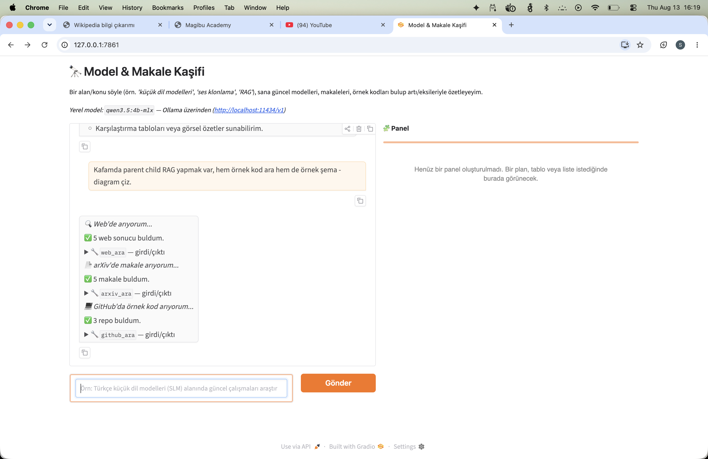
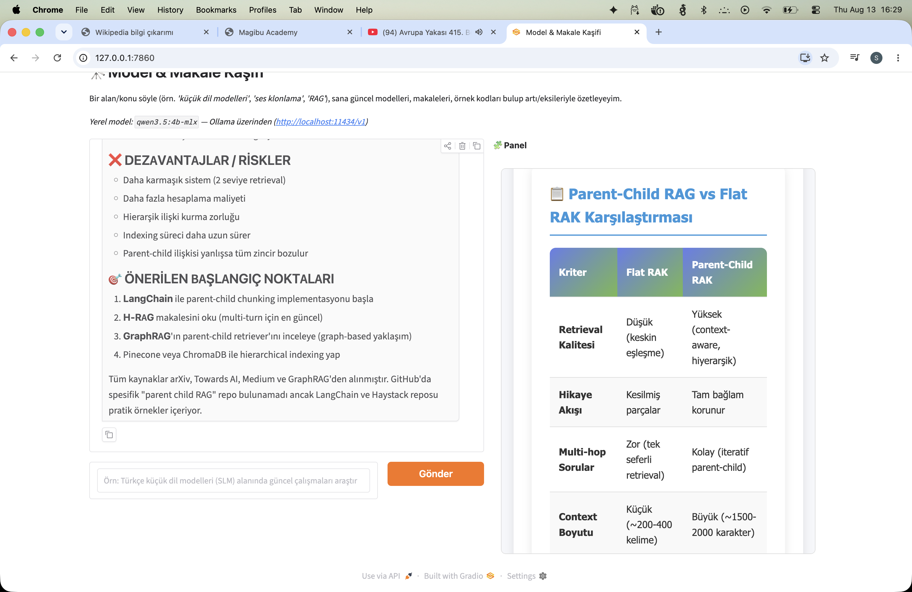
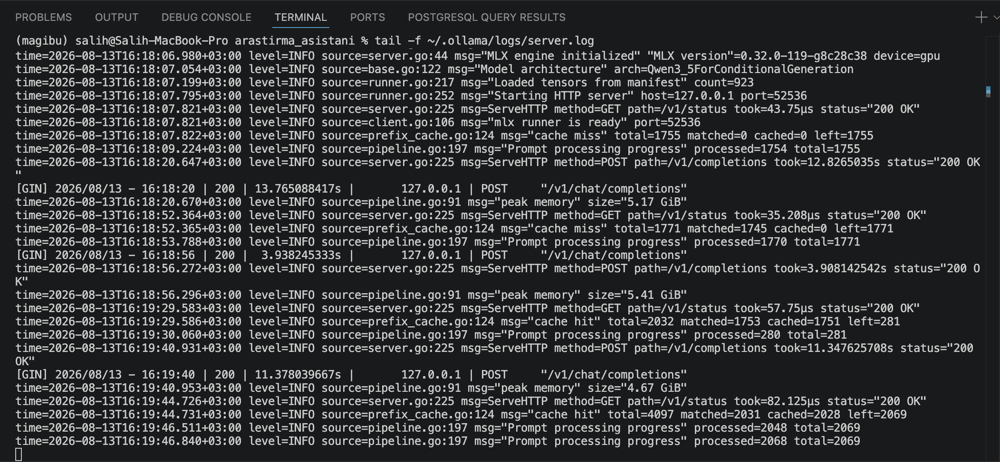

# 🔭 Model & Makale Kaşifi

## Script amacı (kısaca)

Bir konu söylüyorsun (örn. *"küçük dil modelleri"*), yerelde çalışan bir yapay zeka bu konudaki
**güncel modelleri, akademik makaleleri ve örnek kodları internetten bulup** sana artı/eksileriyle
özetliyor; istersen bulduğu bir kod örneğini çalıştırıyor, istersen sana interaktif bir plan/tablo/
çizim paneli açıyor. Hepsi kendi bilgisayarında, dışarıya veri göndermeden (aramalar hariç) çalışır.
Aşağıda ["Örnek çalıştırma"](#-örnek-çalıştırma-parent-child-rag-araştırması) bölümünde gerçek bir
kullanımı ekran görüntüleriyle adım adım görebilirsin.

## 🚀 Nasıl çalıştırılır (adım adım, sıfırdan)

Hiç Python/terminal deneyimin olmasa bile aşağıdaki adımları sırayla kopyala-yapıştır yapman yeterli.

### 1) Ollama'yı kur (yerel yapay zeka motoru)

Mac/Windows/Linux için: https://ollama.com/download adresinden indirip kur. Kurulumdan sonra
Ollama otomatik olarak arka planda çalışmaya başlar (menü çubuğunda ikonunu görürsün). Eğer
çalışmıyorsa terminalden şunu yaz ve o pencereyi açık bırak:

```bash
ollama serve
```

### 2) Bir model indir

Terminalde (yeni bir pencere/sekme açabilirsin):

```bash
ollama pull qwen3:4b
```

Bu komut ~2-3 GB indirir, birkaç dakika sürebilir. (Bilgisayarın güçlüyse `qwen3:8b` gibi daha
büyük bir model de kullanabilirsin — daha akıllı ama daha yavaş olur.)

### 3) Bu klasöre gir

```bash
cd Ders8/arastirma_asistani
```

### 4) Python bağımlılıklarını kur

```bash
python3 -m venv .venv
source .venv/bin/activate        # Windows'ta: .venv\Scripts\activate
pip install -r requirements.txt
```

### 5) Ayar dosyasını oluştur

```bash
cp .env.example .env             # Windows'ta: copy .env.example .env
```

`.env` dosyasını aç, `OLLAMA_MODEL=` satırını 2. adımda indirdiğin modelle eşleştir (örn.
`OLLAMA_MODEL=qwen3:4b`). Değiştirmezsen de çalışır, sadece varsayılan farklı bir model adı yazar.

### 6) Çalıştır

```bash
python3 app.py
```

Terminalde `Running on local URL: http://127.0.0.1:7860` gibi bir satır çıkacak — bu linki
tarayıcında aç. Kutuya bir konu yaz (örn. *"Türkçe küçük dil modelleri alanında güncel çalışmaları
araştır"*), **Gönder**'e bas ve bekle. İlk çalıştırmada model biraz yavaş olabilir, normaldir.

### (Opsiyonel) Ollama loglarını canlı görme

Modelin o an ne yaptığını (prompt işleniyor mu, üretim mi yapıyor) terminalde ayrıca izlemek
istersen, başka bir terminal sekmesinde:

```bash
tail -f ~/.ollama/logs/server.log
```

macOS'ta Ollama arka planda (menü çubuğu uygulaması) çalışıyorsa loglar bu dosyaya yazılır;
`ollama serve`'i kendin elle başlattıysan zaten o terminal penceresi log çıktısını gösterir.

## 📸 Örnek çalıştırma: "Parent-Child RAG araştırması"

Aşağıdaki görseller gerçek bir çalıştırmadan alınmıştır — kullanıcı sırayla şunu soruyor:
*"Kafamda parent child RAG yapmak var, hem örnek kod ara hem de örnek şema/diagram çiz."*

**1) Basit bir "Merhaba" ile başlangıç** — asistan kendini tanıtıp hangi konularda
(gelişmiş dil modelleri, RAG, ses klonlama, vb.) yardımcı olabileceğini listeliyor. Sağdaki
"Panel" alanı henüz boş.



**2) Canlı düşünce akışı** — kullanıcı "Parent child RAG" konusunu sorduğunda, model cevap
vermeden önce hangi araçları hangi sırayla çağıracağını düşünürken bu süreç token token canlı
akıyor; düşünme bitince otomatik olarak katlanabilir bir **"🤔 Düşünme süreci"** bloğuna dönüşüyor.



**3) Araç zincirinin şeffaf gösterimi** — model kararını verdikten sonra sırayla `web_ara`,
`arxiv_ara`, `github_ara` araçlarını çağırıyor; her birinin bulduğu sonuç sayısı ve
girdi/çıktısı ayrı ayrı, katlanabilir bloklarda gösteriliyor (uydurma değil, gerçek arama sonucu).



**4) İnteraktif artifact paneli** — "örnek şema çiz" isteğine karşılık `artifact_goster` aracı
devreye giriyor: sağdaki panelde canlı, renkli bir **"Parent-Child RAG vs Flat RAG"**
karşılaştırma tablosu beliriyor; sol tarafta ise sohbette dezavantajlar/riskler ve önerilen
başlangıç noktaları madde madde özetleniyor.



**5) (Opsiyonel) Ollama loglarını canlı izleme** — arka planda `tail -f ~/.ollama/logs/server.log`
ile modelin prompt işleme/üretim sürelerini terminalde takip edebilirsin (bkz. yukarıdaki
"Ollama loglarını görme" ipucu).



## Dosyalar

| Dosya | Görev |
|---|---|
| `app.py` | Gradio sohbet arayüzü + tool-calling agent döngüsü (Ollama'nın OpenAI-uyumlu `/v1` endpoint'ine bağlanır, streaming ile canlı düşünce/yanıt akışı) |
| `tools.py` | Araç şemaları (`ARAC_SEMALARI`) ve gerçek uygulamaları (`ARAC_FONKSIYONLARI`) |
| `.env.example` | Model/endpoint/opsiyonel GitHub token ayarları şablonu |
| `requirements.txt` | Python bağımlılıkları |

## Araçlar (tool calling)

- `web_ara` — DuckDuckGo ile genel web araması (anahtarsız)
- `huggingface_ara` — Hugging Face Hub model araması (anahtarsız)
- `arxiv_ara` — arXiv makale araması (anahtarsız)
- `github_ara` — GitHub repo/kod araması (anahtarsız, opsiyonel `GITHUB_TOKEN` ile rate-limit iyileşir)
- `kod_calistir` — Küçük bir Python kod parçasını yerel altprocess'te çalıştırır
- `artifact_goster` — Sohbetin yanındaki panelde interaktif bir HTML/JS çıktısı (plan, checklist,
  karşılaştırma tablosu, kart, SVG/Canvas ile diyagram/çizim vb. — formatı model seçer) gösterir/günceller

**Güvenlik notu:** `kod_calistir` sadece süreölçümlü (timeout'lu) bir `subprocess` çağrısıdır,
tam bir sandbox değildir. Yalnızca yerel/eğitim amaçlı kullanım için tasarlanmıştır; güvenilmeyen
ortamlarda veya production'da kullanılmamalıdır. `artifact_goster` ile üretilen HTML de LLM
çıktısı olduğu ve bağlamında güvenilmeyen web sonuçları bulunabileceği için (prompt injection
riski), ana sayfaya doğrudan gömülmez — `sandbox="allow-scripts"` özellikli bir
`<iframe srcdoc="...">` içinde izole çalıştırılır (`allow-same-origin` verilmez, yani iframe
içindeki JS üst sayfaya, cookie'lere veya DOM'a erişemez).

## Ödev gereksinimleriyle eşleşme

| Gereksinim | Karşılığı |
|---|---|
| Yerel model (Ollama/LM Studio) | Ollama, OpenAI-uyumlu `/v1` endpoint (`app.py`) |
| Sistem istemi optimizasyonu | `SISTEM_PROMPTU` (`app.py`) — senaryoya özel akış ve kurallar |
| İnternet araması aracı | `web_ara` (DuckDuckGo) |
| Senaryoya özel araç(lar) | `huggingface_ara`, `arxiv_ara`, `github_ara` |
| Ek/opsiyonel araç | `kod_calistir` (kod yürütme), `artifact_goster` (interaktif HTML/JS panel) |
| Arayüz | Gradio (terminal yerine basit web arayüzü) |
