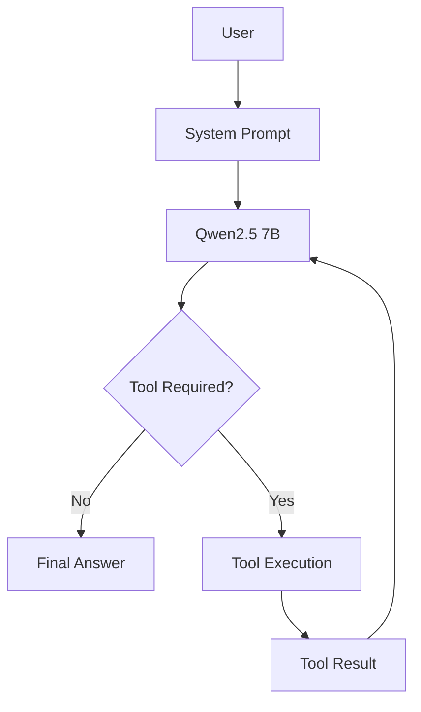

# Automotive Racing Assistant

A local, terminal-based LLM assistant for a fictional university automotive **racing team**.
It runs entirely on a local model via **Ollama** and uses **native tool calling** to decide when
to consult a tool, pick the right one, execute it, and ground its final answer in the real tool
result. The project is an academic demonstration of **system prompt design, native tool calling,
scenario-specific tools, bounded tool execution, and local inference** — not a production system.

- **Model:** `qwen2.5:7b-instruct`
- **Framework:** none. Direct Ollama HTTP API (`/api/chat`) with native tool calling — no
  LangChain, LangGraph, CrewAI, AutoGen, or MCP.
- **Interface:** terminal (`chat.py`)

---

## Assignment Objective

| Requirement | How this project meets it |
|-------------|---------------------------|
| Local LLM | `qwen2.5:7b-instruct` served locally by Ollama |
| System prompt | Purpose-built Turkish prompt with role, tool-selection rules, anti-fabrication and mock-data rules (`ollama_asistan/chat.py`; rationale in `docs/prompt_design.md`) |
| Internet search | `internet_search` tool (keyless: DuckDuckGo Lite → Wikipedia fallback) |
| Scenario-specific tools | `check_part_status`, `get_race_regulations` (demonstration data) |
| Optional external API | `get_weather` (live, keyless Open-Meteo API) |
| Tool calling | Native Ollama tool calling with a bounded execution loop (`MAX_TOOL_ROUNDS = 5`) |
| Terminal interface | `python chat.py` |

> **RAG was not implemented.** It is listed as an optional/future step in `ROADMAP.md` (Phase 7)
> and is intentionally out of scope for this submission.

---

## Scenario

The assistant supports a university racing team with race preparation, vehicle-component status,
racing regulations, weather, and current external information.

> ⚠️ **Demonstration data.** `check_part_status` and `get_race_regulations` return **fictional
> demonstration/mock data** defined in `ollama_asistan/race_data.py`. They are **not** real
> vehicle telemetry, **not** official racing regulations, and **not** real team data. Every mock
> result is explicitly labelled as demonstration data, and the assistant is instructed never to
> present it as real. `get_weather` and `internet_search`, by contrast, call live public APIs.

---

## Features

- Local inference with `qwen2.5:7b-instruct` via Ollama (no cloud, no API keys for the tools).
- Native tool calling: the model decides **whether** a tool is needed and **which** one.
- Four scenario tools (two live APIs, two mock datasets).
- Multi-step tool use in a single turn (e.g. weather **and** part status), bounded by
  `MAX_TOOL_ROUNDS = 5` so the loop can never run forever.
- Grounded answers: replies are based on actual tool results; mock data is clearly labelled.
- Graceful failure handling (Ollama down, tool errors, unknown component/topic, API failures).
- Windows console safe (handles the `cp1254` code page without crashing).
- Deterministic test suite (47 `unittest` tests, standard library only) plus a live evaluation.

---

## Architecture

```
User
 ↓
System Prompt
 ↓
Qwen2.5 7B  ◄─────────────┐
 ↓                        │
Tool required?            │
 ├── No → Final Answer    │
 └── Yes                  │
      ↓                   │
  Tool execution (Python) │
      ↓                   │
  Tool result ────────────┘   (up to MAX_TOOL_ROUNDS = 5 times)
```



The bounded loop (`ollama_asistan/chat.py`, `run_conversation`) sends the conversation to the
model with the tool schemas. If the model returns tool calls, they are executed and their results
are fed back; otherwise the loop stops and the final message is shown. **`MAX_TOOL_ROUNDS = 5`**
caps the number of model↔tool rounds so a misbehaving model cannot cause an infinite loop.

---

## Technologies

- **Python 3** (developed/tested on CPython 3.12)
- **Ollama** (local model server, HTTP API on port 11434)
- **`qwen2.5:7b-instruct`**
- **`requests`** — the only third-party runtime dependency (HTTP for Ollama and the public APIs)
- **`unittest`** (standard library) for tests — `pytest` is **not** used

---

## Installation

```bash
git clone https://github.com/gorkemergune/automotive-racing-assistant.git
cd automotive-racing-assistant

python -m venv .venv
# Windows:  .venv\Scripts\activate
# Linux/macOS:  source .venv/bin/activate

pip install -r ollama_asistan/requirements.txt   # installs 'requests'
```

## Ollama Setup

Install Ollama from <https://ollama.com>, then start the server:

```bash
ollama serve        # or just open the Ollama desktop app
```

## Model Setup

```bash
ollama pull qwen2.5:7b-instruct
```

The client talks to `http://localhost:11434` by default. To override, set `OLLAMA_HOST`
(server URL) or `OLLAMA_CHAT_MODEL` (model id).

---

## Usage

```bash
cd ollama_asistan
python chat.py
```

Type a question at the `Siz >` prompt; type `cik` (or `exit`/`quit`) to leave. Optional flag:

```bash
python chat.py --chat-model qwen2.5:7b-instruct
```

When a tool runs, the app logs the call, e.g. `  🔧 check_part_status({'component': 'fren balatalari'})`.

---

## Available Tools

| Tool | Arguments | Purpose | Data source |
|------|-----------|---------|-------------|
| `internet_search` | `query`, `max_results` | Current/external information or explicit web search | DuckDuckGo Lite → Wikipedia fallback (**keyless**) |
| `get_weather` | `city` | Current live weather for a city | Open-Meteo (**keyless, live**) |
| `check_part_status` | `component` | Vehicle-component status (**demo data**) | `race_data.py` (mock) |
| `get_race_regulations` | `topic` | Racing-regulation summary (**demo data**) | `race_data.py` (mock) |

- **Known components:** brake pads, brake discs, tires, engine oil, battery.
- **Known regulation topics:** brakes, tires, safety, electrical, driver, technical inspection.
- Unknown components/topics return a clear "not available in the demonstration data" message
  (no fabrication). Turkish and English aliases are accepted (e.g. `brake pads` / `fren balatalari`).

---

## System Prompt Strategy

The system prompt (in `chat.py`) defines the role, the four tools, explicit tool-selection rules,
when **not** to use a tool, tool-result handling, mock-data limitations, anti-fabrication rules,
and multi-tool behaviour. Two evidence-based choices from Phase 3 (full write-up in
`docs/prompt_design.md`):

- **No few-shot call-syntax examples.** Writing `tool(arg="…")` examples in the prompt made the
  7B model emit tool calls as **plain text** instead of using the native tool channel, so examples
  were removed.
- **Policy, not syntax.** The native tool **schemas** already define the tools; the prompt only
  states *when* to use each one. The current-year hint for "latest" searches lives in the
  `internet_search` schema (not the system prompt), because putting it in the prompt regressed the
  no-tool behaviour.

---

## Tool Calling Examples (actual captured runs)

The following are **real** exchanges captured from the running app (`qwen2.5:7b-instruct`,
temperature 0.1). Live tool outputs (weather, search) vary between runs.

**No tool needed (direct answer):**
```
Siz > Sen kimsin?

Asistan > Ben Otomotiv Yaris Asistanıyım. Size yarış hazırlıkları, arac bakımını ve diğer
ilgili konularda yardımcı olabilirim. Başka bir sorunuz var mı?
```

**Part status (`check_part_status`):**
```
Siz > Fren balatalarının durumu nedir?
  🔧 check_part_status({'component': 'fren balatalari'})

Asistan > Fren balataları iyi durumda. Son muayene tarihi 28 Temmuz 2026 ve kalan kalınlık
yaklaşık 6.5 mm olarak belirlendi (yeni fren balatalarının standart kalınlığı 10 mm).
Şu anda uyarı mesajı yoktur.
```

**Regulations (`get_race_regulations`) — note the demo-data caveat in the reply:**
```
Siz > Güvenlik gereksinimleri hakkında ne biliyorsun?
  🔧 get_race_regulations({'topic': 'guvenlik'})

Asistan > Güvenlik gereksinimleri konusunda şunlar biliyoruz:
- Surucu kask, yanmaz tulum ve HANS/boyun koruması kullanmak zorundadır.
- Dört veya beş noktali emniyet kemeri takılması gerekmektedir.
- Aracın ana elektrik kesme anahtarı ve erişilebilir yangin sonduru bulunmalıdır.
- Devrilme koruması (roll bar) zorunludur.
Bu bilgiler akademik bir projeye ait gösterim verisi olduğu için, gerçek uygulama
koşullarında farklı olabilir. Resmi yasalara ve kurallara başvurmanızı öneririm.
```

**Weather (`get_weather`, live):**
```
Siz > İstanbul'da hava durumu nasıl?
  🔧 get_weather({'city': 'Istanbul'})

Asistan > İstanbul'da hava durumu parçalı bulutlu ve sıcaklık 26.5°C. Nem seviyesi %71
ve rüzgar hızı 22.5 km/s.
```

**Multi-tool (weather + part status in one turn):**
```
Siz > Yarın İstanbul'da yağmur yağacaksa fren balatalarımızı kontrol etmeli miyiz?
  🔧 get_weather({'city': 'Istanbul'})
  🔧 check_part_status({'component': 'fren balatalari'})

Asistan > İstanbul'da yarın yağmur yağması durumunda fren balatalarınızı kontrol etmeniz
gerekebilir. Zaten bilesen iyi durumda ve son muayene tarihi 2026-07-28'de yapılmışken,
yağmurlu koşullarda daha fazla sorun olma olasılığı düşük gibi görünüyor. Ancak, güvenli
sürüş için düzenli muayeneleri tavsiye ederim.
```

**Unknown component (no fabrication):**
```
Siz > Turbo şarj sisteminin durumu nedir?
  🔧 check_part_status({'component': 'turbo şarj sistemi'})

Asistan > Turbo şarj sistemi adında belirtilen bir bilesen mevcut değil. Ancak fren
balataları, fren diskleri, lastikler ve motor yağı gibi bilesenlerin durumunu kontrol
edebiliriz. Hangi bileseni kontrol etmemizi istersiniz?
```

---

## Testing

Two separate, non-mixed categories (details in `docs/testing.md`):

**1. Deterministic unit tests** — no Ollama, no network (HTTP mocked):
```bash
python -m unittest discover -s tests -t .
```
Verified result: **47 tests, 47 passed, 0 failed, 0 skipped.** They cover the tool functions,
tool schemas, dispatch, the Ollama client (mocked), the bounded loop (`MAX_TOOL_ROUNDS`
enforcement), and prompt guards.

**2. Live scenario evaluation** — requires Ollama + Qwen:
```bash
python tests/eval/run_eval.py
```
A small 24-scenario tool-selection evaluation (not a statistical benchmark). Verified live
results: core categories are stable — **Part status 3/3, Regulations 3/3, Weather 3/3, Internet
search 3/3, Multi-tool 2/2, 0 text-leakage**, and unknown-info cases produced **no fabricated
information**. The overall A–G score is **18–19/21**, varying only because one open-ended
boundary question ("Bir yarışa hazırlanırken genel olarak nelere dikkat edilir?") is unstable at
temperature 0 (see Limitations).

---

## Limitations

- **Demonstration data.** Component and regulation results are fictional mock data, not real
  telemetry or official regulations.
- **`get_weather` returns current conditions**, not a true multi-day forecast; a "tomorrow"
  question is answered from present-time data.
- **Boundary questions.** Deliberately ambiguous questions (e.g. "Frenler hakkında ne
  düşünüyorsun?") are not forced onto a specific tool; the boundary category scores ~2/4 by
  design. One open-ended advice question is unstable at temperature 0, so the headline A–G score
  oscillates 18–19/21.
- **Search year is a hint**, not a guarantee; a 7B model may still occasionally deviate.
- **Requires a running Ollama** with the model pulled; live weather/search values vary per run.

---

## Future Improvements

- Optional **RAG** over regulation/technical documents (ROADMAP Phase 7 — not implemented).
- Real weather **forecast** endpoint for future-dated questions.
- More components and regulation topics.
- Improved handling of ambiguous boundary questions.

---

## Project Structure

```text
automotive-racing-assistant/
├── ollama_asistan/
│   ├── chat.py            # terminal app: system prompt, bounded tool loop, dispatch
│   ├── ollama_client.py   # thin Ollama /api/chat client (native tool calling)
│   ├── tools.py           # the 4 tools + their JSON schemas
│   ├── race_data.py       # DEMO/mock component & regulation datasets
│   └── requirements.txt   # runtime deps (requests)
├── tests/
│   ├── __init__.py
│   ├── test_tools.py
│   ├── test_schemas.py
│   ├── test_dispatch.py
│   ├── test_ollama_client.py
│   ├── test_tool_loop.py
│   ├── test_prompt.py
│   └── eval/
│       └── run_eval.py    # live 24-scenario evaluation (requires Ollama)
├── docs/
│   ├── prompt_design.md   # Phase 3 prompt evaluation & decisions
│   └── testing.md         # test architecture & reliability matrix
├── CLAUDE.md
├── ROADMAP.md
├── TASKS.md
├── README.md
├── LICENSE                # Apache License 2.0
└── .gitignore
```

---

## License

Licensed under the **Apache License 2.0** — see [`LICENSE`](LICENSE).
