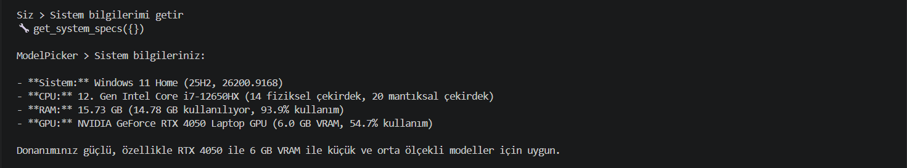
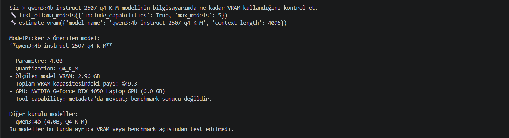
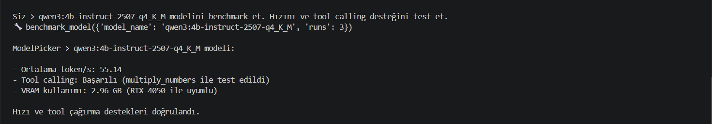
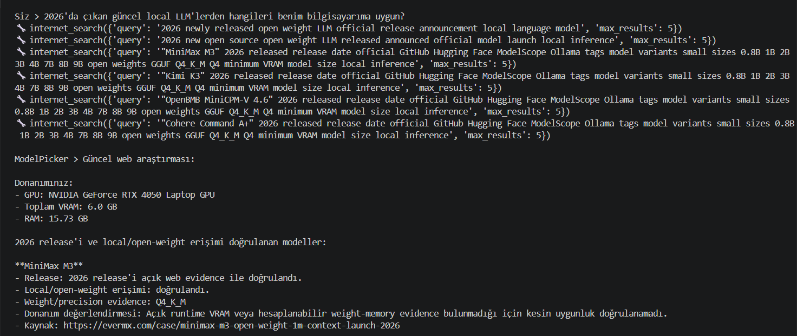
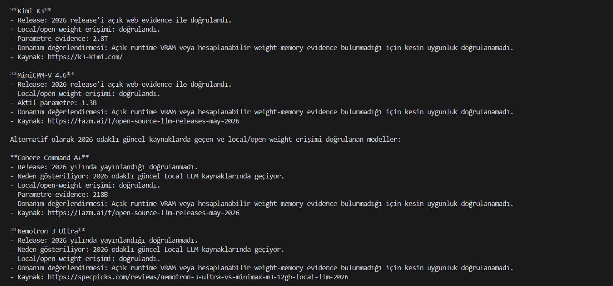
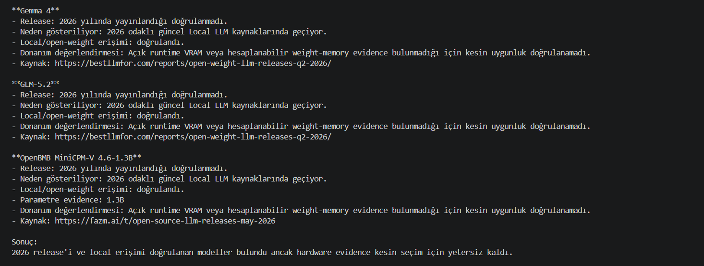

# ModelPicker — Local LLM Advisor

ModelPicker, bilgisayarın mevcut donanımını ve yerel Ollama modellerini analiz ederek **hangi LLM'in kullanılmasının daha uygun olduğunu değerlendiren terminal tabanlı bir Local LLM asistanıdır**.

Proje; yerel bir LLM, tool calling, gerçek sistem ölçümleri, model benchmark'ları ve güncel web araştırmasını tek bir agent akışında birleştirir.

## Özellikler

- Bilgisayarın CPU, RAM, GPU ve VRAM bilgilerini gerçek sistemden okur.
- Ollama üzerinde kurulu modelleri listeler.
- Çalışan modelin gerçek VRAM kullanımını Ollama üzerinden ölçer.
- Modeller üzerinde gerçek inference benchmark'ı çalıştırır.
- Token/s değerlerini hesaplar.
- Tool calling desteğini gerçek bir araç çağrısıyla test eder.
- Güncel open-weight / local LLM modelleri için web araştırması yapar.
- Model release yılı ile yalnızca güncel bir kaynakta geçmesini birbirinden ayırır.
- Local/open-weight erişimini ayrıca doğrular.
- Model-spesifik teknik evidence toplar.
- Donanım uygunluğu konusunda yeterli evidence yoksa tahmin üretmek yerine bunu açıkça belirtir.

---

## Kurulum

### 1. Ollama'yı kurun

Ollama sistemde çalışıyor olmalıdır.

### 2. Agent modelini indirin

```powershell
ollama pull qwen3:4b-instruct-2507-q4_K_M
```

Kurulu modelleri kontrol etmek için:

```powershell
ollama list
```

### 3. Python bağımlılıklarını yükleyin

```powershell
pip install -r requirements.txt
```

### 4. Uygulamayı çalıştırın

```powershell
python chat.py
```

Uygulama terminal üzerinden kullanıcı sorularını alır ve gerekli araçları otomatik olarak çağırır.

---

## Agent Akışı

ModelPicker sabit kullanıcı kelimelerine göre çalışan bir intent router kullanmaz.

Genel akış:

```text
Kullanıcı
   ↓
Local LLM
   ↓
Evidence Planner
   ↓
Gerekli tool / tool'lar seçilir
   ↓
Python tool'u çalıştırır
   ↓
Gerçek evidence conversation'a eklenir
   ↓
Gerekirse yeni tool çağrıları yapılır
   ↓
Grounded final cevap
```

Örneğin güncel bir local LLM önerisi istendiğinde sistem şu tip bir akış oluşturabilir:

```text
internet_search
      ↓
get_system_specs
      ↓
ikinci discovery search
      ↓
model-specific technical search
      ↓
release validation
      ↓
local/open-weight validation
      ↓
hardware suitability
```

---

# Araçlar

## `get_system_specs`

Bilgisayarın gerçek donanım bilgilerini getirir.

Örnek veriler:

- İşletim sistemi
- CPU
- Fiziksel ve mantıksal çekirdek sayısı
- RAM
- GPU
- Toplam / kullanılan / boş VRAM
- GPU utilization

---

## `list_ollama_models`

Ollama üzerinde kurulu modelleri listeler.

Model başına mümkün olduğunda:

- Model adı
- Parametre sayısı
- Quantization
- Model ailesi
- Disk boyutu
- Çalışıyor olup olmadığı
- Runtime context
- Maximum context
- Capabilities
- Ölçülmüş VRAM

bilgileri döndürülür.

---

## `estimate_vram`

Model çalışıyorsa Ollama `/api/ps` üzerinden gerçek VRAM kullanımını ölçer.

Örneğin:

```text
measurement_type: ollama_measured
measured_vram_gb: 2.96
```

Model çalışmıyorsa ölçüm ile tahmin birbirine karıştırılmaz.

---

## `benchmark_model`

Model üzerinde gerçek inference benchmark'ı gerçekleştirir.

Ölçülen değerlerden bazıları:

- Ortalama token/s
- Her benchmark koşusunun süresi
- Üretilen token sayısı
- Model VRAM kullanımı

Ayrıca tool calling desteğini test etmek için gerçek bir fonksiyon çağrısı yaptırılır.

Test aracı:

```text
multiply_numbers(19, 7)
```

Tool çağrısının doğru model tarafından üretildiği kontrol edilir.

---

## `internet_search`

Güncel bilgi gerektiğinde web araştırması gerçekleştirir.

Web sonuçlarından elde edilen bilgiler doğrudan model önerisine dönüştürülmez. Sistem ayrıca:

- model release yılını,
- local/open-weight erişimini,
- parametre bilgisini,
- quantization bilgisini,
- VRAM / memory evidence'ını

ayrı ayrı doğrulamaya çalışır.

Yeterli evidence yoksa kesin donanım uygunluğu iddiası üretilmez.

---

# Örnek Kullanımlar

## 1. Sistem Bilgileri

Kullanıcı:

```text
Sistem bilgilerimi getir
```

ModelPicker gerekli aracı çağırarak gerçek sistem özelliklerini getirir.



---

## 2. Model VRAM Kullanımı

Kullanıcı:

```text
qwen3:4b-instruct-2507-q4_K_M modelinin bilgisayarımda
ne kadar VRAM kullandığını kontrol et.
```

Çağrılan araçlar:

```text
list_ollama_models
estimate_vram
```

Test sisteminde ölçülen model VRAM kullanımı:

```text
2.96 GB
```



---

## 3. Benchmark ve Tool Calling Testi

Kullanıcı:

```text
qwen3:4b-instruct-2507-q4_K_M modelini benchmark et.
Hızını ve tool calling desteğini test et.
```

Çağrılan araç:

```text
benchmark_model
```

Örnek test sonucunda:

```text
Ortalama hız : 55.14 token/s
Tool calling : Başarılı
VRAM         : 2.96 GB
```



---

## 4. Güncel Local LLM Web Araştırması

Kullanıcı:

```text
2026'da çıkan güncel local LLM'lerden hangileri
benim bilgisayarıma uygun?
```

Bu senaryoda ModelPicker:

1. Güncel open-weight modelleri araştırır.
2. Model release evidence'ını kontrol eder.
3. Local/open-weight erişimini doğrular.
4. Model-spesifik teknik aramalar gerçekleştirir.
5. Bilgisayarın GPU / VRAM / RAM bilgileriyle evidence'ı karşılaştırır.
6. Yeterli teknik veri yoksa kesin uygunluk iddiası üretmez.








---

# Grounding ve Hallucination Önleme

ModelPicker'da önerilerin mümkün olduğunca gerçek tool evidence'ına dayanması amaçlanmıştır.

Örneğin:

- `currently_loaded = false` bir modelin kurulu olmadığı anlamına gelmez.
- Model VRAM kullanımı ile sistemin toplam VRAM kullanımı birbirinden ayrılır.
- Tool capability metadata'sı gerçek benchmark sonucu olarak sunulmaz.
- Güncel bir makalede geçen eski model otomatik olarak yeni release kabul edilmez.
- Modelin aktif parametre sayısı toplam model ağırlığı olarak değerlendirilmez.
- Teknik evidence bulunmayan bir model için kesin VRAM uygunluğu uydurulmaz.

---

# Debug Modu

Tool çıktılarının ayrıntılı gösterimi environment variable ile kontrol edilebilir.

PowerShell:

```powershell
$env:DEBUG_TOOLS="1"
python chat.py
```

Kapatmak için:

```powershell
$env:DEBUG_TOOLS="0"
python chat.py
```

Debug kapalıyken kullanıcı yalnızca tool çağrılarını ve son cevabı görür.

---

# Amaç

Projenin amacı **yerel bir LLM'in gerçek sistem ve güncel dış dünya bilgileriyle tool calling üzerinden çalışabildiği küçük bir agent sistemi geliştirmektir.**

ModelPicker özellikle şu soruya evidence tabanlı cevap vermeyi hedefler:

> Bu modeli gerçekten kendi bilgisayarımda çalıştırabilir miyim?
